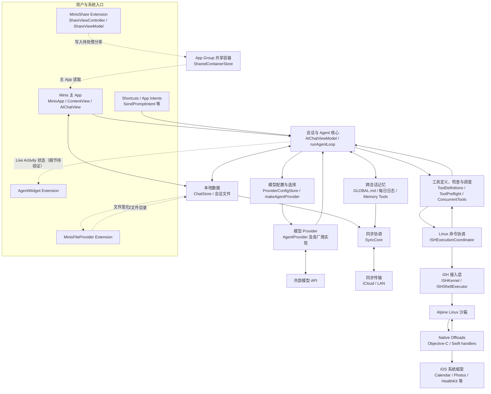

# OpenMinis iOS 架构分类图（第一版）

## 文档状态

- 分析范围：以 `src/ios` 为主，必要时包含 `deps/ish`、`src/shared` 和 `docs/specs`。
- 上游基准：`OpenMinis/OpenMinis@9cf3a855fecd27bb5735b84cacbd56852a3ab8dd`。
- 分析工具：CodeGraph 1.5.0。
- 当前目的：建立代码分类地图，不解释每个函数的完整实现。

这张图中的方框表示代码职责，不表示完全独立的软件。箭头表示主要调用方向或数据流向，也不意味着两个区域之间只有这一条连接。

## 一层分类图



图中实线表示主要调用或结果返回方向。虚线表示通过共享目录、系统事件或 Extension 边界传递数据，不一定是普通的函数调用。

## 这不是严格的分层架构

这七类代码属于同一个 iOS 产品，但职责不同：

1. 主 App 和界面负责接收操作与显示状态。
2. Agent 核心负责组织一次会话和多轮 Agent 循环。
3. Provider 负责把统一的模型请求转换成不同厂商的协议。
4. 工具与 Linux 沙箱负责检查并执行模型请求的操作。
5. Native Offloads 负责把 Linux 命令连接到 iOS 原生能力。
6. 本地数据与同步负责保存、读取和传输状态。
7. Share、Shortcuts、Widget、File Provider 是其他系统入口或展示出口。

它们不是完全独立的。例如 `AIChatViewModel` 虽然名字中包含 ViewModel，但它不只管理界面状态，还承担 Agent 循环、Provider 选择、工具执行和持久化协调。`ChatStore` 也不是只供某一个区域使用，而是被 Agent、界面、Shortcuts、后台活动和同步代码共同调用。

## Xcode Target 边界

`Minis.xcodeproj` 当前定义了以下主要 target：

| Target | 类型 | 作用 |
|---|---|---|
| `Minis` | iOS App | 主应用、聊天界面、Agent 和大部分业务逻辑 |
| `MinisShare` | App Extension | 接收系统分享内容，写入共享容器并唤起主 App |
| `MinisFileProvider` | App Extension | 通过 iOS File Provider 暴露和修改 Minis 文件 |
| `AgentWidgetExtension` | App Extension | 展示 Agent Live Activity 状态 |
| `MinisTests` | Unit Test Bundle | 单元测试 |
| `MinisUITests` | UI Test Bundle | 界面测试 |

App Extension 可能运行在与主 App 不同的进程中，因此不能把普通内存对象直接交给主 App。Share Extension 使用 `SharedContainerStore` 保存待处理内容，再通过 `minis://share` 通知主 App。File Provider 也围绕共享文件目录工作。

## 区域说明

### 1. 主 App 与界面

- **职责**：应用启动、场景生命周期、导航、会话列表、聊天界面和用户操作。
- **主要入口**：`MinisApp` 的 `@main`、`ContentView`、`AIChatView`。
- **主要输入**：点击、文本输入、附件、深链、系统生命周期事件和共享内容。
- **主要输出**：调用 `AIChatViewModel`、查询 `ChatStore`、触发同步或系统展示。
- **主要状态**：SwiftUI 页面状态、当前会话选择和界面展示状态。
- **外部边界**：SwiftUI、UIKit、App 生命周期和系统导航。
- **重点文件**：
  - [`MinisApp.swift`](../../src/ios/MinisApp.swift)
  - [`AppDelegate.swift`](../../src/ios/AppDelegate.swift)
  - [`ContentView.swift`](../../src/ios/Views/ContentView.swift)
  - [`AIChatView.swift`](../../src/ios/Views/Chat/AIChatView.swift)

第一轮不需要完整阅读 `ContentView.swift`。先确认主 App 如何进入聊天界面，以及聊天界面如何取得 `AIChatViewModel`。

### 2. 会话与 Agent 核心

- **职责**：准备用户消息、建立会话、维护上下文、调用模型、处理流式返回、执行工具并决定是否继续下一轮。
- **主要入口**：`AIChatViewModel.send()`。
- **核心循环**：`AIChatViewModel.runAgentLoop()`。
- **主要输入**：用户消息、附件、当前模型配置、历史消息、Skill、Memory 和 MCP 配置。
- **主要输出**：界面消息状态、Provider 请求、工具调用、持久化记录和错误状态。
- **状态所有者**：`AIChatViewModel` 管理运行时状态，`ChatStore` 保存持久状态。
- **重点文件**：
  - [`AIChatViewModel.swift`](../../src/ios/Agent/Chat/AIChatViewModel.swift)
  - [`AIChatViewModel+Persistence.swift`](../../src/ios/Agent/Chat/AIChatViewModel+Persistence.swift)
  - [`AIChatViewModel+SSEStream.swift`](../../src/ios/Agent/Chat/AIChatViewModel+SSEStream.swift)
  - [`ChatLifecycleSupport.swift`](../../src/ios/Agent/Chat/ChatLifecycleSupport.swift)
  - [`ChatModels.swift`](../../src/ios/Agent/Chat/ChatModels.swift)

`send()` 会完成输入检查、会话准备、内核状态等待和并发位置申请，然后进入 `runAgentLoop()`。Agent 循环不是一次固定的网络请求；模型可以返回工具调用，工具结果会再次进入模型上下文，直到产生最终回复或被取消。

### 3. 模型配置与 Provider

- **职责**：保存模型和账号配置，选择当前模型，并把统一的 Agent 请求转换成不同厂商的请求。
- **统一入口**：`AgentProvider`。
- **创建入口**：`makeAgentProvider(for:)`。
- **配置入口**：`ProviderConfigStore`。
- **主要输入**：会话绑定、模型条目、Provider 实例、凭据和推理配置。
- **主要输出**：统一的流式 Agent 事件，包括文本、思考内容和工具调用。
- **外部边界**：Anthropic、Gemini、OpenAI、OpenRouter、xAI、Kimi 等服务。
- **重点文件**：
  - [`AgentProvider.swift`](../../src/ios/Providers/AgentProvider.swift)
  - [`ProviderConfigStore.swift`](../../src/ios/Providers/ProviderConfigStore.swift)
  - [`AIChatViewModel+ProviderFactory.swift`](../../src/ios/Agent/Chat/AIChatViewModel+ProviderFactory.swift)
  - [`LLMProviderFactory.swift`](../../src/ios/Providers/LLMProviderFactory.swift)

`runAgentLoop()` 先通过 `resolveCurrentEntry()` 找到当前模型，再由 `makeAgentProvider(for:)` 创建具体实现。这样 Agent 核心不需要为每个模型厂商维护一套完全独立的循环。

### 4. 工具调度与 Linux 沙箱

- **职责**：定义模型可用工具，修复和检查参数，检查权限，执行工具，并把结果转换回 Agent 能理解的内容。
- **主要入口**：`makeAgentTools()`、`executeSingleToolUse()`。
- **检查步骤**：工具循环检测、参数修复、预执行检查和 Offload 权限检查。
- **命令入口**：`AIChatViewModel+ISHCommand.executeCommand()`。
- **执行协调**：`ISHExecutionCoordinator`。
- **底层接入**：`ISHKernel`、`ISHShellExecutor` 和 `deps/ish`。
- **主要输入**：模型返回的工具名和参数、当前会话 ID、挂载目录和环境变量。
- **主要输出**：命令输出、退出码、文件变化和取消/错误状态。
- **重点文件**：
  - [`AIChatViewModel+ToolDefinitions.swift`](../../src/ios/Agent/Chat/AIChatViewModel+ToolDefinitions.swift)
  - [`AIChatViewModel+ToolPreflight.swift`](../../src/ios/Agent/Chat/AIChatViewModel+ToolPreflight.swift)
  - [`AIChatViewModel+ConcurrentTools.swift`](../../src/ios/Agent/Chat/AIChatViewModel+ConcurrentTools.swift)
  - [`AIChatViewModel+ISHCommand.swift`](../../src/ios/Agent/Chat/AIChatViewModel+ISHCommand.swift)
  - [`ISHExecutionCoordinator.swift`](../../src/ios/Agent/ISH/ISHExecutionCoordinator.swift)
  - [`ISHKernel.m`](../../src/ios/iSH/ISHKernel.m)

`ISHExecutionCoordinator` 是 Swift 层的执行协调者，负责会话挂载、命令执行、停止和抢占。`ISHKernel` 是 Objective-C 接入层，负责启动 iSH、TTY、DNS、挂载和实际命令执行。真正的 Linux 用户空间位于 Alpine rootfs 中。

模型可见的 Agent Tool 和 shell 中的命令不是同一层。当前内建 Tool 大致有两条执行路径：

```text
Agent Tool
├── Swift 直接处理：browser_use、file_*、memory_*、read_image
└── shell_execute
    ├── 普通 Linux 命令：python3、git、curl、脚本等
    └── Native Offload 命令：apple-calendar、apple-photos 等
```

`shell_execute` 不会打开一个终端界面，而是通过 iSH 创建新的非交互式 `/bin/sh` 进程，并用管道收集输出。`file_*` 虽由 Swift 直接处理，但读写的仍可以是 Linux 可见的文件。

### 5. Native Offloads

- **职责**：让 Linux 沙箱中的特定命令调用 iOS 系统能力。
- **主要形式**：Objective-C handler、少量 Swift bridge，以及 iSH 的 `native_offload` 接口。
- **主要输入**：Linux guest 传入的命令名、参数、环境变量和标准输入。
- **主要输出**：退出码和可返回给 Linux/Agent 的文本或文件结果。
- **外部边界**：EventKit、Photos、HealthKit、HomeKit、CoreLocation、AVFoundation、Vision 等框架。
- **权限边界**：`OffloadPermissionManager` 和各 iOS Framework 自身的授权流程。
- **重点文件**：
  - [`NativeOffloads`](../../src/ios/NativeOffloads)
  - [`NativeOffloadUtils.m`](../../src/ios/NativeOffloads/NativeOffloadUtils.m)
  - [`OffloadPermissionManager.swift`](../../src/ios/Agent/Offload/OffloadPermissionManager.swift)
  - [`ios-sandbox-ish-summary.md`](../../docs/specs/ios-sandbox-ish-summary.md)

以日历为例，`CalendarOffload.m` 定义 `calendar_handler` 和 `calendar_offload_register`，并引用 iSH 的 `kernel/native_offload.h`。这说明 Native Offload 是 Linux 沙箱执行系统的扩展，而不是与 iSH 无关的另一套工具系统。

可以把 Native Offloads 理解为 Linux 沙箱与 iOS 原生能力之间受控的桥梁。它只转发已经明确注册的命令，并不会让任意 Linux 程序直接访问全部 iOS API。典型往返路径是：

```text
shell_execute
→ iSH 中的 /bin/sh
→ apple-calendar 占位命令
→ calendar_handler
→ EventKit
→ JSON / 标准输出 / 退出码
→ Agent Tool Result
```

### 6. 本地数据与同步

- **职责**：保存会话、消息、媒体文件和同步状态，并在设备或传输端之间传递变化。
- **主要本地入口**：`ChatStore.shared`。
- **主要同步入口**：`SyncCore.shared`。
- **传输接口**：`SyncTransport`。
- **主要输入**：会话和消息写入、文件变化、删除操作、前后台切换和手动同步。
- **主要输出**：SQLite 数据、会话文件、dirty record、iCloud/LAN 发送与接收结果。
- **外部边界**：SQLite、文件系统、CloudKit/iCloud 和局域网传输。
- **重点文件**：
  - [`ChatStore.swift`](../../src/ios/Agent/Chat/ChatStore.swift)
  - [`SyncCore.swift`](../../src/ios/Agent/Sync/V2/SyncCore.swift)
  - [`SyncTransport.swift`](../../src/ios/Agent/Sync/V2/SyncTransport.swift)
  - [`ICloudSharedZoneTransport.swift`](../../src/ios/Agent/Sync/V2/ICloudSharedZoneTransport.swift)
  - [`LANTransport.swift`](../../src/ios/Agent/Sync/V2/LANTransport.swift)

CodeGraph 当前找到 `ChatStore` 的 171 个调用位置和 `SyncCore` 的 28 个调用位置。它们横跨 Agent、界面、Shortcuts、后台任务和同步代码，因此属于多个功能共同使用的基础部分。

当前仓库同时保留旧同步引擎 `CloudSyncEngine` 和 V2 的 `SyncCore`。实际启用哪一套会受到配置和迁移状态影响，第一版暂不展开这一选择过程。

### 7. 外围入口与系统集成

- **Shortcuts / App Intents**：允许系统自动化创建、继续、查询或重试会话，最终复用会话和 Agent 核心。
- **Share Extension**：处理分享的文本、图片、视频或文件，写入 App Group 共享容器，再唤起主 App。
- **File Provider**：让系统文件界面和其他 App 访问 Minis 管理的目录。
- **Widget / Live Activity**：显示 Agent 运行状态，不承担 Agent 核心逻辑。
- **重点文件**：
  - [`Agent/Intents`](../../src/ios/Agent/Intents)
  - [`ShareExtension`](../../src/ios/ShareExtension)
  - [`FileProvider`](../../src/ios/FileProvider)
  - [`AgentWidget`](../../src/ios/AgentWidget)
  - [`SharedContainerStore.swift`](../../src/ios/Shared/SharedContainerStore.swift)

这些入口并不形成另一套 Agent。它们通过 `ChatStore`、`SharedContainerStore`、深链或共享文件目录，把输入交给主 App 或复用现有会话能力。

### 补充：Memory 是跨区域能力

Memory 不是第八个独立区域。它同时连接 Agent 核心、Tool、本地文件、设置界面和同步：

- `GLOBAL.md` 保存稳定、长期有效的全局记忆。
- `YYYY-MM-DD.md` 保存带时间戳的每日记忆，`memory_write` 向当天文件写入新条目，并让最新条目排在最前面。
- 构造 Agent Prompt 时会自动注入 `GLOBAL.md` 和最近 3 个有内容的每日日志；更早的内容可由 `memory_get` 按关键词和时间新旧搜索。
- Memory 文件由所有会话共享，但是否注入记忆、是否注册两个 Memory Tool，由每个会话自己的 `memoryEnabled` 开关决定。
- 当前实现基于 Markdown 文件和关键词搜索，不是向量数据库。`SOUL.md` 与 Memory 文件放在一起，但负责 Agent 身份和风格，不受 Memory 开关影响。

主要实现位于：

- [`AIChatViewModel+MemoryTools.swift`](../../src/ios/Agent/Chat/AIChatViewModel+MemoryTools.swift)
- [`MemoryManagementView.swift`](../../src/ios/Views/Settings/MemoryManagementView.swift)
- [`SessionMemoryView.swift`](../../src/ios/Views/Chat/SessionMemoryView.swift)
- [`SoulStore.swift`](../../src/ios/Agent/Session/SoulStore.swift)

## 已验证的主要连接

| 起点 | 终点 | 当前证据 |
|---|---|---|
| `MinisApp` | `ContentView` | `MinisApp` 是主 App 的 `@main` 入口，`ContentView` 是主要 SwiftUI 容器 |
| `AIChatViewModel.send()` | `runAgentLoop()` | `send()` 完成会话与并发准备后调用 Agent 循环 |
| `runAgentLoop()` | `makeAgentProvider()` | Agent 循环解析当前模型并创建具体 `AgentProvider` |
| `runAgentLoop()` | 工具定义与流处理 | 调用 `makeAgentTools()`、Provider fallback 和 `processStreamEvents()` |
| `executeSingleToolUse()` | 工具检查与命令执行 | 调用参数修复、预执行检查、权限检查和 `executeCommand()` |
| Agent 工具代码 | `ISHExecutionCoordinator` | FileTools、ISHCommand、Offloading、MCPStore 等 14 个调用位置 |
| `ISHKernel` | Native Offloads | Native Offload handler 引用 iSH `native_offload` 头文件并由 `ISHKernel` 使用 |
| Agent 核心 | Memory 文件 | 构造 Prompt 时注入全局和近期记忆，并通过 `memory_get`、`memory_write` 按需读写 |
| `memory_write` | `SyncCore` | 写入每日日志后把 `MemoryDailyV2` 标记为待同步 |
| Agent、界面、Intents | `ChatStore` | CodeGraph 找到 171 个调用位置 |
| `ChatStore.markDirty()` | `SyncCore.scheduleSend()` | 本地变化在 V2 启用时调度发送 |
| `SyncCore` | `SyncTransport` | `SyncCore` 保存 transport 集合并负责 send/fetch |
| Share Extension | `SharedContainerStore` | Share 处理结果写入共享容器，主 App 的 `AIChatView` 读取待处理分享 |
| File Provider | 会话文件与共享目录 | File Provider 被 ChatStore、FileTools、Sync hydrator 和 iSH coordinator 等代码使用 |

## 仍需验证的关系

以下内容在第一版中只标出所属区域，不给出完整流程：

1. `MinisApp`、`DeepLinkRouter` 与 `ContentView` 之间的全部深链分发顺序。
2. 多个并发工具完成后，结果重新组合并进入下一轮模型请求的精确顺序。
3. `AgentLiveActivityManager` 到 Widget Extension 的完整 ActivityKit 更新路径。
4. File Provider 写入、iSH session mount 和云同步三者之间的文件变化传播顺序。
5. `CloudSyncEngine` 与 `SyncCore` 在启动、迁移和失败回退时的选择条件。
6. Browser Use、MCP 和 Skill 在 Agent prompt 与工具系统中的完整接入点。

这些问题适合在后续具体流程中逐项验证，不需要为了完成第一张分类图一次性全部展开。

## 如何给未知代码分类

遇到陌生文件或类型时，依次回答：

1. 它是否直接接收用户操作、系统事件或 Extension 请求？
2. 它是否组织会话、模型调用或 Agent 循环？
3. 它是否实现 `AgentProvider` 或处理某个模型厂商协议？
4. 它是否检查、调度或执行工具？
5. 它是否进入 `ISHExecutionCoordinator`、`ISHKernel` 或 Linux 文件系统？
6. 它是否引用 `native_offload` 或某个 iOS 系统框架？
7. 它是否读写 `ChatStore`、SQLite、共享目录或 `SyncTransport`？

前几个问题中的第一个明确答案，通常就是这段代码的主要所属区域。一个文件可能与多个区域连接，但仍应区分“它自己的职责”和“它依赖的其他区域”。

## 下一步

使用“用户发送消息，模型调用一个 shell 工具，工具结果返回模型，最终回复写入会话”作为第一条完整运行流程。追踪过程中，把每个节点放回这张分类图，并修正第一版中标记为待验证的关系。
