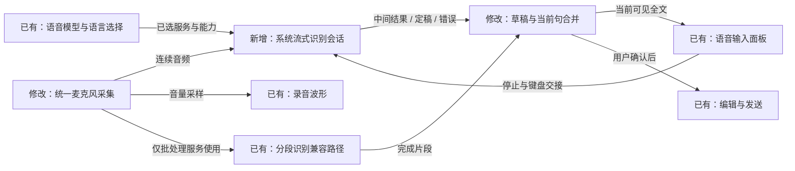
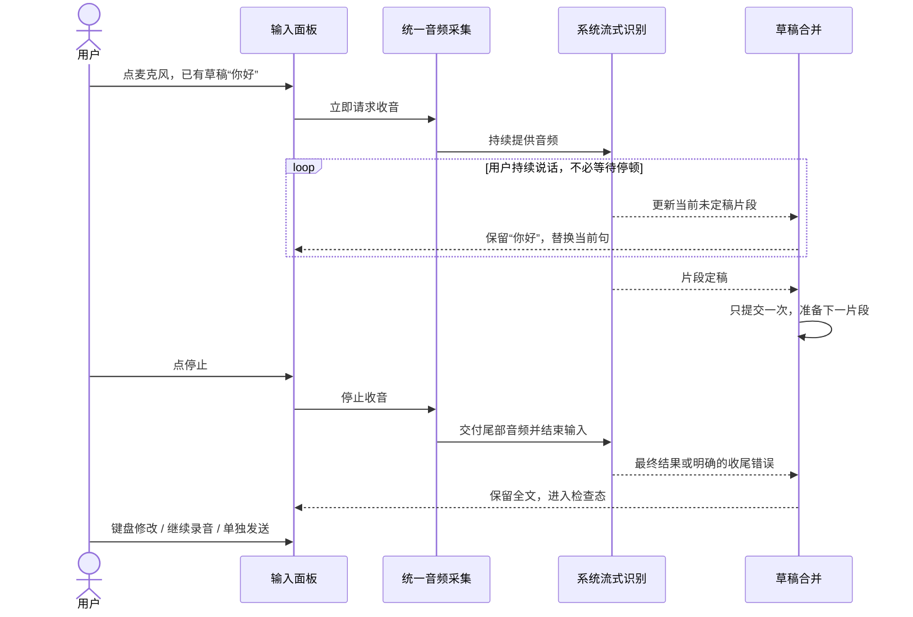

# 26-09-28 实时语音转录
状态：active
更新：2026-09-28

## 恢复信息
分支：main
最近核验 HEAD：40ac6a55e1861827df68927dd78fc8cdf8f79d65
工作目录：/Users/huyuanzhao/Coding/Projects/OpenMinis
工作区：沿用当前对话正在进行的语音 UI 接入未提交改动，不重置、不覆盖、不新建分支或 worktree。
关联任务：[语音输入 UI 正式接入](<../26-09-28 语音输入 UI 正式接入/task.md>)；该任务仍 active，本任务负责此前明确延期的实时识别能力。
下一步：Build 6 已在维护者手机使用并反馈暂未遇到问题，进入提交准备；保留未量化的延迟、长停顿、语言支持和长语音边界，不再等待安装反馈。
发布状态：1.13（6）由维护者手动归档、上传并确认手机使用；本机归档上传成功证据见发布记录。

## Build 6 使用反馈与提交准备（2026-09-28）
后续授权：维护者回复“提交就 ok 了”，明确要求执行已整理范围的本地 Git 提交；不推送、不重新发布、不将待补验证记为完成。下文“仅准备”保留为前一阶段记录。

维护者在当前对话确认已完成 Distribute 并在手机使用，随后反馈：“当前有一些未提交的任务, 准备提交吧, 我在使用的时候暂时没遇到什么问题”。此前关联 UI 任务也记录过维护者对系统实时转录效果满意。上述反馈支持当前个人日常使用结果良好，不等于已逐项测量首字延迟、多语言、长录音边界或异常恢复。

本次同步使用反馈、整理提交范围并刷新检查点，不改实现、不暂存或提交、不推送。保留原始测试与审查记录和未验证项，任务暂不归档；提交分组见 [发布记录中的提交准备](../../../docs/minisx-release-status.md#build-6-提交准备2026-09-28)。

## 任务确认与执行边界
确认状态：已确认（本次交接授权，保留下文初始规划历史）
确认稿版本：v1，2026-09-28
用户依据：“创建一个任务吧, 尽量做到实时转录, 就像在 iOS 的键盘中使用自带的语音识别那样”；此前补充“两者可以不同步”。
真实使用目标：用户保持说话时，输入框逐渐显示并修正识别文字，允许小幅延迟，不必停顿约5秒或手动停止后才出字。
初始规划授权（历史，实施授权见“实施恢复”）：当前对话内读取源码和官方资料，创建项目任务记录。没有新建 Codex 对话，没有开始产品实现、音频采集、模型下载、设备部署或外部审核。
拟议实施位置：继续当前 main 工作目录，继承已认可 UI；不另开工作区。当前未提交修改是接入基础，不视为可丢弃文件。
拟议改动边界：VoiceInputModels、SystemVoiceProvider、VoiceInputViewModel、现有音频采集/VAD接口、InlineVoiceInputView/VoiceComposerPanel 必要文本绑定与状态提示，以及相关生命周期测试；按实际需要适配已有模型选择器的能力说明。不重做 UI、不新增振动、不自动发送消息、不修改其他聊天/工具业务。
拟议设备边界：先使用既定 iPhone 18 Pro / iOS27 Simulator，UDID 479131C9-8187-44E7-8510-A499D7AC3034；每次部署前核对。Simulator 不足以证明真实声音/模型能力，真机安装或采集前再明确目标设备与录音范围；不沿用旧任务安装到模拟器的许可作为新任务真机许可。
数据边界：保留用户已有草稿/会话/模型选择；不同时暗中启动系统和云端双路识别，不因实时能力缺失自动切换到另一个服务商。在线/离线选择须遵守其原有联网语义；离线能力不足时如实说明，不偷偷上传。模型下载需先展示必要性与大小（能查询时）；不在规划阶段下载。
提交/发布：不自动提交、推送、TestFlight 上传或改变共享规则。

## 目标与验收
以下为拟议验收标准，数值目标不是已经达到的承诺。
- [ ] 连续说约10秒、不刻意停顿、不点停止时，识别文本在录音过程中出现并多次更新。不能以每5秒静音分段充当达标。
- [ ] 首字延迟目标约1–2秒，后续尽量随语句更新；实测记录首字/中间结果/最终结果时刻及延迟分布，不用一个好样本代表稳定表现。硬件、语言、离线模型冷启动会影响结果，先报告实测再定最终门槛。
- [ ] 中间结果可能改词、变短、加标点：替换当前未定稿片段，不能只按字符串增长截取尾部追加，不能重复字句或改坏已确认内容。
- [ ] 用户原有草稿、已定稿片段与当前未定稿片段分开维护，显示时合成；输入“你好”后再录“今天天气怎么样”，保留前文且只追加一遍。
- [ ] 点击麦克风立即反馈并请求启动，无人为等待；允许先停顿再说，停顿后继续同次录音。首次权限、资源未就绪必须真实提示，不能显示假录音/假文本。
- [ ] 停止收音后完成尾句确认，结束后原位检查；切键盘先可靠收尾再交接焦点，编辑后继续录音保留改动；显式发送沿用现有发送/排队语义。
- [ ] 中途取消/离场/发送、迟到回调、断网、权限拒绝、识别引擎重启等不能复活旧会话或覆盖草稿。终稿失败时保留已显示文字并说明未确认状态，不能悄悄丢字或把临时结果冒充最终结果。
- [ ] 对当前选择的中文语言（包括截图中的中文香港）、普通话和英文分别检查实际支持情况，不把“中文”当作单一可互换语言。先验证用户选中语言的一条真实路径，再扩展明确支持范围。
- [ ] 保留已认可的波形、黑色停止键、键盘出口、短失败胶囊和同屏文字布局；占位文案不再写成“录音结束后才显示”。高频文本更新不使布局闪跳或恢复旧重影。
- [ ] 支持长句和跨引擎请求边界的连续讲话；首版沿用现有录音总时长上限，不借实时化偷偷放宽。必要的请求轮换不能丢前后衔接音频或重复最终文本。
- [ ] 模型选择反映能力：首版已验证的系统路径提供实时结果；仅批处理模型保留原功能并诚实显示其限制。不能把所有第三方模型标成已支持实时。

## 初始规划时的事实与源码依据（实施前快照）
1. VoiceInputCapable.transcribe(VoiceInputRequest) 只接整段音频并返回一个 VoiceInputResponse.text；当前并无供正式输入面板消费的流式结果协议。入口：src/ios/Providers/Voice/VoiceInputModels.swift。
2. SystemVoiceProvider.transcribe 使用 SFSpeechURLRecognitionRequest；shouldReportPartialResults=true 只用于内部保留结果/超时兜底，未持续回传给 UI。入口：src/ios/Providers/Voice/VoiceProvider+System.swift。
3. VoiceActivityDetector.Configuration.voiceEndFrameCount=156，约5秒静音确认；VoiceInputViewModel.handleSegment 在当前 composerSessionActive 下保持收音并提交完成的片段；结果按序追加。因此现在是录音不断、分段返回，不是持续说话时的实时识别。
4. 仓库另有 SpeechRecognitionManager 使用 SFSpeechAudioBufferRecognitionRequest 和中间结果；当前 beginVoiceInput 已进入 VoiceInputViewModel 新面板路径，不能把旧引擎存在当成新入口已有实时支持。旧实现有独立 AVAudioEngine，不能和 VAD 引擎同时启动争抢音频会话。
5. AIChatView 旧 speechManager.$recognizedText 监听按长度追加；实时结果会改写前词，该策略不能直接复用到新实时路径。新的草稿合并需要显式替换未定稿范围。
6. 当前项目最低 iOS26，但尚无 SpeechAnalyzer/SpeechTranscriber/DictationTranscriber 接入。新 API 可作为比较方案，不能把可编译当作目标设备及语言可用。

## 推荐方案与取舍
### 首版推荐：先把 Apple 系统识别接为持续音频流
- 以现有“系统识别在线/离线”选择为入口，新增可选流式能力，不破坏现有批处理协议。优先基于现有 SFSpeechRecognizer 的音频缓冲请求打通中间结果，复用项目已有经验与权限语义。
- 统一一份音频采集所有权：连续音频送给识别会话，波形/VAD作为旁路观察，不等待VAD静音才开始识别；不能同时启动旧 SpeechRecognitionManager 与现有 VAD 的两套录音引擎。
- 流式事件区分未定稿更新、片段定稿、完成与失败，包含会话代次及片段身份；UI 显示既有草稿 + 定稿文本 + 当前可替换文本。
- 音频实时回调不做网络、字符串拼接、UI更新或阻塞等待。确认缓冲区生命周期、格式转换、背压/队列上限，防止复用音频内存或持续积压。
- 点击停止调用识别收尾并等待尾句；有界超时下保留最好结果并说明状态。不能为了画面快速结束而丢弃尾部音频。
- 当前选中第三方模型时不擅自替换成系统服务。需要用户在现有选择器选择支持实时的路径，说明该取舍后再实施。

### 比较与后续可选路线
| 路线 | 能提供的体验 | 主要代价/限制 | 本轮定位 |
| --- | --- | --- | --- |
| 系统音频缓冲识别 + 中间结果 | 持续说话时出字，可修订当前句 | 需验证语言、离线能力和长请求轮换 | 首版推荐，沿用现有系统在线/离线入口 |
| iOS26 SpeechAnalyzer + SpeechTranscriber / DictationTranscriber | 新的持续分析及渐进结果接口 | 要验证设备/语言支持、资源下载和用户现有语言覆盖 | 首轮只做能力适配比较；若旧接口无法达到目标，再提交有依据的路线调整 |
| 第三方原生流式识别 | 取决于服务商的音频流协议与模型 | 分别适配协议、鉴权、费用、终止和网络重连 | 不承诺首版覆盖所有服务商；需选定具体服务再安排 |
| 更短批处理切片 | 比当前5秒静音更早返回 | 延迟、边界重复、请求数量与成本，仍不等同持续中间结果 | 仅可作明确标识的兼容方案，不能冒充首版实时目标 |

“像 iOS 键盘”作为体验目标：逐步出字、允许改词、停顿不结束、停止后完整保留。不能承诺使用键盘私有实现或每个字的延迟/准确率与系统键盘完全相同。

## 设计图
图的状态与版本：当前首版实现，2026-09-28；已接通下列代码关系，服务/语言及真实语音效果仍待运行验证。

### 功能位置与关系图

系统流式路径与批处理兼容路径按所选能力择一路运行；图中两条箭头不代表双路同时上传。

### 典型场景运行图

## 实现计划
- [x] 确认首版系统识别优先、保留第三方兼容的行为边界。
- [x] 已实现选中语言/服务的运行时能力检查与单音频采集所有权，并核对生命周期；实际语言/模型可用性仍未以真人语音验证。
- [x] 代码已接通生产入口：连续音频 → 中间结果 → 当前句替换 → 停止终稿。构建与局部状态测试通过，完整真实识别链路仍待验收。
- [x] 已实现结果修订、定稿去重、停止超时、晚到回调和编辑往返的状态处理；17项测试覆盖草稿生命周期与音频交接，真实SDK和键盘完整交互仍待验收。
- [ ] 在既定模拟器核对UI；明确真机目标后用真实声音与系统键盘做同条件对比，测时并记录语言/模型/设备/冷热启动。
- [ ] 只有代表路径与观察方法有效，才扩展停顿、长录音、断网、语言与输入法组合；更新图与任务记录。
- [x] 已完成固定快照Pi审查及两处修复的局部复审，并逐项记录主Agent判断；真实语音效果保持待验收。

## 首轮验收与停止条件
代表场景：保留一段原有草稿，连续说约10秒中文，不主动停顿5秒，期间应出现并修正文本；停顿10秒后继续一句，再停止、键盘改词、继续录音并检查没有重复/丢失。测录音开始、首个结果、每次更新和终稿的时间，不记录不必要的私人音频/文本。
先验证观察方法能捕捉持续音频和中间结果；模拟器不支持模型/实际声输入时如实停止该条证明，不用假注入文字宣称实时链路通过。需要真机时另明确设备，不擅自部署。
若系统选中语言不支持、离线资源不可用、老接口请求轮换丢字，或延迟明显偏离目标，记录证据再讨论必要路线改变。不得无条件循环尝试、偷偷换服务商或把更短批处理当成功。

## Spec 与资料清单
本任务未触及 AGENTS Spec Index 所列原生工具/日历/URL协议；不加载无关Spec。若实施使用调试RPC，再读取 docs/specs/debug-server-api.md 的所用方法章节。
官方资料（2026-09-28 已查阅；语言/设备能力需运行时查询）：
- [实时音频缓冲请求](https://developer.apple.com/documentation/speech/sfspeechaudiobufferrecognitionrequest)：持续追加音频，显式 endAudio 收尾。
- [识别请求及中间结果](https://developer.apple.com/documentation/speech/sfspeechrecognitionrequest)：shouldReportPartialResults 控制中间结果。
- [SpeechTranscriber](https://developer.apple.com/documentation/speech/speechtranscriber)：查询设备、支持语言及已安装语言，结果为异步序列。
- [渐进转录预设](https://developer.apple.com/documentation/speech/speechtranscriber/preset)：progressiveTranscription 配置中间结果与快速结果。
- [SpeechAnalyzer 官方介绍](https://developer.apple.com/videos/play/wwdc2025/277/)：连续音频分析、资源准备与逐步结果。

## 进展与验证
2026-09-28：任务创建，已核对当前main、未提交语音UI改动、批处理接口、旧系统缓冲识别实现及Apple官方能力资料。只创建计划文档与检查点；未实施或运行新的语音采集/识别测试。

## 2026-09-28 实施恢复
本对话收到源对话 `01a0e3ac-b9ef-7560-a8c1-9d5259a2139f` 的明确交接指令：“请在本对话完成 MinisX 实时语音转录的实现与验证”“用户已授权在新对话推进这个任务，不要仅因任务文档旧状态为 planned 或待确认而重复请求同一实施授权”。确认沿用 v1 系统流式优先、第三方批量保留、当前 main/工作区和指定模拟器。初始“本轮授权”段是创建计划时的历史，不代表本轮仍仅限规划。
已实际核验 main、HEAD 40ac6a55e1861827df68927dd78fc8cdf8f79d65，检查点 match，无进行中的 Git 操作。保留全部既有未提交 UI/工程/测试修改。未创建工作树，不提交或发布。
委派 Luna Max 仅实现流式 provider/协议；主 Agent 负责采集与 VM/界面衔接、集成检查及验收。实时路径绕过 VAD 分段，不储存调试音频；离线不可用明确失败。先检查局部生命周期和构建，再核验既定模拟器真实路径，不能把事件测试当成真实语音效果。

### 当前集成检查点
- 已接入连续采集分支：仅同一个 AVAudioEngine；系统路径不创建 VAD，不等待静音，不保留 WAV/调试音频；波形限频并限制至一个待派发更新。
- 草稿合并用原稿 + 已定稿 + 当前可替换片段；按会话代次隔离迟到结果；停止等待识别终态，离场/编辑/发送先取消旧回调。
- 2026-09-28 原生界面只读核验：实际选中语言为中文（中国大陆）zh-CN，模型为系统识别（在线），当前草稿为空。此前计划提及 zh-HK 是历史截图，不据此覆盖实际选择。
- 指定模拟器 iPhone 18 Pro / iOS27 / 479131C9-8187-44E7-8510-A499D7AC3034 已核实为 Booted。XcodeBuildMCP 的默认工具链指向 CommandLineTools，设置 session env 后 UI 工具仍错误；改用同一原生 AXe 工具并在每条命令指定 DEVELOPER_DIR，读取成功。未改变全局 xcode-select；未使用网页或镜像。
- 尚未构建、运行新增测试或触发新实时识别；上述只表示代码集成进展。

### 首版实现与本轮验证收口
用户在本对话明确回复：“暂时不方便，先完成代码与可自动验证的部分”。本轮不要求真人发声，不触发新的麦克风识别采集；完成状态与音频交接测试、构建、原生界面核对和 Pi 审核。真实语音验收保持开放。

实际入口：`VoiceInputViewModel.startComposerCapture` 按 `VoiceStreamingCapable` 分流，系统在线/离线进入 `SystemVoiceStreamingSession`；`VoiceActivityDetector.start(streamingSession:)` 复用单一 AVAudioEngine，流式路径绕过 VAD/WAV/调试录音。`VoiceStreamingDraft` 保留原稿、顺序定稿和当前可替换片段。`finishFromComposer` 先停采集、再 `endAudio` 等终态；离场、外部编辑、发送清理均失效旧代次。`InlineVoiceInputView` 继续原位文字与键盘交接，原面板背景、无重影事务、黑色停止键、1秒失败 toast 保留。

音频有界处理：45 秒主动结束每个识别请求，期间新音频暂存在最多8.5秒交接队列；自然终稿按最后识别词的时间戳截取最近8秒PCM时间窗，只重放未识别的尾部。等待终稿最多4秒，超时、边界不可靠或队列超过上限均明确失败并保留显示的文字。保留原5分钟录音总上限。PCM只在内存短暂保存，不落盘，不新增模型下载，不同时上传系统与第三方两路。

已知限制（不能用静态测试消除）：自然终稿的末词时间边界缺失或超出8秒时间窗时会明确结束本次录音；系统若在主动收尾前返回 `kAFAssistantErrorDomain/1110`（无语音）也会停止并提示，尚未证明长初始停顿的目标体验。需要真实设备确认发生条件；若代表路径受影响，应按本任务停止条件提出更适合的 API 路线，而非冒充已达标。长句请求切点的实际识别完整性同样未验证。

模型选择页显示系统实时能力依赖语言/设备，第三方模型为分段识别。显式离线模式不再因能力不足自动上传在线；流式 locale 精确匹配，不把香港中文换成普通话。首次只读界面显示系统在线/zh-CN；安装重启后的最终截图显示系统在线/zh-HK。本轮未操作语言选择器或改其持久化实现，以最终界面为后续代表路径的选择依据；两次界面读数都不代表真实识别可用性证明。新增日志仅记录模式、locale、事件时间与字数，不记录识别文本或音频。

### 自动验证（固定源码首轮）
- `git diff --check`、Swift语法解析通过。
- 指定模拟器上 Debug 构建及15项测试通过：`VoiceComposerLifecycleTests` 9项，`VoiceStreamingAudioPipeTests` 6项。覆盖修订变短/空串、定稿去重、原稿保留、迟到结果、取消/发送/编辑后续录、错误保留尾句、音频首请求、主动收尾、45秒轮换期间尾音频、自然终稿连续重放、边界超出范围拒绝及 final 后迟到错误。纯合成静音PCM只测试缓冲与状态，不证明麦克风/识别质量。
- 首轮15项日志 `/private/tmp/minisx-live-tests-15.log`；结果包 `/Users/huyuanzhao/Library/Developer/Xcode/DerivedData/Minis-cfpxwfypujsbkhabpmwgqdxwcrrx/Logs/Test/Test-Minis-2026.09.28_12-13-03-+0800.xcresult`。首次并行集成构建读取到了尚未完成的 provider 修改而失败，未运行测试；当前完整版本重建通过，没有把临时构建错误当产品问题。
- 将按 `reviews/001 系统实时识别与草稿音频边界` 固定15个相关源码/工程/测试文件和本任务记录发送 Pi / DeepSeek deepseek-flash；不含凭据、用户会话、截图、音频或项目外数据。审核依据当前AGENTS持续授权与本次交接直接发送要求，默认无需再次确认。Pi结论不替代本任务真实语音验收。

### 原生界面与审核处理
新版已安装启动到指定模拟器，并打开 Device Hub。通过临时拒绝麦克风的真实失败路径核对面板占位文字、设置说明和模型选择页能力标识，截图与UI树见 evidence/；检查结束恢复原已授权权限并重启。没有触发实际录音、转录、发送或模型/语言选择。未将这些截图当成实时结果证据。最终截图语言为中文（香港），与先前未重启界面的中文（中国大陆）读数不同；语言读取/持久化逻辑未由本任务修改，后续真实验证需重新确认当前选择。

001 审核已成功发送并返回 nonblocking / 7项意见，原报告与逐项判断见 [审核001](<reviews/001 系统实时识别与草稿音频边界/report.md>)、[处理记录](<reviews/001 系统实时识别与草稿音频边界/resolution.md>)。主 Agent 采纳 R3 空结果无提示与 R7 不足一采样点边界两项，已修复并补2项测试；R1/R2/R6保留为运行验证限制，R4/R5不据此撤回已认可UI或扩大死代码清理。

修复后的首轮重测遇到 Xcode build.db 临时被其他构建占用，未执行测试，不是源码编译或产品失败；只读确认编译进程已结束后在同一范围重试。旧15项结果不能直接替代新增修复后的17项重测。

最终重测：Debug构建与17项相关测试全部通过（10项草稿生命周期 + 7项音频交接），0失败。最终日志 `/private/tmp/minisx-live-tests.log`，结果包定位保存于 evidence/自动测试结果.txt。修复002将固定此版源码进行局部复审。

### 本轮最终状态
2026-09-28：按用户“先完成代码与可自动验证的部分”收口。最终源码已通过指定模拟器的 Debug 构建和17项测试，安装并启动至同一 iPhone 18 Pro / iOS27 / 479131C9-8187-44E7-8510-A499D7AC3034；Device Hub已打开。本轮未采集真人语音、发送消息、下载模型、部署真机、提交或推送。

002局部复审返回 nonblocking / 3项意见，原报告与主Agent核对分别见 [审核002](<reviews/002 空识别反馈与采样边界修复/report.md>)、[处理记录](<reviews/002 空识别反馈与采样边界修复/resolution.md>)。空终稿替换临时片段沿用服务修订语义；失败分支保留文字。测试不覆盖真实SDK和全部UI的事实已明确，PCM复制失败诊断细分为可选改进。本轮复审后产品源码未再修改，17项结果适用于最终源码。

验收状态：实现和自动验证完成，产品体验验收未完成。真实首字延迟、连续讲话、10秒停顿后续说、请求轮换尾音频、实际离线/语言支持及音频回调性能均保留开放；不能用测试或审核 nonblocking 替代。任务及关联语音UI任务继续 active，不归档。

### 远程开发与后续手机验收安排
2026-09-28，用户明确：“机器我放在家里了，我现在是远程开发，到时候推送到 testlight internal ，我在我自己的手机上测试吧”。据此把后续真实语音验收改为 TestFlight Internal 交付后的个人 iPhone 手动测试；不再要求当前阶段使用家中 Mac 的麦克风。此消息明确后续交付渠道与测试人，本轮不将“到时候”解释为立即归档或上传指令。

首条代表路径仍为：原有草稿 → 连续说约10秒并观察中间结果 → 停顿约10秒后续说 → 停止核对尾句 → 键盘修改后继续录音，记录延迟、重复或缺失。先完成这一条再决定是否扩展语言/模式/长录音。成功构建、上传、Apple处理及内部可安装、用户安装后实际使用分别记证据；真实体验验收继续开放。

### Build 5 内部测试发布授权与执行
2026-09-28，用户明确：“先推送到 testflight internal 吧，记得更新 build 号，我自己测试下”。本次授权覆盖当前工作区语音UI与实时识别实现的Build递增、签名归档、上传TestFlight Internal以及在现有个人内部测试范围内核对分发；不包含Git提交或远端Git推送。沿用main / HEAD 40ac6a55e1861827df68927dd78fc8cdf8f79d65，保留全部既有变更。主App及三个正式扩展Debug/Release从1.13（4）改为候选1.13（5）。真实语音效果待维护者手机测试，不作为本次已通过事项。

构建使用generic/platform=iOS，仅生成分发归档，不部署任何新设备。输出到本机Xcode/MinisXReleases独立目录，记录未提交diff及未跟踪源码摘要。第一步检查签名归档与四个产品；签名、身份、包内容、源码漂移或上传失败时停止依赖步骤，定位后再继续。未提前独立读取远端构建列表，候选编号是否可用以Apple接收结果确认。

已知限制：真实延迟/长停顿/尾句未测；阿里paraformer-realtime-v2与讯飞iat的现有HTTP请求实现与官方WebSocket协议不符，此次价格调查只读发现、未修复，不将它们列为本版已验证能力。测试先选“系统识别”路径。

### Build 5 上传结果
2026-09-28 13:02:41（Asia/Shanghai）：1.13（5）签名归档与TestFlight Internal Only上传成功，Apple接收后进入处理。四个产品编号与签名/权限/图标检查通过，1887个构建输入摘要未漂移；上传回执 `6bc81c6d-48bc-4e00-8eb7-d4048e6ac18b`，app ID `6816328476`。详细发布记录见 [发布状态](../../../docs/minisx-release-status.md)，产物 `/Users/huyuanzhao/Library/Developer/Xcode/MinisXReleases/2026-09-28-125416-build5/`。

8项既有第三方框架dSYM警告未阻断上传；自有四个产品dSYM完整。独立Apple处理查询因altool需要额外认证不可用，未创建新凭据，不把上传成功当作内部可安装或真机验收。用户手机后续选择系统识别进行首条代表路径验证。未提交、未Git推送、未修改阿里/讯飞适配、未将任何任务标为产品验收完成。
