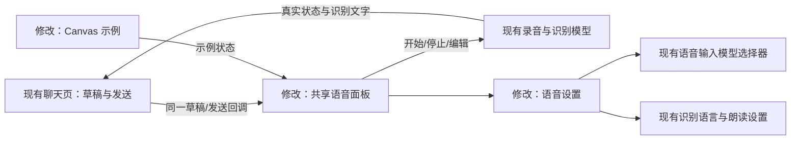
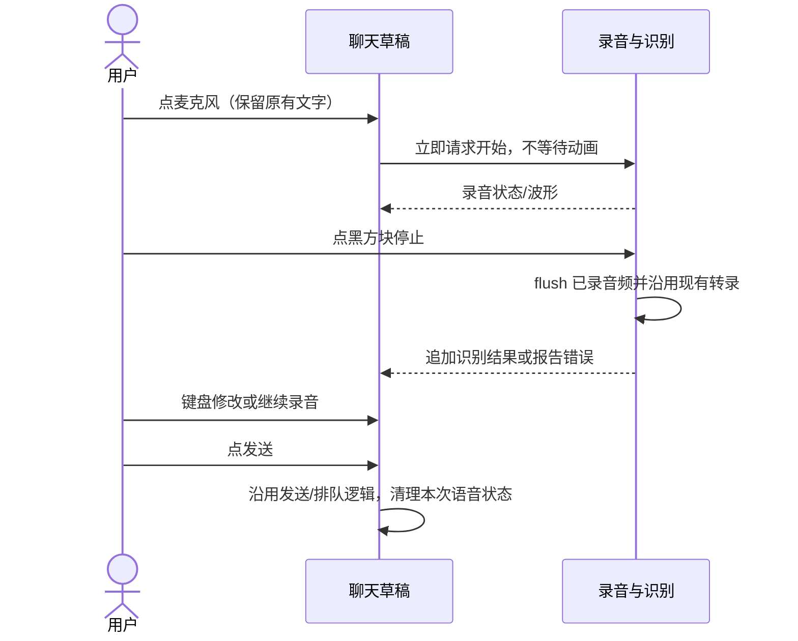
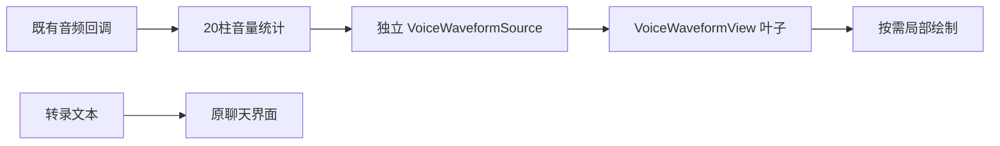
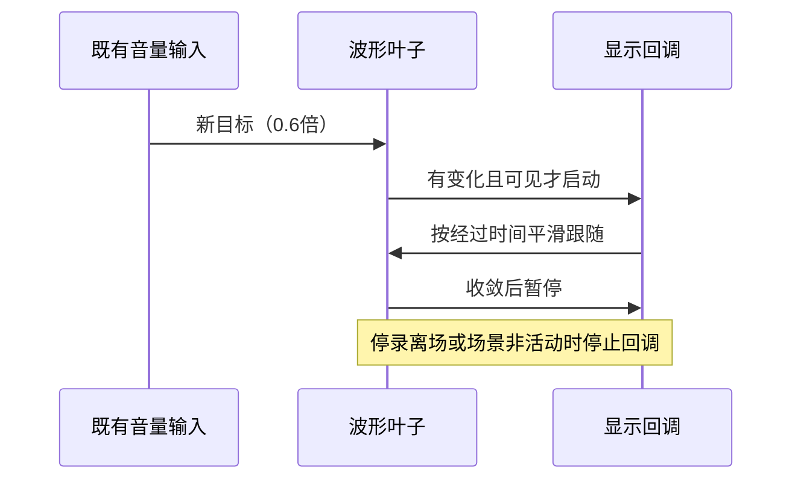

# 26-09-28 语音输入 UI 正式接入
状态：active
更新：2026-09-28

## 恢复信息
分支：main
最近核验 HEAD：40ac6a5
工作区：继承本对话已确认的 ShortVoiceComposerPreview.swift、project.pbxproj、ProviderConfigStore.swift、UnifiedModelPicker.swift 未提交修改；保留这些改动并纳入本次接入。
下一步：Build 6 已在维护者手机使用，反馈暂未遇到问题；进入提交准备。最终 0.8 倍波形专项测试未复跑、独立审查未完成，正式收尾前需补齐或明确调整验收范围。
待审批：002 至 004 审查已完成；005 调用拒绝、006 未完成且快照过时，不能用此前审查结论替代最终波形审查。后续发送按当前项目授权与工具审批执行，不追认历史调用。

## Build 6 使用反馈与提交准备（2026-09-28）
后续授权：维护者回复“提交就 ok 了”，明确要求执行已整理范围的本地 Git 提交；不推送、不重新发布、不将待补验证记为完成。下文“仅准备”保留为前一阶段记录。

维护者在当前对话确认已完成 Distribute 并在手机使用，随后反馈：“当前有一些未提交的任务, 准备提交吧, 我在使用的时候暂时没遇到什么问题”。据此记录本轮日常使用反馈良好，不再写成尚未交付手机。未提供逐项运行结果或性能测量，不将此反馈扩写为所有异常路径、波形专项测试和资源指标均通过。

本次仅整理提交范围、同步记录与检查点；不改产品源码，不暂存、提交、推送或部署设备。任务保留 active 和原始审查证据。提交分组及剩余项见 [发布记录中的提交准备](../../../docs/minisx-release-status.md#build-6-提交准备2026-09-28)。

## 任务确认与执行边界
确认状态：已确认
确认稿版本：2026-09-28 现有 Canvas UI 与本对话交互决定
用户依据：用户原话“我觉得现在设计的 UI 就不错, 可以开始创建任务并开始实现了”；前一条为“那我们先不做振动反馈, 先把 ui 搞定吧”。
真实使用目标：在聊天输入框点麦克风开始录音，文字与录音控制同屏；结束后原位检查，可转键盘编辑、继续追加语音，单独发送。
授权范围：正式 UI 与必要的录音/草稿状态衔接、本地构建和针对性测试、共用组件 Canvas；无振动，不改造流式识别服务，不自动提交/推送/发布，不安装到真实 iPhone，不创建新 Codex 对话。
执行位置：当前对话，/Users/huyuanzhao/Coding/Projects/OpenMinis，main 当前目录；无新 worktree。
设备与数据：构建 iOS Simulator；运行验证先沿用当前 Xcode Canvas。已只读核对启动中的 iPhone 18 Pro / iOS 27.0，UDID 479131C9-8187-44E7-8510-A499D7AC3034；本轮运行验证限定此模拟器，不重置已有数据。真实录音权限、硬件和服务商识别质量需真机验收，不能由模拟替代。
首轮验证与停止条件：已有文字→点麦克风→黑方块停止→等待已有识别完成→键盘修改→再录→发送；检查不丢草稿、不重复追加、不提前发送。观察工具连续失败或不能提供新证据时停止该路径，记录未验证，不扩展真实设备/网络请求。

## 目标与验收
- [ ] 共用正式组件和 Canvas，沿用已确认的 17pt 字号、104–160pt 语音正文区、24pt 圆角、44pt 点击区域、0.32s 切换动画；支持减少动态效果。
- [ ] 麦克风一次点击直接启动，不等待动画，不加触觉反馈。权限/启动失败如实呈现；启动前短暂停顿不结束录音。
- [ ] 录音/转录时隐藏 +、/、上下文占用；正文和控制同屏，黑色停止方块不发送；无 × 撤回录音。
- [ ] 停止后保留草稿，处理中的转录完成前避免发送/编辑造成丢字；键盘编辑、继续录音保留已有文字。
- [ ] 语音设置整合识别语言、现有语音输入模型选择器和朗读回复；保留已有手动 AI 纠错能力及其同意机制。
- [ ] 状态提示始终在输入面板内；显示录音/转录/失败真实状态，不假装当前批处理识别能实时出字。
- [ ] 真实发送/队列语义沿用聊天页；防止录音中手势/快捷键绕过结束和检查；发送后回到文字入口。
- [ ] 构建、针对性草稿/异步边界检查与 Canvas 验证分别记录；真机语音和键盘验收尚待验证。

## 上下文与决定
- 已确认原型：src/ios/Views/Chat/Voice/ShortVoiceComposerPreview.swift。
- 正式入口：AIChatView.inputFieldOrWaveform、inputBottomRow、micButtonContainer、performSend/performEnqueue。
- 现有 InlineVoiceInputView 包含旧折叠 UI、转录镜像、模型设置、手动纠错；本轮替换布局，保留必要业务。
- VoiceInputViewModel（VoiceInputPanel.swift）管理 VAD、段落识别、重试。流式转录另做，当前 UI 诚实显示批处理状态。
- 两份草稿的同步与晚到识别结果是本轮核心风险；停止必须走 flush 路径，不能直接 reset 丢掉当前录音。

## 设计图
图的状态与版本：实施方案 v1，2026-09-28；交互已获用户确认，具体代码结构由实现核对。

### 功能位置与关系图

### 典型场景运行图

实现对应与修订：共享组件为 VoiceComposerPanel；InlineVoiceInputView 连接真实服务；AIChatView.beginVoiceInput/returnToKeyboard/performSend/performEnqueue 负责出入口；VoiceInputViewModel.startFromComposer/finishFromComposer 负责录音与收尾。图中的共享组件和已有选择器关系已与源码核对。

## Spec 阅读清单
无命中 AGENTS Spec Index 的原生能力/URL/数据库协议改动。按需参考现有语音纠错实现及其用户同意约束；不改变识别提供商协议。

## 实现计划
- [x] 从已认可原型提取共享布局并使 Canvas 使用正式组件。
- [x] 正式聊天接入即时开始、停止、键盘与草稿同步，保留设置和纠错。
- [x] 校验识别回调时序/失败与发送边界，运行针对性检查和构建。
- [ ] 检查最终代码/交互，记录验证边界和独立审查状态。

## 进展与验证
2026-09-28：任务创建，读取现有实现；尚未完成正式接入。现有原型的编译/Canvas 证据不代表正式功能验收。

## 阻塞与纠偏
原型阶段自动审批拒绝向 DeepSeek 外发源码；本次不绕过该限制。正式接入先完成本地实现与验证，独立审查保持未完成。

## 审查
待最终固定快照和本地检查。

2026-09-28 实现进展：VoiceComposerPanel 已提取并通过 iOS 26 目标类型检查；Canvas 使用同一组件。AIChatView 与 InlineVoiceInputView 已接入新的工具栏、设置和键盘路径，发送/手势受录音忙碌状态约束。VoiceInputViewModel 生命周期调整进行中，尚未构建整体或运行验收。

2026-09-28 本地界面复核：只读审查发现的中断提示遗漏、正式麦克风34pt命中与预览44pt不一致，均已修正；语音发送外观也提取为共用 VoiceComposerSendLabel。历史消息编辑时增加模式标识与原退出入口，录音忙碌时禁止退出以免丢字。正式 PastableTextView 的键盘/高度行为仍需运行验证，不能由 TextEditor 示例替代。该本地复核不替代尚未进行的 Pi 独立审查。

验证工具：XcodeBuildMCP 默认使用 CommandLineTools，不能解析模拟器工具；改用已安装的同一 AXe 工具并仅为命令指定 DEVELOPER_DIR，已成功读取目标模拟器 UI。未修改全局 xcode-select，也未新增模拟器。

2026-09-28 集成自检：修正录音期间跳过 provider config 更新导致下一轮仍用旧模型的问题；每次继续录音先 prepare、重新解析，再以当前草稿播种。命令行 diff 检查通过，共享面板独立类型检查通过；Xcode 自动构建先后成功，但最终生命周期修正后仍需重新构建。Canvas 当前停留在载入状态，尚不能算本轮视觉验收通过。

## 本轮交付与验证（2026-09-28）
实施：正式面板、文字出入口、黑色停止方块、灰框内提示、既有模型选择器、语言/朗读/手动校对设置均已接入；不含触觉反馈或流式 ASR 改造。录音期间静音只分段，保留原五分钟总上限。启动请求、离场后的迟到回调和最终音频收尾均有状态保护；正常分段和自动重试结果按录音顺序释放。

主 Agent 已逐段核对 UI 与 VoiceInputViewModel 的实际改动。生命周期子代理完成主要实现；主 Agent 接手补完 generation 防护、Speech 权限失败、取消释放与针对性测试。追加的本地复核不能替代 Pi 审查。

### 通过的检查
- `git diff --check`；共享面板以 iOS 26 目标独立类型检查。
- 正式 App 和测试宿主编译通过。`VoiceComposerLifecycleTests` 5 项全部通过：乱序结果按顺序追加、失败不阻塞后续文字、清空缓冲、转键盘保留草稿并拒绝迟到音频、启动任务运行前离场使其失效。
- 最终 VM 测试日志：`/private/tmp/minisx-voice-ui-tests-final.log`；测试结果：`/Users/huyuanzhao/Library/Developer/Xcode/DerivedData/Minis-cfpxwfypujsbkhabpmwgqdxwcrrx/Logs/Test/Test-Minis-2026.09.28_09-16-20-+0800.xcresult`。
- 模拟器实际发现转键盘后焦点被离场视图清除。改为切换动画 removed 完成后请求焦点，修复后再次构建成功，日志 `/private/tmp/minisx-voice-ui-focus-build.log`。此修改不改变已通过的 VM 测试逻辑；后续以真实界面路径验证。
- 在 UDID `479131C9-8187-44E7-8510-A499D7AC3034` 的正式 App 中核对：麦克风入口显示新面板；拒绝麦克风时提示位于灰框内；语音模式无 +、/、上下文控件；语音设置含语言、模型、朗读；模型入口打开既有模型分组/系统在线离线页；完成能返回设置再返回面板；键盘入口恢复普通输入框与软件键盘。截图与 UI 树见 evidence/。
- 运行检查仅临时把该模拟器的麦克风权限从已授权改为拒绝，结束恢复已授权；未调用实际录音/识别或发送消息，未修改模型选择。

### 工具失败与验证边界
- 首次命令行构建被 Canvas 并发占用 build.db 阻止；不是源码编译错误。
- 首次无签名测试宿主因缺少 App Group entitlement 在启动时退出；改用模拟器本地签名后同组测试通过。未改变工程签名配置。
- 自动化脚本原先按 Keyboard 类型查找键盘，但此系统将它暴露为带 UIKeyboardLayoutStar 标识的 Group；已用截图与焦点日志纠正判断。
- 键盘显示已证实，但硬件键码和软件按键自动化都未成功写入临时文字，草稿往返运行断言未通过。没有把工具输入失败判成产品文字丢失，也未把 VM 草稿测试当成真实键盘编辑验收。停止扩展此工具路径，保留原始日志。
- Canvas 本轮曾停留在载入画面；生产组件与预览已共用且编译通过，但不记为最终 Canvas 渲染验收通过。
- 真机实际录音、停顿、尾句完整性、网络重试、多段连续转录、真实键盘修改后继续录音、发送/排队、动态字体和深色模式仍需运行验收。流式实时出字尚未实现。
- Pi 独立审查仍未完成：此前自动审批拒绝源码外发；未绕过。任务维持 active，不归档、不标记全部验收完成。

## 独立审查 001：语音面板接入与录音草稿边界
2026-09-28 用户明确指令：“先发送审核吧”。本轮仅固定代码、发送独立审查并核对报告，不据此直接扩大修改范围。
范围：当前 main / 40ac6a5 之上的 9 个新增/修改源码与工程文件，加 VoiceActivityDetector、VoiceProviderResolver、SystemVoiceProvider、VoiceOutputPlayer、VoiceInputModels、ChatInputBar、AIChatViewModel 等直接协作代码。本任务记录作为确认需求；不发送截图、用户会话、凭据、其他任务或项目外资料。
重点：启动/停止/退出与权限请求的异步竞态，尾段 flush 和静音停顿，分段结果顺序与自动/手动重试，语音草稿与键盘编辑同步，发送/排队防护，既有设置/模型/校对入口兼容性，以及正式组件与预览是否一致。区分可证实缺陷、待运行核实疑点和工具证据限制；不得把无真实音频/键盘输入证据推断为已通过。
固定快照放在当前 Codex 工作区的 review-bundles/20260928-voice-ui-001（仓库外）；审查导出目录为 reviews/001 语音面板接入与录音草稿边界。

2026-09-28 审查发送结果：已准备并核验快照 a22c1367，但网络调用在进程创建前被自动审批拒绝，未发送、无报告。拒绝及文件清单保存于 reviews/001 语音面板接入与录音草稿边界/dispatch-blocked.md。此处更新仅记审批状态，会使 001 的任务文本 freshness 过期；源码未变，原快照保留，获明确授权后另准备新轮次。

## 独立审查 002：语音面板与草稿边界（明确授权后发送）
上一条助手已具体说明向 DeepSeek / deepseek-flash 发送 21 个相关源码文件和本任务记录，提供全部文件清单，并排除凭据、用户会话及其他任务。用户对此直接回复：“我真是服了, 自从我设置了 Pi 来审核之后, 没有一次自动发送成功的, 我都说了你就发送就完了, 怎么老卡我啊”。这构成对已明示目的地和范围的明确发送授权，无需再问。
保持 001 的同一源码范围，仅更新任务授权记录后重新固定快照；通过相同 Pi 入口发送，不绕过审批、不改变接收方、不扩大文件范围。

2026-09-28 审查 002 已成功发送并完成：Pi 0.85.1 / DeepSeek deepseek-flash，返回 nonblocking / 5 项意见。原始 report.txt、report.json、report.md、status.json、manifest 和 bundle 位置均保存于 reviews/002 语音面板与草稿边界；主 Agent 已另写 resolution.md 核对意见，不把 Pi 结论当验收。源码未修改；前述“外发阻塞/独立审查未完成”均为历史状态，本轮已解除。后续仍需意见处理和运行验收。

## 背景材质统一（2026-09-28）
用户反馈：“用 Device hub 就 ok”“语音输入界面的颜色与文字输入界面的背景色不一致”。后续使用 Device Hub；已停止当前模拟器的 serve-sim 网页镜像。
已确认原因：ComposerSurface 的 voiceStyle 分支使用 secondarySystemBackground 实心背景，文字模式使用已有 regular glass。移除语音专用材质分支，保留原有圆角/尺寸和动画；生产面板、独立语音预览、文字预览共用 ComposerSurface，InlineVoiceInputView 仍由外层绘制背景以免叠加。录音和识别逻辑未改。
本次只处理用户指出的颜色差异；002 审查原始证据不修改，其他意见与完整运行验收仍待继续。
验证：git diff --check 通过；正式 App Debug 模拟器构建成功（/private/tmp/minisx-voice-ui-surface-build.log），已在同一 UDID 479131C9-8187-44E7-8510-A499D7AC3034 安装并启动。背景统一的代码已逐处复核；未触发录音/服务商调用，模式切换后的视觉效果留给用户在 Device Hub 核对。本次未新增生命周期测试或独立审核轮次；既有整体任务仍为 active。

## 语音入口动画重叠核查（2026-09-28）
用户要求确认点击麦克风到显示语音界面时文字与背景重叠。本次仅调查，未修改源码。
在既定 iPhone 18 Pro / iOS 27.0 模拟器（479131C9-8187-44E7-8510-A499D7AC3034）实际复现：旧文字输入占位文字、+ / 等按钮尚在渐隐，新语音标题/正文已出现；背景高度正从短输入框向上展开，中间数帧形成重影和临时裁切。最终布局能稳定，问题位于切换过程。录像约 3.57–3.93 秒可见，证据为 evidence/语音入口动画重叠.mp4 与语音入口动画重叠关键帧.png。
源码对应：beginVoiceInput 对 voiceInputActive 使用 withAnimation；inputFieldOrWaveform 的 AnyView 内容替换与 inputBottomRow 条件移除没有显式统一过渡，外层 ComposerSurface 同时改变尺寸。逐帧证实重叠；具体修复尚未实施或验收。
测试为权限拒绝路径以免采集声音/请求识别：仅临时撤销此 App 在模拟器的麦克风权限，结束已恢复原已授权状态；未发送消息。初次录制未等重启就绪，后一次默认点击只激活输入框，均未作为复现证据；最终核对 voice.enter 后使用 physical 触摸，录后 UI 树确认 voice.keyboard 存在。实际授权录音时的状态更新时序仍未单独验证。

## 语音入口动画修复（2026-09-28）
用户明确要求“修改啊”，授权直接修复上述已复现的切换重叠。正文和文字工具栏合为同一内容容器；新增 ComposerContentTransition，仅在 isVoice 改变的事务中清除 animation 并设置 disablesAnimations，阻止旧 UIKit 文本、工具栏与新语音内容交叉渐隐/位置插值。外层 ComposerSurface 保持原 0.32 秒尺寸/圆角动画；正式和 Canvas 共用此边界。录音启动、停止、草稿与权限逻辑未改。
第一候选（compositingGroup + id + 非对称 opacity/identity transition）编译成功但录像仍有残影，已舍弃；没有以编译成功当修复完成。最终事务方案编译通过，日志 /private/tmp/minisx-voice-transition-fix2-build.log。
最终版本已安装并启动于既定 iPhone 18 Pro / iOS 27 模拟器。实际双向切换录像与关键帧保存于 evidence/语音切换动画修复.mp4、语音切换动画修复关键帧.png、语音切换返回文字关键帧.png；入场约 3.8–4.3 秒逐帧检查，旧占位文字及 + / 工具栏不再与新语音内容同屏交叠，背景尺寸继续平滑变化；回文字后光标恢复。UI 树有键盘节点但本轮截图未显示软件键盘，不作为软件键盘弹出新证据。
仍使用临时拒绝麦克风路径以免采集声音；权限已恢复已授权，App 已重开。该证据覆盖视觉模式切换，不代表真实录音/转录完成验收。正在对本次局部改动做独立审查，整体任务仍 active。

本次局部 Pi 审核 003 在进程创建前再次被自动审批拒绝；明确理由和快照见 reviews/003 输入模式切换动画/dispatch-blocked.md。未绕过或发送，已列明五个源码与 DeepSeek 目的地请求具体确认。本地动画修复已完成并部署；审核状态保持未完成。

用户随后对列明五个源码、审核说明和 DeepSeek/deepseek-flash 的具体问题明确回复“允许发送至 DeepSeek”。本轮在该新明确授权下重试同一未变的快照 edfc4cab；工具审批已通过，Pi 已启动。dispatch-blocked.md 保留为先前被拒的历史；不得将已启动当完整报告。

003 审核已在用户明确允许后成功完成，Pi 返回 nonblocking / 5 项意见；原始报告、固定快照索引和主 Agent 逐项处理记录均保存于 reviews/003 输入模式切换动画。无动画回调疑点已对照 Apple 官方文档纠正；短暂展开裁切/特殊状态保留为验证边界。当前局部重影修复完成并已部署，整体语音任务继续 active。

## 录音状态控件交叠及提示时长（2026-09-28）
用户截图指出录音点与设置文字重叠，并反馈“解析失败”的深灰胶囊停留太长。原因是前次只约束文字/语音模式事务，VoiceComposerPanel 仍对整个 phase 使用隐式 smooth 动画，使 idle 设置行与 recording 波形行交叉渐隐。
修复：移除面板全局 phase 动画，在面板内容上加 transaction(value: phase) 清除 animation 并设置 disablesAnimations，位于背景之前；待机、录音、转录控件直接替换，外层背景仍保留伸缩。VoiceInputViewModel.report 的语音失败胶囊 duration 从 2.2 改1.0秒，全局 MinisToast 未改，其既有淡出为0.3秒，错误原因继续由 lastFailure/面板提示保留。更新失效的旧折叠面板注释。
正式 Debug 模拟器构建通过：/private/tmp/minisx-voice-phase-toast-build.log；diff --check 通过。新版本已安装并启动到既定 iPhone 18 Pro / iOS27 / 479131C9-8187-44E7-8510-A499D7AC3034。录像 evidence/录音状态切换与短提示.mp4：先从文字点麦克风，再在语音待机点麦克风；高帧率抽帧在约8.8秒显示开启麦克风的 recording-phase 波形与停止键，旧设置文字及继续录音按钮已退出，没有两组控件交叠，随后返回idle。证据为录音控件切换关键帧.png。
为避免采集声音，使用临时拒绝麦克风的真实启动路径；只覆盖isStarting时的recording布局和失败回idle，未将其写成实际持续录音验收。结束恢复原已授权权限并重开App。胶囊下半屏像素计数与帧图共同核对：明显可见时间分别4.467–5.633秒（1.167秒）、8.967–10.100秒（1.133秒）；这是画面阈值估计，包含淡入淡出时的低对比帧时长不计，代码上1.0秒后开始0.3秒淡出。实际“解析失败”服务商未被故意触发，与麦克风失败共用report路径。

004 局部复审已直接发送成功（沿用本对话已明确允许的相同接收方及源码子集），返回 nonblocking / 3项意见。主 Agent 对照真实入口、MinisToast默认1.6秒及Apple transaction(value:) 文档核对；原报告和resolution保存于reviews/004 录音控件切换与失败提示。本轮两个局部修复完成并部署，持续真实收音及整体语音验收仍未声称完成。

实时转录后续：用户明确要求创建独立项目任务，已建立 [26-09-28 实时语音转录](<../26-09-28 实时语音转录/task.md>)，状态planned。此前实时识别延期现进入规划；本UI任务及其未完成验收继续保留，不自动归档。

实时转录任务续接更新（2026-09-28）：新对话已沿用本UI实现接通系统连续音频/中间结果，当前源码仍在同一main工作区；本任务已认可的布局、背景、状态事务和1秒失败提示保持。实时任务完成代码与自动验证，真实声音/键盘编辑续录/实际发送等验收仍开放，详见 [实时语音转录](<../26-09-28 实时语音转录/task.md>)。本UI任务仍active，不因实时代码接入而自动完成或归档。

### Build 5 内部测试交付
2026-09-28，维护者明确要求递增Build并上传TestFlight Internal后在自己的iPhone测试；本任务语音UI与实时识别改动已一并打包为1.13（5），13:02:41 Apple接收成功，上传结束时Processing。归档、签名与四个产品编号核对通过。内部组可用和手机安装未独立核实；真实交互验收仍待维护者反馈，任务保持active。详见 [发布状态](../../../docs/minisx-release-status.md) 和关联实时语音转录任务。

## B 波形平滑跟随（2026-09-28）

用户已在手机验证系统实时转录效果满意，反馈点状波形卡顿；该反馈不自动关闭其他未验证路径。经过同输入动画对照，用户选择 B，当前参数跟随时间 40 ms、灵敏度 0.6 倍，上升回落同速、无停留无弹跳。明确实施授权：“好的, 按照 B 的方式调整动画吧”。同对话已确认资源规范，全文必读：`docs/specs/resource-efficiency.md`。

本轮沿用 main 和当前目录，保留已有实时识别与 UI 修改。只修改波形组件、专用数据通路、PCM 音量统计及预览/针对性测试；识别服务、采集频率、文字合并、既有模式切换不改。使用原指定 iPhone 18 Pro / iOS27 / 479131C9-8187-44E7-8510-A499D7AC3034 构建和合成输入的组件验证，不新增真人录音、不安装真机、不上传 TestFlight、不提交。XcodeBuildMCP 因全局 CLT 无法找到 simctl，沿用命令级 DEVELOPER_DIR；不更改全局开发工具选择。

实现方案：独立可观察波形源仅被叶子读取；40 ms 一阶平滑按实际时间计算，最多 20 柱；使用按需显示回调只驱动局部绘制，请求上限 60Hz，系统可降频。稳定时暂停、离场/后台释放显示回调，减少动态效果时直接更新；音量仍使用原有约20Hz投递。选择 UIKit 小型绘图桥接以显式控制调度/收敛/释放，不给整个 SwiftUI 面板附加逐帧状态。移除音量统计中的整段数组复制和分块临时数组。

验收：参数与 B 对齐；新目标接续当前显示值；不会因波形发布 VoiceInputViewModel.objectWillChange；稳定输入停止逐帧工作；减少动态效果、场景切换、卸载释放有明确覆盖。先验证纯插值和生命周期，再构建指定模拟器并核对正式组件。工具无法提供新证据时停止扩展，真机流畅度/CPU/GPU/能耗不以模拟器结果替代。独立 Pi 审查必须显式携带资源规范全文。

当前：实现中，待组件集成、构建测试和 Pi 审查；本轮不声明真机体验或能耗已验证。

B波形本地结果：2026-09-28，五个生产/预览文件及VoiceWaveformTests已完成；无识别服务或音频采集频率变更。固定20柱CALayer，原始音量源与父模型通知隔离，40ms/0.6一阶对称跟随，显示回调稳定后及场景非活动/卸载时失效；无新增逐帧Task或永久Timer。PCM统计移除整段复制及20组临时平方数组。七项专项测试在指定Simulator通过，包含正式SwiftUI叶子到UIKit渲染的源更新与停止检查；源码编译通过。日志 `/private/tmp/minisx-waveform-b-tests4.log`，结果 `/Users/huyuanzhao/Library/Developer/Xcode/DerivedData/Minis-cfpxwfypujsbkhabpmwgqdxwcrrx/Logs/Test/Test-Minis-2026.09.28_13-51-50-+0800.xcresult`。此前共享缓存占用、并行克隆失败和固定等待测试失败均保留原日志，未冒充通过。

独立审查：005在进程创建前被自动审批拒绝，原因见同轮dispatch-blocked.md；准备006最终快照，待明确补充本轮八文件/资源规范载荷授权，未绕过。CPU/GPU/能耗、真机实际手感未实测，手机仍是已交付Build5，不宣称本次动画已更新到手机；本任务保持active。

### B 波形灵敏度调整为 0.8（2026-09-28）

用户直接要求：“灵敏度用 0.8 倍吧”。当前正式参数改为40ms/0.8，升降同速和按需刷新/释放策略保持。同步修改两项已有测试中的三处倍率/响应/最终高度断言。此调整取代上文0.6参数；保留旧测试与审查快照为历史证据，不将其视为0.8版本的运行结果。

只读检查时没有已启动的Simulator。本次为单个数值调整，完成源码/断言一致性与diff检查，不为此启动设备或重复全量构建；0.8版本的设备测试尚未执行。005外发拒绝与006待授权状态保留；006快照已因本次参数修改过时，后续获准审查时需准备新快照。未发布、未更新手机、未提交或推送。
