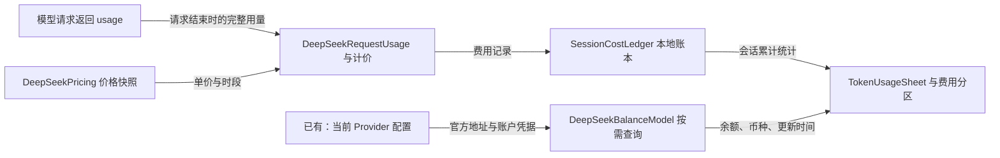
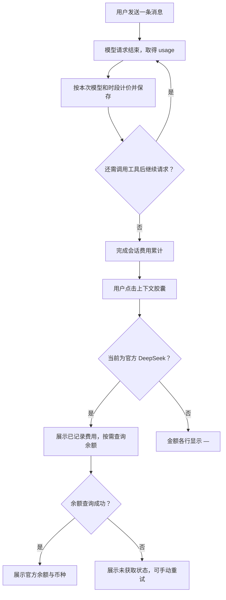

# 26-09-29 DeepSeek 会话费用与账户余额
状态：active
更新：2026-09-29

## 恢复信息
分支：main
最近核验 HEAD：272da5d
工作区：本功能源代码和任务记录未提交；其他对话的发布文档及旧任务归档不属于本次范围。
下一步：本次指定 Simulator 新对话正常路径已通过；其他模型切换、旧会话 UI 及手机验收未覆盖，按需要继续。
待审批：无；按用户 v2 明确修订的需求实施。

## 任务确认与执行边界
确认状态：已确认。用户在 v1 确认稿后明确指定最终显示项、历史范围和币种；直接修改指令作为本次有界实现授权。
确认稿版本：v2，2026-09-29，当前对话。
确认原话：“费用与余额”中，不显示“本轮估算费用”，只显示剩余两项即可。旧对话就先不显示。币种默认使用人民币。
用户依据：用户要求“计算当前会话的消耗量”“获取并计算余额”，并指定上下文、Token（会话总计）、缓存（会话总计）、金额、速度、深度思考、Agent 循环的顺序；金额需同时显示“本轮估算费用”及余额；其他 OpenAI 兼容模型显示“-”。
真实使用目标：点击输入框上下文胶囊，查看当前会话用量、DeepSeek 费用和当前账户剩余余额。
授权范围：实现本次明确功能、必要本地测试与构建、既有授权内 Pi 审查；不部署设备或发布。
执行位置：当前对话，/Users/huyuanzhao/Coding/Projects/OpenMinis，现有 main 工作目录，以未提交修改交付。
实现文件范围：用量页面、请求用量归属与持久化、DeepSeek 计价与余额服务、对应本地化、必要测试、Harness 记录。
设备与数据：计划执行本地逻辑测试与 iOS 构建；不部署到手机、不读取或复制真实 API Key 到测试材料。真实账户端到端验证单独绑定设备与用户授权。
外部操作：余额功能运行时仅向 DeepSeek 官方余额端点发送该 Provider 的 Key；Pi 审查沿用项目既有授权，不包含凭据。无提交、推送、TestFlight 发布。
首轮验证与停止条件：先用固定 usage 与模拟余额响应验证一次发送含多次工具请求的计价与呈现；结果可观察后补会话恢复、切换模型与失败路径。构建/审查不可用时如实记录，不扩展到设备或新工具链。

## 目标与验收
- [x] 点击原有上下文胶囊进入原有“会话 Token 用量”页面。
- [x] 顺序固定：上下文 → Token（会话总计）→ 缓存（会话总计）→ 费用与余额 → 速度 → 深度思考 → Agent 循环。保留现有条件显示语义。
- [ ] 会话 Token、缓存累计口径沿用全部已记录模型请求；不把最后一次上下文数当作累计用量。
- [ ] DeepSeek 官方已知价格模型按缓存命中、未命中、输出分别计价；同一请求流式累计 usage 只结算一次，一轮中的多次模型请求分别累加。
- [x] 费用区只显示会话累计估算费用和账户余额；人民币 CNY，不显示本轮费用。
- [ ] 切换到其他 OpenAI 兼容模型，金额各行显示“—”，不请求其余额，不显示上一 Provider 的旧值。
- [ ] 余额取官方 total_balance，保留 currency；不将赠金和充值金额重复叠加到总余额，不以本地费用再次扣减服务端余额。
- [ ] 余额请求失败或未知时显示“—”和简短状态；旧缓存如保留必须标示更新时间，不能伪装为最新余额。
- [ ] 历史费用没有可靠价格/来源记录时显示未知或明确的不完整状态，不能用今天价格冒充历史账单。
- [ ] 不读取/记录/发送与本功能无关的凭据；仅使用 CNY，未返回人民币余额时显示“—”，不隐式汇率换算。

## 上下文与决定
已核实：main 工作区在计划前干净。TokenUsageSheet 位于 src/ios/Views/Chat/AIChatView.swift:6064，当前 Thinking 在 Context 后。OpenAIAgentProvider.swift:253 已解析缓存字段，inputTokens 已扣除缓存。AIChatViewModel.swift:5747 在主循环逐请求累加会话 Token；AIChatViewModel+Persistence.swift 的会话加载从 rawMessages 重建总计。

实现规则：
- 通过官方 HTTPS 主机与实际模型 ID 识别可计价 DeepSeek，不只根据名称包含 deepseek。第三方平台的同名模型按用户要求显示“—”。
- 会话费用与现有会话 Token 统计使用相同范围：主聊天及工具循环中的模型请求；不含标题生成、上下文压缩、minis-model-use 等独立工具服务。页面已说明范围。本轮费用不展示、不单独汇总。
- 金额计算使用十进制定点/Decimal，保存实际模型、请求时间、价格版本及用量完整性。API usage 缺失与 0 区分；中断/重试不能伪装完整用量。
- 价格快照 2026-09-29，使用请求开始时间在北京时间确定峰/闲档并持久化时间依据；跨峰谷请求仍是估算，不声称与账单精确一致。未知年份或无法确认的调休日价格不伪造。
- 余额按当前 Provider 账户隔离，打开页面按需刷新；短缓存与手动刷新；无定时轮询。关闭页面取消页面发起的无用请求；切换配置拒绝旧响应。
- 余额展示官方返回数值，费用独立估算，不用余额差推断本轮支出。

已决定：仅会话累计估算费用、账户余额；默认人民币；历史会话不补算，旧会话隐藏费用区。新建会话建立独立的本地费用记录，既有会话不登记。

官方资料（前一轮核实 2026-09-29）：
- https://api-docs.deepseek.com/zh-cn/quick_start/pricing/
- https://api-docs.deepseek.com/api/get-user-balance/
- https://api-docs.deepseek.com/zh-cn/api/create-chat-completion/

## 设计图
状态：当前实现 v2，2026-09-29；24 项逻辑测试及完整 iOS 构建通过，未做手机实测。

### 功能位置与关系图

### 典型场景运行图

实现对应：页面 TokenUsageSheet / SessionBillingSection；OpenAIAgentProvider 在 usage 中附加严格验证的 DeepSeekRequestUsage；processStreamEvents 每次流开始、结束向 SessionCostLedger 登记一次。ChatStore 创建本地新会话时登记，旧会话和导入会话不登记。SQLite 外键随会话删除清理；请求记录保留实际消费，不随消息编辑删除回退。AIChatViewModel+Billing 读取 O(1) 累计结果；费用本地持久化，不通过 iCloud 同步。

## Spec 阅读清单
必读：docs/specs/resource-efficiency.md 全文；.agents/skills/plan-task/SKILL.md 全文；AGENTS.md；docs/harness/record-formats.md。
SwiftUI 参考：/Users/huyuanzhao/.codex/skills/swift-expert-skill/SKILL.md 及 references/latest-apis.md；实际实现按需加载状态、列表、页面生命周期参考。

## 实现计划
- [x] 根据用户直接修订确认 v2：仅会话累计、余额、人民币、旧对话不显示。
- [x] 建立请求费用计算、归属与可恢复记录，先通过固定样例验证峰谷、缓存、多次调用去重。
- [x] 实现隔离账户的余额服务与有界刷新、取消逻辑。
- [x] 按确定顺序调整页面，加入金额与失败/未知显示，补中文本地化。
- [x] 验证会话恢复、模型/账户切换、无 usage、查询失败；完成 iOS 构建和静态检查。
- [x] 主 Agent 核对实际改动后，按 Harness 请求独立 Pi 审查并处理核实的问题；绑定最终代码和测试证据。

## 进展与验证
已完成：页面重排、人民币两项金额、严格官方端点识别、价格解析、按请求登记与去重、本地恢复、余额查询、取消与账户隔离。主 Agent 已检查实际改动及最终测试源码。

最终验证：
- 24 项 XCTest 全部通过：10 项计价/币种/端点边界、3 项严格 usage 解析、6 项 SQLite 去重/不完整/恢复/删除、5 项余额取消/切换/缓存/请求构造。使用与生产文件 SHA-256 一致的 Foundation/Combine/SQLite 源码副本在临时 SwiftPM 包运行；没有启动 iOS 应用或真实网络余额请求。Xcode Developer 环境运行，首次沙箱缓存写入受限后获准完成测试。
- Debug iOS Simulator 通用目标最终构建成功，未部署任何模拟器或手机。编译集成与逻辑测试证据不能替代界面与真实账户实测。
- git diff --check（src/ios）通过；源文件、测试、构建日志和 SHA-256 记录见本任务 evidence/。
- 初轮测试发现峰时判断缺少年份导致金额取错，已修复，并以上述 24 项最终测试重新验证。

独立 Pi 审查已完成（nonblocking），主 Agent 已逐条核实并保存 resolution.md：修复地址前后空白识别不一致，补充两种缺失缓存字段断言；最终 24 项测试和 iOS 构建再次通过。原 Pi 快照保持不变，修复后的单行逻辑由主 Agent 针对性复审与最终源码摘要绑定。

待完成：手机实际点击/展示与真实账户端到端验收。目标清单尚未整体勾选，不代表源代码功能未实现，而是避免将静态检查、逻辑测试和编译替代运行验收。任务保留 active；未提交、未推送、未部署。

## 资源边界与当前限制
- 每个主聊天请求开始/结束各写入一次，流式片段不写盘；累计值 O(1) 读取，单请求记录随会话删除级联清理。
- 余额请求只随费用页面出现/账户变更/手动刷新触发；页面退出取消，禁重定向、禁 Cookie/磁盘缓存，12 秒请求超时/15 秒总超时，响应上限 16 KiB。单页面只缓存一个账户结果，缓存最长60秒，不后台轮询。
- 其他 Provider、不完整用量或未支持价格不能产生伪造零金额。价格快照保留版本与来源；2026 以外日历暂无确认，显示不可估算。真实账户账单、真机能耗未验证。
- 工作期间另有对话更新 release-status 与归档旧任务，本任务不修改、不审查这些范围；只绑定本功能源代码、当前任务记录和适用规范。

## 2026-09-29 Simulator 验证授权
用户明确要求“你用 Simulator 新开一个对话做尝试”。本次限已启动 iPhone 18 Pro / iOS 27 / 479131C9-8187-44E7-8510-A499D7AC3034，安装当前已构建应用 com.yyzzzor.minisx，使用模拟器已有配置新建对话，发送简短测试请求并检查费用/余额与页面。允许该新对话的实际模型请求和余额查询；不导出凭据、不部署手机、不更改其他现有对话。此前无部署范围由本次明确指令对该模拟器有界扩展。

## Simulator 当前结果
指定 iPhone 18 Pro 的真实新对话正常路径已通过：实际模型回复 OK、Token 输入10294（含缓存640）/输出2、仅一条计费记录；精确累计 ¥0.0193496，UI ¥0.0193，实际余额查询 UI ¥40.23。两行、人民币、列表顺序均已通过控件与截图核验。见 evidence/simulator-2026-09-29/validation.md；其中明确记录 UI 输入工具限制、LLDB 仅注入测试文本、另一预览实例端口占用及临时配对已撤销。未读取 API Key、未改源码、未部署真机。此前“真实账户未验证”的历史记录由本段对该正常路径更新，其他未覆盖范围仍保持开放。

## 2026-09-30 归档就绪核对

用户询问本任务是否可归档。按当前 archive-task 技能核对后，本次保留 active；没有修改实现、部署设备、启动测试或重新审查。

已确认的完成证据：
- evidence/source-sha256.json 中 17 个生产/测试/配置文件与当前文件逐一比对，全部一致。未发现需要仅因代码漂移重跑验证的依据。
- 原有 24 项逻辑测试、iOS 构建及 Pi 审查处置记录存在；Pi 为当时已执行的历史证据，当前暂停 Pi 不要求为归档机械重做审核。
- 2026-09-29 指定 Simulator 的新 DeepSeek 会话已验证真实请求、计费记录、人民币费用、实际余额与页面顺序。早先“尚无真实账户运行证据”的表述对该正常路径已被后续证据覆盖。

尚未关闭的事项：
1. 验收清单仍有未勾项。已有逻辑测试可用于关闭其对应的计算、去重、余额解析、隔离和持久化条件；不能将未勾选直接解释为功能缺陷，也不能一键全部勾选。其他模型切换显示占位、旧会话隐藏费用的 UI 运行场景尚无证据，任务历史记录仍保留运行验收开放状态。后续收尾应按原确认范围逐项注明证据层级，并仅对有实际必要的缺口补验证。
2. 受影响的长期 Spec 尚未覆盖本任务的会话费用统计范围、两行人民币展示、旧会话隐藏及未知费用/余额语义；当前 Spec 索引和 Provider 路由 Spec 只有一般用量身份约定。本任务也没有“无须维护”的具体理由，尚不满足当前归档规则中的 Spec 同步条件。应与正在进行的 Spec 文档工作协调后补齐，避免重复创建或覆盖其文件。

下一步：完成上述验收记录与 Spec 收尾后再判断归档。手机实测、真机能耗、全部实网错误场景不因这次归档判断自动成为新增必做项；未提交不是阻塞，不要求为了归档提交或推送。原始审查报告和证据保持不变。
