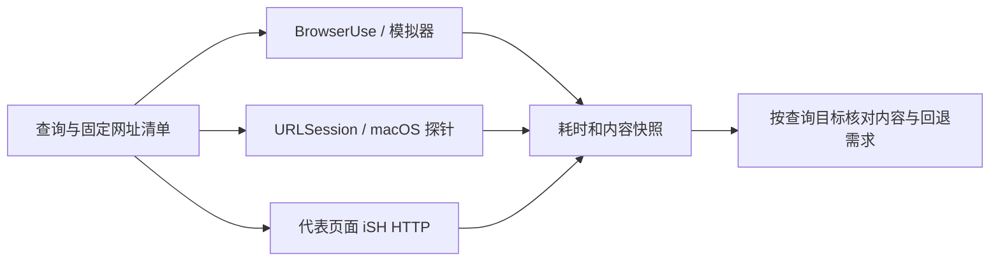
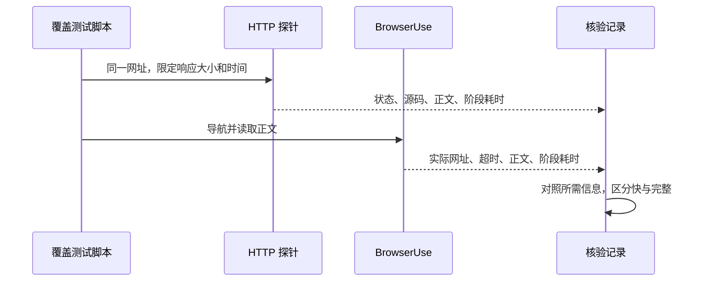

# 26-10-01 网页获取广覆盖对照测试

状态：完成（2026-10-01）　｜　Spec：`docs/specs/ios-browser-automation.md`、`docs/specs/resource-efficiency.md`、`docs/specs/ios-sandbox-ish-summary.md`　｜　验证：[verification.md](verification.md)

## 目标

以真实查询需求和可控页面覆盖现有 BrowserUse 与直接 HTTP 获取的速度、正文完整性和失败方式，确定哪些情况适合 HTTP 优先、哪些必须回退浏览器或其他读取方式。测试不改变产品行为，不安装 Pi 或 Node，不共享浏览器认证状态，不提交或推送。

## 方案

1. 官方定价、静态技术文档、动态文档、新闻、中文百科、搜索结果、PDF 等真实页面：固定同一网址，分别访问，保存快照和分阶段耗时。
2. 本地可控页面：延迟子资源、JavaScript 正文、登录提示、慢主响应、图片表格和跳转；以已知内容作为验收依据。
3. 原生 HTTP 使用独立 Swift URLSession 探针，在 macOS 上执行，只验证原生 API 方法和页面适用性，不声称得到 iOS 产品工具的性能。以模拟器 iSH Python 对代表页面交叉验证。
4. 选择代表性查询，以同一模型和 High 进行完整 Agent 路线对照；分别限制为 BrowserUse 与现有 iSH HTTP 能力，明确这不是尚未实现的 web_read 产品工具。
5. 默认每例一次，不因失败无限重试；代表案例复测，交替顺序。记录登录提示、空壳、部分内容及图片/PDF需求，不将 HTTP 200 当作完整成功。

## 拟议规则

本任务仅验证既有能力与探针，没有新增产品规则。

## 验收

- [x] 覆盖至少 8 类真实查询及动态、慢响应、图片和登录等边界，保留固定网址与判定目标。（证据：verification.md 的“18 个案例的首轮结果”。）
- [x] 每例保存两条路线的状态、分阶段耗时、内容快照和可回答性判断，失败也保留。（证据：verification.md 的“18 个案例的首轮结果、内容读取中的三个发现”。）
- [x] 复测代表性差异案例，记录次序、缓存和模拟器/主机差异。（证据：verification.md 的“代表性复测、测试条件与计时口径”。）
- [x] 完成代表性 Agent 路线对照，记录相同模型、思考设置、不同工具约束和结果。（证据：verification.md 的“同模型完整 Agent 对照”。）
- [x] 提供产品经理能够阅读的对比表与流程建议；明确未实现原生产品工具、未验证真机锁屏和能耗。（证据：verification.md 的“产品经理流程图、验证与资源边界”。）
- [x] 原工作目录分支和全部未提交内容保持原状。（证据：verification.md 的“验证与资源边界；evidence/original-worktree-check.json”。）

## 决定

- 用户 2026-10-01 明确要求设计较广的搜索条件、执行覆盖测试并比较两种方法。
- 沿用已从 main 创建的调查 worktree `/private/tmp/minisx-build8-agent-latency`，不切换原目录分支。
- 当前没有独立 iOS HTTP 网页读取工具，不能把探针结果描述为产品工具验收。
- 较长测试脚本按 AGENTS.md 委派实现；结果判断和汇报由主会话负责。

## 遗留事项

本任务覆盖测试已完成。原生 iOS 读取工具尚未实现；真机前台/锁屏、能耗与多查询 Agent 重复统计留待后续产品实现验收。
