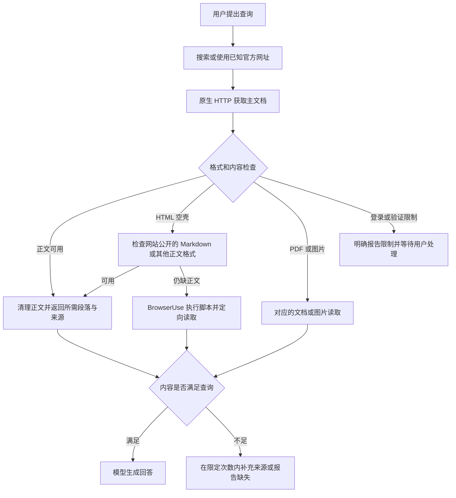

# 网页获取广覆盖对照测试：结果与流程建议

2026-10-01 完成。覆盖 12 个公开页面与 6 个可控边界页面，首轮共 36 次访问；5 个代表案例反转顺序复测，共 10 次访问。另外核验了 Apple 官方 Markdown、高德浏览器 DOM，以及一组同模型完整 Agent 对照。

## 核心结论

HTTP 优先适合源码已含正文的页面，能够省去 WebView 渲染、子资源等待、DOM 稳定检查和预览截图。浏览器仍可补足 JavaScript 正文、搜索结果与交互。两条路线底层都使用 HTTP；差异在于取得内容后还执行了哪些步骤，以及工具返回的信息是否足以回答。

本次最明确的慢点是导航等待：高德 MCP/定价页和“正文已就绪、装饰图片延迟”页面，BrowserUse 均返回 30 秒未完成提示。后者通过可控条件确认，正文可用与页面全部资源加载完成是两个时刻。直接 HTTP 只获取主文档，因此能提前取得正文。

完整 Agent 的胜负还受工具组合影响。Python 查询中 BrowserUse 11.800 秒完成，现有 iSH HTTP 15.401 秒完成。HTTP 组为了定位正文增加了空输出后的修正、文件写入和文件读取。通用工具需要把下载、正文提取和定向段落返回整合起来，才能减少模型往返；单纯要求模型临时编写请求脚本不保证更快。

## 测试条件与计时口径

- BrowserUse：iPhone 18 Pro / iOS 27 Simulator 中已安装的 MinisX 1.13 Build 8 DEBUG。网页矩阵通过同一会话的浏览器 CLI 执行，隔离新标签页并仅关闭本次创建的标签。矩阵沿用 1280×2400 视口；完整 Agent 的新会话使用 390×844，因此两层数字分别解释。
- HTTP：独立 Swift Foundation URLSession 探针在 macOS 运行，使用 ephemeral 会话，关闭 Cookie/认证/响应缓存共享；User-Agent 与浏览器桌面 Safari 对齐。限制 15 秒、2 MiB。它是原生 API 的可行性探针，尚未成为 iOS 产品工具。
- 表格 BrowserUse 时间为 navigate + get_readable，动态夹具还包含显式 DOM 等待。排除标签创建、页面核验和关闭；保留 DEBUG RPC/iSH CLI 传输开销。BrowserUse 自身导航还包含 DOM 稳定检查与截图。
- 表格 HTTP 时间为 URLSession 主响应下载到保存正文的 networkMillis；启动进程和 HTML 清理耗时未包含其中。完整 helperWall 保存在原始记录中。例如高德 MCP 首次请求 0.192 秒，探针进程全程 1.338 秒，复测分别为 0.207/0.245 秒。因此不将两列相除宣称严格的性能倍数。
- 公开页面先 HTTP 后 BrowserUse；复测先 BrowserUse 后 HTTP。共享 WebKit 状态和系统 DNS/TLS 的缓存并非严格冷启动条件。可控页面设置 no-store，正文上限 64 KiB、线程上限 8，不无限重试。
- “取得所需信息”按真实正文人工核对，不以状态 200 或关键词命中作为完整成功。首次原生评分只检查 12,000 字符预览，后续改为完整保存正文；原始结果保留，修正评分另存 content-score-audit.json。

## 18 个案例的首轮结果

单位：秒。下面的查询是读取目标；除两个搜索页外，使用固定网址，以排除模型选网址差异。覆盖的是网页发现/读取的组成环节，没有将全部案例作为端到端搜索任务运行。

| 查询条件/边界 | BrowserUse 导航＋读取 | HTTP 下载 | 内容结果与差异 |
| --- | ---: | ---: | --- |
| 官方产品文档：高德 MCP 如何接入，使用什么类型的 Key？ | 33.29 | 0.192 | HTTP 与浏览器均取得接入说明；浏览器导航到 30 秒超时。 |
| 定价与表格：高德免费配额、收费项目和商业许可有哪些？ | 32.87 | 0.142 | HTTP 源码含配额/许可说明，部分价格依赖图片；浏览器 get_readable 只取得页脚，目标信息不足。 |
| 静态技术文档：asyncio.gather 的异常处理和 return_exceptions 含义是什么？ | 5.31 | 1.372 | HTTP 完整源码含目标段落；浏览器首屏正文在目标段落前截断，需定向读取。 |
| 技术教程与代码：Fetch API 如何处理 HTTP 错误？ | 4.36 | 1.281 | HTTP 含 response.ok 代码；浏览器可读文本含 HTTP 错误处理说明，但本次输出缺少该代码标识。 |
| 现代前端文档：Vite 快速开始步骤和 Node.js 要求是什么？ | 8.08 | 1.463 | 两条路线均取得 Node.js 要求和安装命令。 |
| 限额与表格：GitHub REST API 对匿名和认证请求的限额有什么区别？ | 6.61 | 0.887 | 两条路线均取得匿名/认证限额说明。 |
| 依赖 JavaScript 的官方文档：URLSession 支持哪些网络任务？ | 8.71 | 2.614 | HTML HTTP 返回 JavaScript 空壳；浏览器渲染后取得网络任务说明。官方 Markdown 另有成功证据。 |
| 新闻与时效：BBC 新闻首页有哪些新闻标题，是否能够取得正文链接？ | 10.74 | 1.366 | 两条路线均取得新闻标题；HTTP 同时保留文章链接。关键词 BBC 只作信号，未评价新闻真实性。 |
| 中文长文与表格：上海市百科中的人口与行政区划资料能否读取？ | 9.10 | 2.485 | 两条路线均含人口/行政区划内容；浏览器返回截断文本，HTTP 保存完整源码。 |
| PDF 文档：读取 PDF 中的 Dummy PDF file 文本。 | 5.44 | 1.586 | HTTP 下载了 PDF，但探针未实现 PDF 提取；浏览器 get_readable 返回空正文。两者均未完成文本目标。 |
| 搜索结果页：搜索高德 MCP 收费，并取得官方文档链接。 | 9.73 | 1.222 | HTML HTTP 为脚本/跳转空壳；浏览器得到包含高德官方链接的结果页。 |
| 备用搜索结果页：搜索高德 MCP 收费，并取得官方文档链接。 | 4.04 | 1.091 | HTTP 结果偏向“高”的字典内容；浏览器主要得到导航栏。两者均未取得目标官方链接。 |
| 正文可用但子资源未完成：读取已呈现的测试正文，不需要等待装饰资源。 | 32.58 | 0.009 | 两者均取得已就绪正文；浏览器等待 30 秒超时，HTTP 不请求延迟 35 秒的装饰图片。 |
| JavaScript 正文：读取由脚本插入的动态答案。 | 4.45 | 0.006 | HTTP 只有“正在加载”；浏览器执行脚本后取得已知动态答案。 |
| 登录限制：识别必须登录，避免把登录表单当成目标内容。 | 2.59 | 0.005 | 两者均正确识别登录提示；没有执行登录，也没有读取受保护内容。 |
| 服务器主响应缓慢：读取慢响应中的正文，并记录真实等待。 | 5.63 | 3.008 | 两者均取得正文，并承担服务器 3 秒的主响应等待。 |
| 图片中的价格表：读取图片中的价格，需要识别正文不包含数值。 | 2.53 | 0.007 | 两者文字输出均缺少 39/99；HTTP 保留图片地址。需要图片读取，不能当作完整定价结果。 |
| 网址跳转：跟随跳转，记录最终网址并读取正文。 | 2.54 | 0.011 | 两者均跟随 302 跳转并取得正文；最终网址正确。 |

网址、判定目标和每次实际返回均位于 [案例清单](evidence/cases.json)、[首轮记录](evidence/results.jsonl) 与 evidence/snapshots/。本次取得的定价内容只用于判断页面可读性，没有据此发布价格结论。

## 代表性复测

| 案例 | BrowserUse 首轮/复测 | HTTP 下载首轮/复测 | 是否保持同样差异 |
| --- | ---: | ---: | --- |
| 高德 MCP | 33.29 / 33.22 | 0.192 / 0.207 | 是；浏览器再次导航超时，HTTP 正文可用。 |
| Python 文档 | 5.31 / 5.06 | 1.372 / 3.240 | 是；HTTP 网络波动，但完整源码可用；浏览器正文仍在目标段落前截断。 |
| Apple HTML | 8.71 / 8.44 | 2.614 / 2.340 | 是；浏览器有目标内容，HTML HTTP 无正文。 |
| 延迟子资源 | 32.58 / 32.55 | 0.009 / 0.006 | 是；正文均可用，浏览器仍等待导航超时。 |
| JavaScript 正文 | 4.45 / 4.47 | 0.006 / 0.008 | 是；浏览器取得答案，HTML HTTP 只有加载提示。 |

原始记录：[BrowserUse 复测](evidence/browser-repeat.jsonl)、[HTTP 复测](evidence/native-repeat.jsonl)。这里只报告样本与范围，不声称统计显著性或长期 P95。

## 内容读取中的三个发现

1. **正文截断会增加工具调用。** `getReadable` 的 JavaScript 先保留 15,000 字符，`formatJSResult` 又只输出前 10,000 字符；“Text (15000 chars)”不能代表 Agent 实际收到 15,000 字符。Python 的 gather 条目位于后面。实际 Agent 使用 execute_js 定向读取后成功回答。源码入口为 `src/ios/Agent/BrowserUse/BrowserUseJavaScript.swift:210` 与 `BrowserUseManager.swift:2272`。
2. **加载与选区均会影响高德定价页。** `get_readable` 匹配 `.content` 后只取得 399 字符页脚；追加 `document.body.innerText` 虽取得导航中的许可字样，仍没有配额正文。HTTP 保存的源文档含相关说明，部分价格为图片。这里同时存在渲染内容不足与正文选区不合理，不能仅归因于选择器。证据：[定向 DOM 核验](evidence/amap-price-targeted-followup.json)。
3. **动态网站可能公开其他读取格式。** Apple HTML 空壳提供了官方 `.md` 地址；后续 URLSession 请求在 1.140 秒取得 26,953 字符 Markdown，包含 Data tasks/Download tasks。当前探针只清理 HTML，因此其自动 partial 状态由人工核验纠正。首次额外请求因测试输出目录遗漏而未保存，保留为测试脚本错误，不计为站点失败。证据：[Markdown 核验](evidence/apple-markdown-audit.json)、[定向请求记录](evidence/followup-http.jsonl)。

模拟器 iSH Python 对高德、Python、Vite 与 Apple 另做交叉核验：源码正文与 JavaScript 空壳的差异一致。该证据证明同一模拟器已有 HTTP 内容获取能力，不能替代尚未实现的 iOS URLSession 产品工具验收。[交叉核验](evidence/ish-crosscheck.json)

## 同模型完整 Agent 对照

目标相同：根据 Python 官方页面说明 gather 的异常与子任务取消行为，并提供来源。两个新 MinisX 会话均选择 DeepSeek-V4.1-Flash（deepseek-flash）、High，使用官方 `https://api.deepseek.com/v1/responses`。应用版本、模型入口与 API 协议相同，仅在用户提示中约束读取路线；每组 180 秒上限，串行执行。工具定义仍全部可见，没有修改应用系统提示或工具实现。

| 指标 | BrowserUse 组 | 现有 iSH HTTP 组 |
| --- | ---: | ---: |
| 日志中开始处理至停止处理 | 11.800 秒 | 15.401 秒 |
| 脚本轮询观察到结束 | 12.289 秒 | 16.248 秒 |
| Agent 模型请求次数（不含标题） | 4 | 6 |
| 工具调用次数 | 3 | 5 |
| 具体工具 | navigate、get_readable、execute_js | 4 次 shell_execute、1 次 file_read |
| 工具执行时长合计（保存的 duration） | 4.363 秒 | 6.867 秒 |
| 关键内容依据 | 定向 DOM 取得 gather 条目 | HTTP 文本经修正定位后取得 gather 条目 |
| 回答结果 | 三个目标结论正确，有官方来源 | 三个目标结论正确，有官方来源 |

BrowserUse 直接定位官方文档的函数节点。HTTP 组先下载到文件，首次查找 `asyncio.gather` 得到空输出，因为剥离标签后得到 `asyncio . gather`，随后用 return_exceptions 定位、另存片段、再读取文件。HTTP 组还使用了一次 file_read，偏离“仅调用 shell_execute”的约束；因此此组实际体现现有 HTTP＋文件工具组合，而不是严格单工具试验。

两组均有正确阅读依据。原始最终文本分别为 592/753 字符（含 Markdown、URL 和英文标识）；没有把“400字”当成严格字符上限的合格证明。每组仅执行一次，不能据此认定 BrowserUse 在所有 Agent 任务中更快。也没有实现并测量“一次调用便返回目标段落”的新原生工具。

脚本日志标记提取器最初未识别完成行，但停止状态正确；已人工/脚本复核原始日志中与完整 sessionId 对应的 `isProcessing=true/false key=`，上述 11.800/15.401 秒以此为准。RPC 消息导出将单个工具结果截断为 2,000 字符；已只读补充这两个测试会话的完整 DB 消息，避免误判依据缺失。

证据：[校正指标](evidence/agent-comparison/metrics-audit.json)、[浏览器完整消息](evidence/agent-comparison/browser/messages-full.json)、[HTTP 完整消息](evidence/agent-comparison/http/messages-full.json)。标题各有 1 次请求，排除在 Agent 请求计数之外。这里的请求/工具次数也不等同于 UI 的“Agent 总循环次数”。

## 产品经理流程图

现有流程中的等待位置：

建议形成通用读取流程，优先减少等待和往返；以下为设计建议，产品尚未实现：

搜索与正文读取分别判断：HTTP 无法读取某个搜索结果页，不代表其返回的官方文档也必须用浏览器。读取工具适合提供网址、查询目标、正文/段落、最终网址、截断状态、动态/登录/PDF/图片等状态，让模型基于内容选择回退。

建议后续实现优先级：先增加能一次返回正文与定向段落的 iOS 原生读取工具；再改进 BrowserUse 导航就绪条件与截断提示；最后以本矩阵运行回归，补充更多整段 Agent 查询及真机前台/锁屏对照。需要保持既有浏览器登录态与新 HTTP 会话的隔离。

## 验证与资源边界

已完成 18 案例双路线访问、5 案例复测、内容人工核验、4 页面同模拟器 iSH 交叉核验，以及 1 组同模型完整 Agent 对照。失败/空壳/PDF/图片结果均保留。脚本静态校验与 Swift 探针编译通过；应用没有源码修改，因此未重建应用或运行产品单元测试。

本次没有测量真机后台/锁屏、能耗、WebContent 进程完整 CPU/内存、生产负载、登录后数据、反爬稳定性或不同模型。日志的瞬时 CPU/内存不能形成资源收益结论。HTTP 请求可以省去本次观察到的渲染/资源步骤，但不能将下载成功外推为后台持续 Agent 运行能力。

测试使用独立 main 调查 worktree；原目录仍为 feat/bilibili-video-notes，31 个原有未提交/未跟踪文件的状态与 SHA-256、HEAD 均与测试前一致。[保留检查](evidence/original-worktree-check.json)。没有提交或推送。测试夹具已关闭，工具临时构建产物保存在证据目录。

任务归档后，原始记录中的 active 路径代表当时执行位置；对应正文快照位于归档目录 evidence/snapshots、repeat-snapshots 或 followup-snapshots，原始计时记录保持原样。
