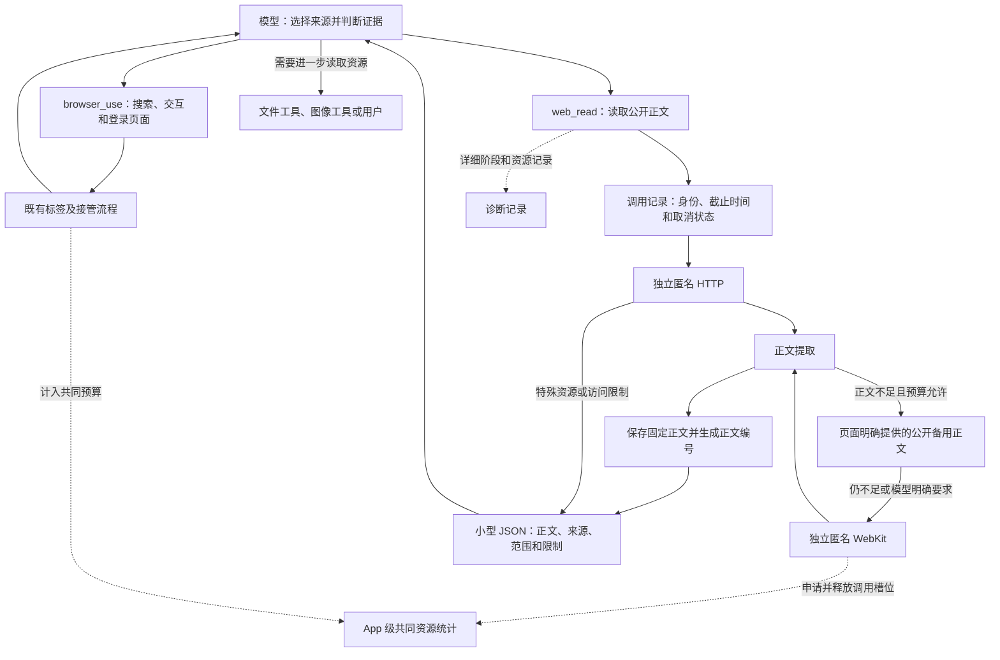
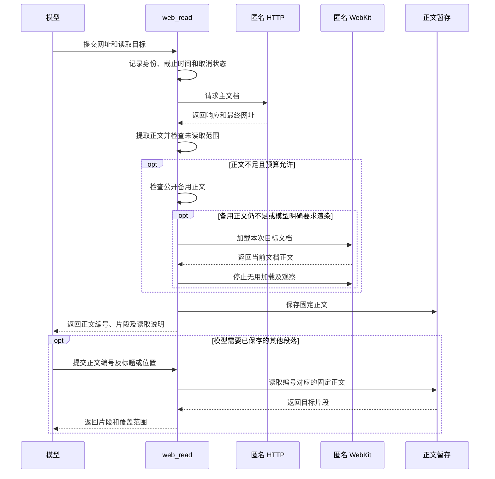

# 统一网页读取实施方案

方案约束已于2026-10-02确认。测试资料准备完成，产品尚未实现。

| 文档 | 用途 |
| --- | --- |
| [task.md](../task.md) | 了解目标、决定和进度。 |
| [统一网页读取 Spec](../../../../docs/specs/ios-web-read.md) | 查阅27条拟议行为规则。 |
| [验证说明](../validation/README.md) | 准备测试输入并区分验证层级。 |

新接口和模块名称在实施时确定，行为以 Spec 为准。

## 问题与依据

方案要缩短 Agent 取得足够证据的整体时间。
应用需要同时保证正文正确、身份隔离及资源释放。

| 已有观察 | 对方案的影响 | 证据 |
| --- | --- | --- |
| 前台模拟器5次高德导航累计约162秒。 | 应用需要检查导航等待。 | [运行复现](01-build8-agent-latency/reproduction.md)。 |
| 可控页面正文已可读，浏览器仍等待30秒。 | 工具应在目标正文就绪时结束无用加载。 | [运行复现](01-build8-agent-latency/reproduction.md)。 |
| 一次完整查询中，BrowserUse 用时11.800秒，现有 HTTP 路线用时15.401秒。 | 测试需要覆盖定位及后续工具往返。 | [覆盖对照](02-browser-http-comparison/verification.md)。 |

原手机导出缺少工具结果，不能还原每次导航的准确耗时。
macOS 探针和单次 Agent 实验也不能证明新 iOS 工具已经提速。
原始调查见[手机会话报告](01-build8-agent-latency/verification.md)。

## 初版范围与职责

第一版提供公开匿名正文读取。搜索沿用现有入口。

| 内容或操作 | 执行者与处理方式 |
| --- | --- |
| 公开 HTML、纯文本、Markdown | `web_read` 提取正文。 |
| 来源选择与证据充分性 | 模型根据用户问题判断。 |
| 请求、格式、正文范围及加载状态 | `web_read` 返回读取事实。 |
| PDF、图片 | `web_read` 返回资源地址、类型和未读取状态。 |
| 登录要求、访问拒绝 | `web_read` 报告限制。 |
| 点击、输入及复杂交互 | 模型选择受原许可约束的 `browser_use`。 |
| 资源需要进一步读取 | 模型选择现有文件或图像工具，或通过现有路径请求用户处理。 |

测试需要确认交接工具实际读取了资源。
只返回 PDF 或图片地址时，对应内容查询仍未完成。
本任务暂不实施 PDF 文字提取及扫描、图片 OCR。
图片识别及 `web_read` 登录能力仍待决定。

## 与 browser_use 共存

模型按目标及身份选择工具。

| 场景 | 模型的动作 |
| --- | --- |
| 已知公开网址、长文定位或续读 | 优先使用 `web_read`。 |
| 操作搜索页面 | 使用 `browser_use`。 |
| 点击、输入或滚动 | 使用 `browser_use`。 |
| 需要既有登录或交互后的页面状态 | 在对应浏览器标签中继续读取。 |
| 当前用户请求已有充分证据 | 直接回答。 |
| 存在明确缺口、更新或刷新要求 | 针对目标补充读取。 |
| 匿名读取遇到认证或交互要求 | 根据现有授权决定后续处理。 |

应用同步修改工具说明、系统提示和 `minis-browser-use` 引导。
旧提示不能继续将普通公开读取一律引向浏览器。
`web_read` 的内部回退属于同一调用，不隐式派发 `browser_use`。

模型可以使用浏览器合法返回的内容作为当前回答的证据。
匿名缓存只保存匿名读取自身取得的正文。
应用不把浏览器 DOM、私人正文或登录身份复制到匿名缓存。
同一网址因身份不同而返回不同内容时，结果说明来源和身份范围。

## 拟议关系图

## 拟议典型场景图

应用保存正文文本，不靠保留 WebView DOM 支持续读。
取消或截止后，工具停止进入下一阶段。

## 输入与结果契约

模型通过网址或正文编号发起读取。
“当前用户请求”指用户发送消息至 Agent 完成此次回答的过程。

| 输入 | 用途 |
| --- | --- |
| 网址 | 确定目标来源。 |
| 标题、代码标识符或关键词 | 定位正文片段。 |
| 路线选择 | 明确要求补充动态渲染。 |
| 正文编号及续读位置 | 读取已经保存的固定正文。 |

程序提供可解释的定位结果。
自然语言目标由模型转换为定位词，程序不承诺理解任意问题。

模型结果采用[已确认的小型 JSON 契约](../validation/result-contract.md)。
正文使用 Markdown 字符串；Provider 沿用原工具协议及调用标识。

| 内容 | 保存位置 | 用途 |
| --- | --- | --- |
| 正文、来源和抓取时间 | 模型结果。 | 支持回答及引用。 |
| 部分正文、截断、超时或访问限制 | 模型结果。 | 模型判断需要补充什么。 |
| 正文编号、实际范围和续读位置 | 模型结果。 | 模型读取已保存内容。 |
| 目标相关的未读取资源 | 模型结果。 | 支持资源交接，避免假定已读取内容。 |
| 详细阶段耗时、资源计数和内部请求时序 | 诊断记录。 | 分析等待、预算及实际释放。 |

源站声明类型与实际文件特征冲突时，工具说明影响读取的限制。
备用正文只覆盖原文一部分时，工具说明来源关系和覆盖边界。
图片 alt 文本和附近文字不能代替图片像素中的数据。

应用优先保留元数据及目标片段，再编码完整 JSON。
完整正文通过有数量和大小限制的缓存保存。
应用核对 `ConcurrentTools` 的二次截断和文件转存。
最终 Provider 请求中的 JSON 必须可解析，并保留实际可用的定位信息。
警告写入 `limitations`，不能在 JSON 外追加文字。

## 路线与正文就绪

一次读取按以下顺序执行：

1. 应用在排队开始时创建调用记录。
2. 独立匿名 URLSession 请求主文档。
3. 工具记录重定向及来源身份。
4. 工具限制响应字节，并提取正文候选。
5. 工具按下表选择后续动作。
6. 工具保存已取得的正文，并返回结果。
7. 应用结束本次不再需要的加载和观察。

| 情况 | 后续动作 |
| --- | --- |
| 当前目标正文已可读 | 返回正文。 |
| 空壳、加载提示或局部正文缺失 | 检查页面明确提供的 Markdown 地址或已有提取方法的内嵌数据。 |
| 备用正文仍不足 | 使用独立匿名 WebKit。 |
| 模型明确要求动态补充 | 使用独立匿名 WebKit。 |
| 登录或交互才能继续 | 返回限制及交接信息。 |
| 调用已取消或截止 | 结束调用。 |

工具不进行通用接口扫描。
所有候选来源和尝试均占用同一时间及次数预算。

WebKit 就绪检查绑定本次导航的文档代次和实际网址。
同一网址重新加载时，旧 DOM 不能作为新文档返回。
就绪检查使用有界事件监听或低频检查。
采样间隔及阶段上限通过最小原型测量确定。
到期仍无就绪证据时，工具返回部分结果或失败。

## 隔离、取消与资源

### 身份和页面状态

| 对象 | 隔离要求 |
| --- | --- |
| HTTP | 不读取共享 Cookie、认证存储或响应缓存。 |
| WebKit | 使用独立匿名网站存储，不恢复共享 Cookie 备份。 |
| 导航和 DOM | 只属于读取工具自己的渲染器。 |
| UA、viewport 和观察器 | 不修改既有标签的配置。 |
| 用户接管 | 沿用原会话暂停及恢复流程。 |

读取完成、取消或超时，均不能提前解除接管。
测试先在既有浏览器建立模拟登录，再检查匿名 HTTP 和 WebKit。
两条匿名路线均不能取得私人标记，既有浏览器登录仍可使用。

### 调用记录和正文保存

每次调用统一记录以下信息：

- 应用记录进入队列的时刻和截止时间。
- 应用记录取消状态及唯一结束状态。
- 应用记录所属聊天、工具和调用标识。
- 应用记录请求、临时渲染及等待任务。

正文编号只对原聊天、当前用户请求和原身份有效。
网页更新不会改变编号对应的固定正文。
请求结束后，应用清理正文缓存。
日志和错误不包含凭据或私人内容。

### 共同资源预算

`BrowserTabPoolRegistry` 现有8标签上限只统计注册的浏览器池。
其 `requestSlot` 满额时可能抢占其他池的活动标签。
读取服务不能直接沿用该抢占路径。

应用扩展 App 级资源统计，统一计入浏览器和匿名 WebKit。
应用在创建任一实例前申请共同槽位。
已有池和新服务使用同一数量来源，防止重复统计或漏计。

| 资源情况 | 应用的动作 |
| --- | --- |
| 总占用低于上限 | 创建新实例并记录持有者。 |
| 总占用达到上限 | 读取有时限地排队，或报告资源限制。 |
| 标签正在使用或接管 | 读取请求保持该标签。 |
| 资源压力出现 | 优先释放可清理的读取缓存、队列项和临时渲染。 |
| 清理导致读取无法继续 | 工具说明受限或未完成。 |

排队时间计入总截止时间。
响应、正文缓存、并发队列和诊断均设置可检查上限。
解析在非主线程完成，截图仅在读取目标需要时执行。
具体数值依据代表性 iOS 测量确定。
WebKit 数量上限不能代替 App 和 WebContent 的内存与能耗测量。
WebContent 是 WebKit 用来执行页面的独立进程。

### 停止范围

工具批次指模型在一次响应中提出的一组工具调用。

| 触发 | 清理范围 |
| --- | --- |
| 单次读取超时、异常或内部取消 | 本次调用的请求、队列、渲染、观察及未提交正文。 |
| 工具气泡 Stop | 当前批次内的 `web_read`、`browser_use` 及其队列项。 |
| 会话 Stop | 当前会话活动任务中的两种工具及其队列项。 |
| 删除会话 | 先结束当前会话任务，再按原生命周期清理数据和引用。 |

单次读取清理不调用其他工具的 `stopAllLoading()` 或接管恢复入口。
批次及会话停止按归属分发。
只有 `web_read` 活动或排队时，停止按钮也要有效。
其他聊天、既有登录和已提交结果按原生命周期保留。
已发生的网页副作用不会因停止而自动撤销。

迟到回调先对应原调用，再丢弃已取消内容。
回调不能再次启动回退，也不能写入其他调用。
应用在界面、模型历史和数据库中保留一致的结果配对。

### 前台与锁屏

维护者已开启增强后台运行、实时活动和任务通知。
系统也允许 MinisX 通知及实时活动。
真机前台和锁屏对照使用相同配置。
测试分别观察实际保活、网页阶段时间和资源释放。
历史缓慢不能直接归因为权限未开启。
锁屏是否影响效率，由真机证据判定。

## 分步解决方式

| 步骤 | 实现内容 | 验证目标 | 规则 |
| --- | --- | --- | --- |
| 1. 匿名 HTTP 与调用记录 | 实现请求、结果类型及统一预算和取消。 | 格式、重定向、访问限制及响应边界准确。 | W1–W3、C1、F1、F3、I1、R1–R3。 |
| 2. 正文定位与编号续读 | 实现正文提取和有上限的固定正文缓存。 | 长文、代码、表格及最终模型输入保留目标内容。 | C2–C4、I3、R3。 |
| 3. 备用正文与匿名 WebKit | 实现备用来源、当前文档检查和共同资源准入。 | 局部动态、旧 DOM、隔离及资源压力处理准确。 | F1–F2、I2、I4、R1–R5。 |
| 4. Agent 全流程接入 | 更新工具说明、提示、停止、展示及持久化。 | 工具选择、取消范围及乱序结果配对准确。 | W5–W6、R6、A1、A4、C3。 |
| 5. 分组回归和设备测量 | 执行20个主要组、5类代表查询及真机对照。 | 先确认正确性与资源释放，再判断提速。 | A2–A3。 |

现有代码入口见 [Spec 的代码入口](../../../../docs/specs/ios-web-read.md#代码入口)。
新模块实际路径在实施时补充。

## 验收与依赖

当前集合包含原18个案例及新增48个案例，共66个。
新增案例中，8项专门验证工具共存。
执行安排见[分组清单](../validation/groups.json)。
42个新增必测案例按产品组覆盖，6个可选内容案例暂不执行。
历史案例用于覆盖参考，历史 PDF 文字查询保留为延期能力。
全部新增产品案例尚未执行。

历史脚本含旧 RPC 和缓存路径，不能直接作为本轮运行入口。
本地31项自检只证明测试输入符合预期。
它们不证明 iOS 工具、真实 Agent 或账号隔离已经通过。
详细步骤见 [iOS 验收说明](../validation/ios-acceptance.md)。

完整查询使用正常生产提示及全部工具。
测试在相同模型和配置下多次执行，并记录实际样本数。
样本不足时，不发布 P95 或通用提速倍数。

| 依赖 | 验收处理 |
| --- | --- |
| PDF 或图片内容能力尚未启用 | 边界识别可以通过，内容查询保持未完成。 |
| 后续启用内容能力 | 验证页码、图片与数字对应关系及资源上限。 |
| 高德计费信息依赖图片 | 先确认图像工具交接，再核对事实。 |
| Responses 多图片结果配对错误 | 作为独立修复依赖记录，保留协议失败状态。 |
| 循环计数和完整诊断导出问题 | 作为独立问题处理，本任务保留所需可追溯指标。 |

官方设计依据、已确认的结果格式和分组安排见[设计参考](04-web-read-design-references.md)。
