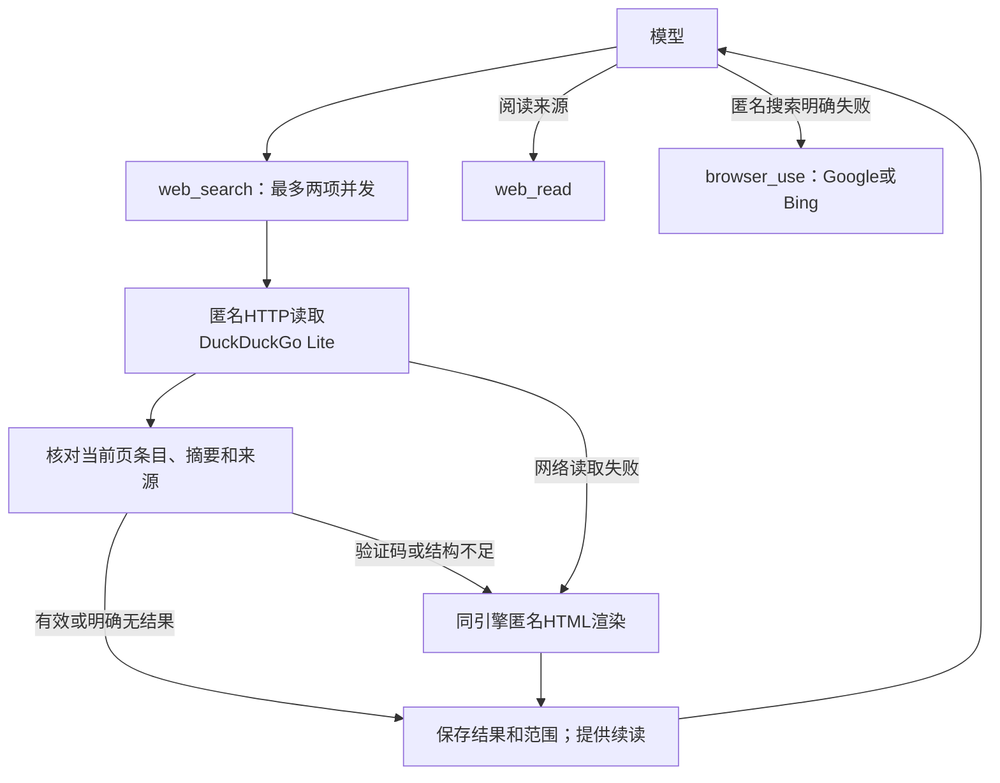
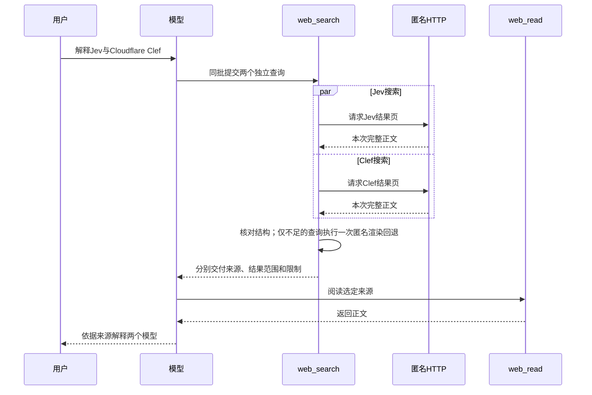

# 26-10-02 BrowserUse 搜索速度优化

状态：active（匿名搜索已实现，等待维护者使用反馈，S5与S7部分验收；规则及证据见[匿名网页搜索S0–S9](../../../docs/specs/ios-web-search.md)和[验证记录](verification.md)）。
关联Spec：[统一网页读取](../../../docs/specs/ios-web-read.md)、[浏览器自动化](../../../docs/specs/ios-browser-automation.md)、[资源规范](../../../docs/specs/resource-efficiency.md)。
验证：[verification.md](verification.md)。

## 目标

应用在保留有效信息和来源的基础上，减少搜索等待。
`web_search`一次取得标题、摘要和来源链接，`web_read`继续阅读来源正文。
资源允许时，两个独立搜索并发执行。

## 当前事实

完整数值和环境见[对照基线](validation/baseline.json)。

| 已观察的阶段 | Jev搜索 | Clef搜索 |
| --- | --- | --- |
| 浏览器导航 | 10.826秒 | 9.565秒 |
| 导航后的页面变化观察 | 1.585秒 | 3.183秒 |
| 预览截图 | 0.132秒 | 0.047秒 |
| 完整导航工具 | 13.441秒 | 13.503秒 |
| 后续读取搜索文字 | 0.380秒 | 0.200秒 |

两次导航并发执行，同批从派发到全部完成为13.286秒。
工具内部阶段与界面计时的起点不同，不直接相加推算整轮时间。
原问句整轮为56.123秒，共8次模型请求、7个工具批次、14次工具调用。
现有记录没有测量搜索结果首次出现的时间，不能预先确定提前返回的收益。

当前`navigate`等待`WKNavigationDelegate.didFinish`或导航失败、超时。
随后`execute`等待页面变化趋于稳定，再生成界面预览。
预览截图未发给模型；减少截图主要影响运行开销。
当前模型还需要后续`get_text`，并曾另行提取来源链接。

macOS直接HTTP探测已取得两次DuckDuckGo Lite文字结果。
Clef查询为1.291秒，Jev查询为1.440秒，均取得标题和来源链接。
Google普通HTTP请求仅返回跳转提示；Bing返回结果的相关性不足。
这些结果不是iOS产品验收，也不是同一搜索引擎的受控提速对照。
此前DuckDuckGo HTML页面曾返回验证码，长期稳定性仍待验证。

## 方案

第一版使用匿名HTTP读取DuckDuckGo Lite公开搜索页面。
工具等待正文完成，提取当前页的有效条目及后续页入口。
较长结果保存在当前请求范围内，模型可以按编号继续读取。
验证码、空壳或提取不足时，工具回退到同引擎的匿名HTML页面渲染。
同一次调用最多两个读取入口，共享原截止时间。

| 情况 | 处理 |
| --- | --- |
| 当前页结构有效，条目和来源可取得 | 返回标题、摘要和完整来源链接。 |
| 单次输出超过预算 | 返回固定编号、范围和续读位置，保留尚未输出的信息。 |
| HTTP失败或结构不足 | 工具执行一次同引擎匿名渲染回退。 |
| 明确无结果 | 直接返回无结果，模型可以调整关键词。 |
| 回退仍无法取得完整结果 | 保留已取得内容并报告限制；模型可以使用现有Google/Bing浏览器路线。 |
| 两个独立搜索 | 同时执行，每项独立处理回退、取消和结果。 |
| 资源不足 | 有界排队或报告受限，不扩大现有浏览器资源上限。 |

HTTP与渲染均隔离既有浏览器身份，不读取或导出其Cookie。
成功HTTP路径不创建WebView、不生成截图，也不等待界面预览。
同一查询内部不同时启动多个读取方式。
搜索结果仅提供来源线索；模型阅读来源后判断证据是否足够。

### 回退关系图

### 典型场景图

## Spec变更

本任务新增[匿名网页搜索](../../../docs/specs/ios-web-search.md)S0–S9。
本任务修改[统一网页读取](../../../docs/specs/ios-web-read.md)W4、W5中的搜索工具选择及R6的批次和会话停止范围。
其余WebRead规则保持原任务的验证状态。

## 验收

- [x] 满足S0：当前结果页的有效条目、关键摘要和来源保留，尾部信息可取得。
- [x] 满足S1：等待本次完整HTTP正文并核对结构，不以首条标题或HTTP成功提前返回。
- [x] 满足S2：一次返回可使用的来源链接；超限结果提供固定编号及续读范围。
- [x] 满足S3：HTTP成功路径没有WebView、截图或预览等待，普通浏览器动作正常。
- [x] 满足S4：验证码、空壳、无结果和部分结果具有准确状态。
- [ ] 满足S5：匿名HTTP及渲染无法取得浏览器私人标记，原登录和用户接管状态保持。
- [x] 满足S6：排队、超时、单项、批次及会话取消实际释放资源，迟到结果丢弃。
- [ ] 满足S7：先核对来源与信息质量，再分别报告直接工具及完整Agent对照结果。
- [x] 满足S8：两项搜索实际重叠执行，单项回退或取消不破坏另一项。
- [x] 满足S9：最多一次同引擎匿名渲染回退，查询、预算及结果范围可追溯。

每项证据及S5、S7未验证范围见[逐项验收](verification.md#逐项验收)。

## 决定

- 搜索质量优先于速度，不为提速截断或遗漏有效信息。
- 采用匿名HTTP文字读取，候选服务可以使用DuckDuckGo。
- 资源允许时并发执行两个独立搜索，每项内部顺序回退。
- 第一版无需付费搜索API、搜索账户或密钥。

## 实现计划

- [x] 将确认的路线及质量、并发规则写入Spec，标记拟议。
- [x] 接入匿名搜索、完整提取、续读和同引擎回退。
- [x] 接入工具定义、提示、许可、派发、持久化及停止生命周期。
- [x] 完成针对性测试、独立审查及iPhone 18 Pro真实查询对照。
- [x] 按证据更新验收和Spec的生效状态。

## 执行边界

分支为`investigate/build8-agent-latency`，源码对照基线为`611dbfeba9ba`。
模拟器使用iPhone 18 Pro / iOS 27.0，最低部署目标保持iOS 26。
实现和审查遵守项目模型分工；真机资源及锁屏表现单独验证。

## 下一步

维护者计划自行Archive并分发至TestFlight Internal，先收集真实使用反馈；发布结果与使用验收分别记录。
后续补充完整Search与既有登录浏览器、用户接管的组合验证，并积累质量、验证码和耗时样本。
跨调用限频和验证码冷却尚未实现；真机资源和锁屏结果保持独立未验证，任务尚未归档。

## 代码入口

- [工具定义](../../../src/ios/Agent/Chat/AIChatViewModel+ToolDefinitions.swift)
- [工具派发](../../../src/ios/Agent/Chat/AIChatViewModel+ConcurrentTools.swift)
- [提示及生命周期](../../../src/ios/Agent/Chat/AIChatViewModel.swift)
- [匿名网络](../../../src/ios/Agent/WebRead/WebReadURLSessionTransport.swift)
- [匿名渲染](../../../src/ios/Agent/WebRead/WebReadRenderer.swift)

## 当前结果

匿名HTTP成功路径通常约1–2秒，当前同引擎样本确实减少工具阶段等待。
验证码可能触发一次匿名HTML回退；若仍受阻，工具准确交还限制，由模型补充来源。
构建成功，86项相关回归覆盖通过；完整Agent和双搜索流程记录见验证文档。
系统提示词已明确DuckDuckGo默认路线、质量优先和两个独立查询同批执行，本轮静态核对见[提示词与风险核对](verification.md#提示词与风险核对2026-10-03)。
本轮未重新构建或执行模型查询，S5及S7仍为部分验收。
本轮本地提交范围为匿名HTTP搜索、配套回退与并发、生命周期、共享读取兼容、测试及任务记录。
原有七份Harness修改和八处构建号调整保留在工作区，不纳入本次提交。
