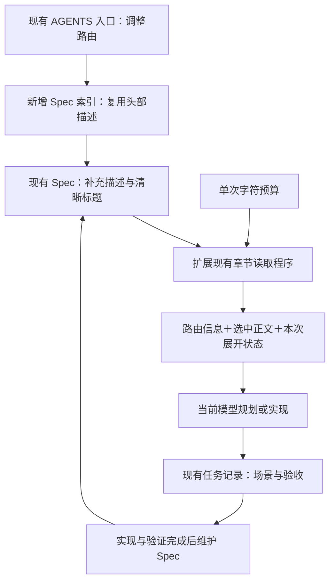
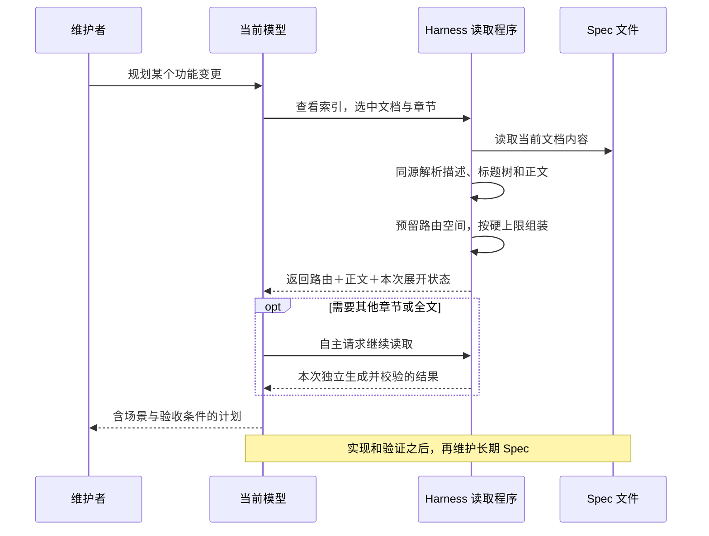

# 26-09-29 Spec 文档治理与渐进上下文
状态：done
更新：2026-09-29

## 恢复信息
分支：main
最近核验 HEAD：272da5d9bb8051c82075513df9a395344d4e7f6b
工作区：已有大量未暂存和未跟踪改动，包含 Harness 规范与 Hooks、DeepSeek 费用功能、发布记录以及其他任务的归档移动。本任务创建时没有清理、提交或改写它们；检查点用于识别恢复时的漂移，不代表这些变化都属于本任务。
下一步：无。已完成实现、定向回归、审查修复与复审，按 archive-task 归档；未提交或推送。
待审批：无。用户已在实施对话明确要求实现本任务；沿用 v1 设计方向及验收，局部接口与默认值自主确定。

## 任务确认与执行边界
确认状态：设计方向及本轮实施已确认。
确认稿版本：v1，2026-09-29，本任务记录；汇总当前对话最新决定，后面的局部实施建议不冒充用户指定的实现细节。
用户依据：
- 实施对话（2026-09-29）：“在本项目中, 前面规划了一个 "tasks/active/26-09-29 Spec 文档治理与渐进上下文" 的任务, 在本轮对话中实现它吧”。
- “这套方案目前看比较合理, 我计划单开一个新对话来实现”。
- “要不你先在项目中创建计划, 我在另一个对话中让它实现”。
- “在注入文档时采用‘路由信息+正文’的方式是合理的”。
- “‘Description + 清晰目录 + 正文中的关联链接 + 搜索工具’这个组合我同意”。
- 预算频繁不足时，结合具体 Spec 与场景再分析，不现在预建复杂机制。
真实使用目标：维护者和 Agent 能通过精简入口定位现行 Spec；规划时取得相关场景、约束和验收条件；单次提供的 Spec 上下文受程序控制的字符上限约束，仍保留补读入口；实现与验证后维护长期规范，后续任务继续使用。
本轮授权：实施已确认计划中的 Spec 工具、测试、规范与技能路由，完成定向验证、独立审查及符合条件后的项目任务归档。原规划轮只授权计划；本轮授权仅对之后的实施生效。不修改产品代码、Hook 配置或其他任务。
执行位置：本轮在 /Users/huyuanzhao/Coding/Projects/OpenMinis 的现有 main 工作区实施，留在当前对话；不创建对话、分支或 worktree，不清理既有修改。
设备与数据：不需要 Simulator、真机、API 凭据、外部模型 API 调用或发布操作。
提交与发布：无 commit、push、Issue Tracker 发布授权。
归档：2026-09-29，A1–A10 达到本轮验收范围，必要修复及复审完成，Spec 已同步；整体移动到 tasks/archive/，保留原始材料与检查点。

## 已确认的设计

1. Spec 同时服务维护者与 Agent，用清楚的语言写场景、预期行为、验收条件；区分现行约定、现状说明及未来计划，不能把实现缺陷改写成规范。
2. 规划阶段读取当前适用的 Spec，本次拟改变的行为及验收先写入任务记录。长期 Spec 在实现与验证完成后维护，归档前确认已同步，或说明本任务不需要变更的理由。
3. Spec 不设硬性文件长度上限。长文档依赖清晰标题、可定位目录、正文关联链接实现渐进呈现；按主题需要拆分，不机械按字数切分。
4. 每份 Spec 的头部使用简短 description，说明覆盖范围与适用任务。description 在源文档维护，路由展示复用它；标题树从正文生成，避免两处手写重复目录。其他元数据只在确有用途时增加。
5. 采用“Description＋清晰目录＋正文关联链接＋搜索工具”，不额外强制每份文档维护一套“必读入口”或依赖图。
6. 注入/提供内容采用“路由信息＋正文”。先为路由及继续读取入口保留空间，再放入当前选中的完整小节；无需给补充正文固定比例，但不能让正文挤掉所有补读入口。
7. 借鉴 Trellis，用普通程序执行单次字符硬上限。分别考虑单份内容与总返回量，中文按 Unicode 字符而非 UTF-8 字节计数；描述、目录、正文、引言、版本定位、包装、分隔符和提示均计入总返回量。不是整份 Spec 长度限制，也不是会话累计 Token 限制。
8. 允许模型自主选择相关文档、补读章节，必要时阅读全文。完整小节优先，保留理解所需的范围、定义、前提和例外；搜索片段不能代替验收规范。
9. 使用“本次已展开／本次部分展开／本次未展开”，仅表示本次实际返回的正文范围，不表示历史阅读、重要程度、模型理解或内容仍留在上下文。
10. 目录、正文、标记来自同一次文档读取结果；只有完整正文被返回才标“本次已展开”。父章节仅返回部分子章节时不能标完整展开。沿用已有版本摘要能力即可，不另建版本数据库。
11. 当前不维护跨轮次、跨 Agent 的阅读状态，不记录“模型已理解”，不额外调用 LLM 做预算管理、自动摘要或阅读审核。
12. 通过具体场景、验收条件及验证结果判断规范落实。预算频繁不足时再就真实案例分析目录、粒度或任务范围，不预建复杂调度、无限补读循环或强制依赖机制。

### 已放弃的早期建议

- 8,000 字符的 Spec 文件硬上限：已撤回。
- 每份 Spec 额外必读清单、跨轮次“已经读过”账本、把返回记录当阅读证明：不采用。
- 重要章节占满预算、剩余主题完全不可发现：不接受。
- 直接照搬 Trellis 从文档开头按字符截断、可能截断段落的方式：采用其预算与路由预留思路，正文优先按完整小节组织。
- 引入完整 Trellis 框架、向量数据库、额外摘要模型、后台扫描或持续轮询：不在范围内。

## 现状核验与复用入口

规划轮已实际读取以下文件；表中“已有/待改”记录规划时状态，当前成果见 Spec 同步与最终验收：

| 文件 | 已有能力或需要衔接的事项 |
| --- | --- |
| [AGENTS.md](../../../AGENTS.md) | 已是精简入口；仍保存六份 Spec 的表格，模型分工与技能路由已存在 |
| [spec-context.md](../../../docs/harness/spec-context.md) | 已定义按完整小节、保留前提、固定来源版本等规则；仍有旧 Pi 叙述 |
| [spec_context.py](../../../scripts/harness/spec_context.py) | 已有 list/read、ATX 标题树、完整标题路径、祖先引言、代码围栏忽略、SHA256；无本计划中的预算及展开状态输出 |
| [test_spec_context.py](../../../scripts/harness/test_spec_context.py) | 现有章节提取回归入口，后续定向扩展 |
| [design.md](../../../docs/harness/design.md) | 仍写“唯一简短 Spec 索引在 AGENTS.md”，迁移索引时同步，避免两套权威来源 |
| [collaboration.md](../../../docs/harness/collaboration.md) | 模型职责、执行授权及资源验证边界 |
| [plan-task](../../../.agents/skills/plan-task/SKILL.md) | 规划与确认、两张设计图、任务阅读清单；文末仍有旧 Pi 文案，按当前根规则暂停 Pi |
| [record-formats.md](../../../docs/harness/record-formats.md) | 任务、阅读清单、设计图、检查点及归档约定 |
| [Hooks 任务](<../../active/26-09-29 Harness Hooks 与独立审核/task.md>) | 原生 Hook 信任/触发证据仍待完成，不能因配置存在就宣称本任务自动注入生效 |

保留旧 list/read 及现有审查准备所用提取接口；不要为了新输出形态破坏已有快照来源绑定。是否新增子命令由 Luna 核对调用点后决定。

## 文档层级与路由方案

以下路由已实施；实际命令与预算边界见 docs/harness/spec-context.md。

| 层级/拟用路径 | 职责与触发 | 内容归属 |
| --- | --- | --- |
| AGENTS.md | 进入项目；指向 Spec 索引、适用技能及少量持续规则 | 不存全部描述、目录或操作细节 |
| docs/specs/index.md（程序生成） | 规划或查找规范时，按主题发现相关 Spec | 简短索引；文档名称、源 description 与路径；描述从源文件派生，避免双写 |
| docs/specs/*.md | 判断文档相关后，查看标题树并选择正文 | 功能约定、场景、验收与关联链接；源头维护 description |
| docs/harness/spec-context.md | 使用/维护上下文提供工具时 | 路由流程、预算口径、单次展开语义、工具入口与能力边界 |
| docs/harness/spec-authoring.md（新增） | 新写或维护 Spec 时 | 面向人与 Agent 的写作规则、场景/验收要求、维护时点与专业依据 |
| plan-task / resume-task / review-task / archive-task | 各阶段按需进入 | 引用对应规则，不复制规则全文；归档前衔接 Spec 维护结果 |
| tasks/active/<任务>/task.md | 某次功能规划与交接 | 本轮变化、阅读依据、验收证据和未决事项；任务事实不堆进长期 Spec |
| scripts/harness/spec_context.py | Agent 调用阅读工具或适配层提供上下文时 | 确定性提取、预算分配、标记与来源一致性；不判断语义正确性 |

Spec 维护入口可以先由现有技能引用短小写作指南承接；只有确有可复用的独立步骤时才增加维护技能，不能只为目录对称再建一套工作流。新增索引的生成/更新入口与现有工具一并设计，不再添加常驻服务。

## 设计图
图的状态与版本：当前实现，v2 / 2026-09-29；对应 spec_context.py 的 index/context 和现行技能路由。已验证受控读取，原生 Hook 不在本次实现范围。

### 功能位置与关系图

### 典型场景运行图

图中的上下文提供不等于已经具备原生 Hook 自动注入。第一条落地路径必须接到实际规划/阅读流程；若适配宿主 Hook，另以真实事件证据说明覆盖范围，不能以脚本测试代替。

## Spec 阅读清单

规划/恢复时：
- 本任务全文：用户最新决定、授权、否定方向和验收。
- docs/harness/spec-context.md 全文：当前章节读取约定与工具边界。
- docs/harness/record-formats.md :: 记录格式草案 > 任务记录、任务设计图：记录衔接。
- docs/specs/resource-efficiency.md 全文：对未来代码中的扫描、计数、重复解析及依赖成本适用；本轮按脚本资源开销范围检查，不做设备性能测试。

按需参考：
- docs/harness/collaboration.md :: Collaboration details > Codex Model Delegation：委派和独立审核前读取。
- docs/harness/design.md :: OpenMinis 开发 Harness 设计 > Spec 上下文：修正规则归属时读取。
- 具体功能 Spec：以原有索引/现行任务范围选择；不为本任务背景研究读取全部产品正文。

此任务阅读清单是已有任务交接格式，不等于给每份 Spec 新增强制“必读入口”。

## 实现计划

- [x] 恢复时确认实施授权、分支及脏工作区；保留现有改动，核对 spec_context.py 调用点和已有测试。
- [x] 确定局部接口与预算默认值，写明计数口径；优先沿用现有小工具。先交付一条“索引选文档→读取章节→返回路由与正文”的可观察路径。
- [x] 由 Luna xhigh 扩展描述/目录提取、预算组装及本次展开状态；同一文件一次读取结果用于上述数据。预算计算不调用额外模型。
- [x] 先用一份适合的现有 Spec 演示真实阅读路径，再以少量定向用例验证超限、父子章节状态与中文计数；不做全产品构建。
- [x] 完成 Spec 索引与规则路由，接入规划/恢复阅读流程；明确工具返回与原生自动注入的证据边界。
- [x] 现有六份 Spec 补齐 description、可用目录/链接，并核对场景与验收覆盖。对上游计划性内容保留状态，不能凭空宣称已实现；不相关的大规模事实核验另记后续范围。
- [x] 验证完成后维护 spec-context、写作指南、相关技能和根入口；消除迁移产生的重复权威索引及当前入口里的旧 Pi 默认指引，保留历史证据与暂停的适配器。
- [x] 必要的实质代码审核交给全新 Astra medium，只读、无历史；主模型核对原始验证结果及处置，不重复全面审查。
- [x] 记录最终文件、实际接入方式、验证证据和未验证范围；Spec 同步完成后按 archive-task 判断，不因计划已经写完而提前归档。

### 局部参数与待核实事项

- 用户确认“硬性字符长度”，没有亲自指定数字。实施建议先参考 Trellis 的单份 9,400 / 总返回 9,500 字符作为可配置默认候选；不是 Spec 文件上限，也不是跨模型最佳值。验证实际宿主/工具更低限制时以真实能力调整，并在任务中记录依据；一般参数选择不另增审批。
- 路由空间先按本次实际内容计数，不预设复杂配额或正文比例。目录过长时只展示当前层级并保留展开入口；不把全部目录默默裁掉。
- 所选小节无法完整容纳时，明确未展开或部分展开的真实范围并保留细化读取入口。允许后续明确读取全文；硬上限的适用接口必须说明，不用无上限自动回退绕过它。
- 预算不足反复出现才记录具体样本与情境，届时再讨论文档/任务结构。暂不实现跨轮次账本、语义重要性评分或复杂依赖闭包。
- 开发 Harness 不拥有宿主完整提示组装权；本次先验证受控的 Spec 提供路径。原生 Hook 的事件、信任和输出限制恢复时核实，不能直接套用 Trellis Beta 的跨平台能力。

## 场景与验收

| 编号 | 场景 | 预期结果与验证方式 |
| --- | --- | --- |
| A1 | 新任务只涉及一项功能 | 通过描述与目录找到相关规则、场景、验收条件；观察实际工具输出，未自动加载无关 Spec 正文 |
| A2 | 长 Spec 中读取一个完整小节 | 返回该小节及必要前提、源路径和其他章节的继续读取入口；总输出不超所配置字符上限 |
| A3 | 正文与路由竞争预算 | 包装和提示一起计数，补读入口仍在；用边界长度、中文与多文档小样本验证 |
| A4 | 父章节仅返回部分子章节 | 标本次部分展开；完整子章节标已展开，其余标未展开，标记与实际返回范围一致 |
| A5 | 前后两次选择不同章节 | 各次独立标记；本次未展开不宣称历史未读，不依赖跨轮次状态 |
| A6 | 两次调用之间文档发生修改 | 每次目录、正文、标记及来源摘要相互一致；不混用旧标题与新正文 |
| A7 | 定位歧义或代码围栏中存在伪标题 | 保持现有清晰错误及忽略围栏行为；不默默读错章节，不破坏现有提取回归 |
| A8 | 用户检查文档层级 | 从 AGENTS 能找到 Spec 索引、上下文规则、写作规则和任务入口；链接可用，描述与目录没有两个手写权威副本 |
| A9 | 功能实现和验证完成 | 维护长期 Spec 或记录无须变更理由；草案/待验证行为不伪装成现行已实现能力 |
| A10 | 交付宣称自动注入 | 只有取得对应宿主真实触发证据才这样表述；否则明确是受控工具读取/技能调用，不能把可调用脚本说成全局强制机制 |

验证强度：定向 Python 单元测试、至少一条实际文档阅读路径、链接/来源一致性和 git diff --check。无需 iOS 构建、设备部署、基准测试平台或额外模型阅读考试。对于已有快照/审查调用点只做与改动相关的回归。
停止条件：新证据要求改变功能目标、修改不相关产品行为、接入额外服务或超出既有宿主能力时，只暂停受影响步骤并说明；不通过反复注入、无限重试或降低验收标准掩盖问题。

## 分工与交接

- 主模型维护计划、规范与协调，核验原始证据及最终验收。
- 代码、配置、测试、集成修复一律委派 gpt-6-luna / xhigh；fork_turns 显式 none 或支持的正整数字符串。可恢复参数错误自动纠正后重试，不能擅自替换模型。
- 必要审核用全新 gpt-6-astra / medium、task_name=review_*、fork_turns=none，只读；不复用实施会话或旧审核会话，暂不使用 Pi。
- 避免过度工程化、不必要的防御性设计、重复审查和额外的用户可见对话。
- 本计划不授权提交、推送、发布或绕过 Hook 信任。

## 专业依据与适用边界

以下资料在本次连续讨论中已查阅；用于设计依据，恢复时按需核实具体接口，不全量加载。

| 来源 | 采用的原则与限制 |
| --- | --- |
| [Trellis 动态 Spec 加载](https://docs.trytrellis.app/beta/advanced/dynamic-spec-loading) | 字符预算、剩余文档索引、路径与描述；Beta 文档不是本仓库已安装能力 |
| [Trellis 已核对源码版本](https://github.com/mindfold-ai/Trellis/blob/be9e19b269c25cb2787489eb81062bf96619442c/.trellis/scripts/common/spec_inject.py) | 最终拼接内容计数、预留索引、索引过大退化为数量与查询入口；其正文截取是字符前缀，本项目不照搬语义截断；900 是该实现预留策略阈值，不是本项目固定配额 |
| [Trellis 工作流](https://docs.trytrellis.app/beta/start/how-it-works) | 启动索引、上下文按需、检查通过后维护可复用 Spec；不照搬其提交或任务审批政策 |
| [OASIS DITA shortdesc](https://docs.oasis-open.org/dita/dita/v1.3/os/part1-base/langRef/base/shortdesc.html) | 简短描述辅助理解主题、链接预览和搜索；不等于证明模型路由准确率 |
| [GitHub Docs 元数据](https://docs.github.com/en/contributing/writing-for-github-docs/making-content-findable-in-search) | 头部简介与标题互补，兼顾发现与人类阅读 |
| [Google 长文档组织](https://developers.google.com/tech-writing/two/large-docs) | 清晰范围、标题、导航与渐进呈现；无统一 Spec 字数标准 |
| [NASA 良好需求写法](https://www.nasa.gov/reference/appendix-c-how-to-write-a-good-requirement/) | 明确、可验证的预期行为；适度采用，不搬入大型合规流程 |
| [LangChain short-term memory](https://docs.langchain.com/oss/python/langchain/short-term-memory) | 模型调用前由程序执行上下文处理；不意味着项目拥有宿主完整消息管理能力 |
| [MemGPT 第 2.2 节](https://arxiv.org/html/2310.08560v2) | 外部队列管理容量；检索/摘要部分仍涉及模型，不宣称全流程零模型开销 |
| [Lost in the Middle](https://arxiv.org/abs/2307.03172) | 上下文提供不等于有效使用；论文测试结论不直接代表当前模型具体失败率 |
| [原始 to-spec 技能](https://github.com/mattpocock/skills/blob/main/skills/engineering/to-spec/SKILL.md) | 仅借鉴需求整理思路；不发布 Issue Tracker，不复制其全部写作限制 |

## 进展与验证

- 2026-09-29：已读取当前根规则、plan-task、记录格式、上下文规则、协作说明、相关现有任务和章节读取源码；确认 main 与上述 HEAD。
- 原规划轮仅形成计划及检查点；当时未执行实现、测试、独立审核与原生注入。当前实现证据见后续记录。
- 本计划单独成任务，避免把尚待原生触发验证的 Hooks 任务混同为本次交付。
- 文档校验：git diff --check 无诊断；新增 task.md 的 no-index 空白检查无诊断；9 个本地链接全部存在；含 2 个 Mermaid 源码块（未做图形渲染验证）。恢复检查点随本记录保存。后续实施在本节追加证据，不把计划勾选项当成已完成。

## 阻塞与纠偏

当前无阻塞或待用户决策。独立审查 R1–R4 已修复并经定向复审；技能格式检查器缺依赖与文件名平台跳过已如实记录，不改变验收标准。
恢复时若现有文件已变化，核对差异再继续，不根据本记录覆盖其他工作。资源限制或预算频繁不足要附真实输入与输出再讨论。

## 审查

原规划轮未进行代码审核。本轮[独立报告](<reviews/001 字符预算与渐进阅读/report.json>)确认四项 P2，主模型全部接受，[处置记录](<reviews/001 字符预算与渐进阅读/resolution.md>)保存依据；已委派 Luna 在原范围修复。

### 本轮实施恢复

- 2026-09-29：resume-task inspect 返回 match；main / 272da5d9bb8051c82075513df9a395344d4e7f6b，无未完成 Git 操作。既有修改保留。
- 编码委派 implement_spec_context，gpt-6-luna / xhigh / fork_turns=none，仅负责上下文脚本和测试；主模型负责规范、任务与审查处置。

### 代表路径与局部接口

- CLI 选择：新增 `index [--check]` 生成/校验简短索引；`context [--outline] [--per-doc-budget N] [--total-budget N] <path 或 path::完整标题>...` 提供受控输出。旧 list/read 与提取 API 保留，不受新预算限制，不作为自动无上限回退。
- 默认单份 9,400 / 总量 9,500 Unicode 码点，包装和最终换行一起计算；这是本任务采用的可配置局部参数，不是源文件长度限制。
- 已观察代表路径：Calendar outline 554 字符、选择“当前验收限制”1544 字符，保留前提与完整小节；父部分、所选完整、兄弟未展开。源 SHA256 为 `1158fd3589a1224f9d6ea248cdb8e06097b1941a27fcbd161398b2201ab200db`，与文件一致。此证据只证明工具阅读行为，不是日历运行测试。
- 原始输出暂存 `/tmp/minisx-spec-validation/`，交付前复制最终证据进本任务。新版定向测试与独立审查仍待完成。
- 六份 Spec 已补源 description、导航与维护验收场景，保留旧状态和验证边界；四个任务技能衔接读取与维护，新增 spec-authoring.md。文档初步 `git diff --check` 无诊断，索引生成及链接验证待完成。

### 最终作者验证（独立审查前）

- `test_spec_context.py`：10 项通过，覆盖兼容提取、中文/包装计数、单份和总预算、父子状态、独立调用、来源变化和路由缩减等。
- `test_review.py`：普通沙箱 31 项通过、1 项非 UTF-8 文件名构造被 macOS 拒绝；权限提升重试后 31 项通过、1 项按原测试逻辑跳过（系统不支持该文件名）。不修改无关测试，不声称 32 项全通过。
- 真实 `review.py prepare/check` 保持章节提取与来源绑定；没有调用 Pi。
- `index --check` 通过，6 个源描述与生成链接一致；16 份变更 Markdown 检查 105 个本地目标，无缺失。`git diff --check` 通过。
- 长文档 debug-server-api / Protocol 返回 4,016 字符，完整章节与文档前提保留；SHA `6b3ff8a7801a8524082e5b097c7506f2d483e57f02c477394bf1d2912cc0a426` 与源一致。双文档 2,678 字符，Calendar 全文初版 6,654、作者冻结版本 6,675 字符（均为工具 stdout，不含日志附加的命令/退出码）。
- skill-creator 官方 quick_validate：4 次均因系统 Python 缺少 PyYAML 未成功运行；未安装依赖。技能头部元数据未改，正文链接单独核对。此限制不影响 Spec 工具的标准库实现。
- 未做 iOS 构建、设备操作、全部产品行为复测、原生 Hook 触发验证或模型阅读效果评测。

## Spec 同步

已维护全部 6 份源 Spec 的 description、导航、状态边界和维护验收场景；index 从源生成。已同步 AGENTS、spec-context、spec-authoring、design、operations、record-formats 及 plan/resume/review/archive 技能。没有将 Draft、历史静态清单或日历已知限制改写为已实现能力。

### 审查修复验证

- R1–R4 已由 Luna 在两份脚本中定向修复，新增四个回归。`/usr/bin/python3 -B -m unittest discover -s scripts/harness -p test_spec_context.py -v`：14 项通过；`test_review.py`：31 项通过、1 项原有平台跳过。原始结果在第二轮 validation 附件中保存，不覆盖第一轮。
- 待复审代码 SHA256：`9c294073005dfb624c7ad039bcba74a59fd84838a0a6e2212e9cbb0446adf9d7`；测试 SHA256：`edaab520a29789eac0ad585c8bb3e25f1941067fd963c78dac87e188de743fd5`。
- 复审范围为[前提保留与兼容修复](<reviews/002 前提保留与兼容修复复审/scope.md>)，只核对四项修复及相邻影响，尚未以测试通过宣布最终验收。

## 最终验收与归档依据

完成日期：2026-09-29。代码最终版本与第二轮快照一致；`review.py check --repo` 已返回 `ec8bfe478ecc1ae79a366ee9a90a7ba358f10becd7ba1f1516146d083b10559f`。随后仅更新任务/处置及归档位置，不覆盖固定材料。

| 验收 | 结果与证据 |
| --- | --- |
| A1 | 六份描述生成索引；Calendar 与 debug Protocol 实际读取只提供所选正文及前提，不加载其他 Spec 正文。 |
| A2 | 长 API 文档小节完整提取；R1 修复后必要前言无法容纳时仅返回路由，独立样本确认。 |
| A3 | 中文、包装、单份/总量与边界预算回归；R2 跨档路由样本 300 成功、281 失败，无无上限回退。 |
| A4 | 父部分、子完整、兄弟未展开与实际范围相符；目录本身不算正文。 |
| A5 | 每次调用独立 coverage，无跨轮阅读账本；不同选择回归通过。 |
| A6 | 修改前后标题/正文/摘要一致，来源变化回归通过；交错多文档仍各读取一次。 |
| A7 | 既有标题歧义、缺失与围栏回归通过；旧接口普通水平线兼容恢复，read/list 实例成功。 |
| A8 | 根入口→生成索引→Spec/上下文/写作指南及任务技能路由；105 个本地目标存在，源 description 单点维护。 |
| A9 | 六份 Spec 与 Harness 规则已同步；保留 Draft、历史核查基线、日历已知限制及产品未重测边界。 |
| A10 | 仅宣称受控工具读取与技能调用；没有宣称原生 Hook 自动注入或全局强制机制。 |

最终验证：14 项 Spec 测试通过；审查工具 31 项通过、1 项非 UTF-8 文件名平台跳过；四项审查问题全部修复，新会话定向复审无新增发现。[最终处置](<reviews/002 前提保留与兼容修复复审/resolution.md>)与[修复测试日志](validation/round2/spec-context-tests.log)保留原始证据。

技能 quick_validate 的 4 次运行因缺 PyYAML 不可用，未安装新依赖；四份技能头部与实施前副本逐一比较无差异，正文链接另行检查。没有声称该校验器通过。没有 iOS 构建、设备验证、全产品事实复核或原生注入证据；这些不在本轮交付范围。

文件范围：scripts/harness/spec_context.py 与 test_spec_context.py；docs/specs 下六份 Spec 及生成 index；docs/harness 的 spec-context、spec-authoring、design、operations、record-formats；AGENTS.md 与四个任务技能；本任务及验证/审查附件。保留工作区其他既有修改，无新分支/worktree、无 commit/push。

本任务完成，具备自主归档条件。原恢复检查点保存在 validation/resume-checkpoint.json，归档前保存最终检查点，移动时保持检查点与历史报告字节。任务归档不是代码提交。
