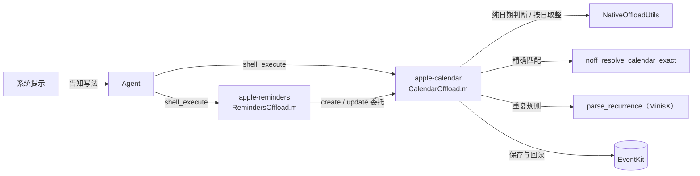
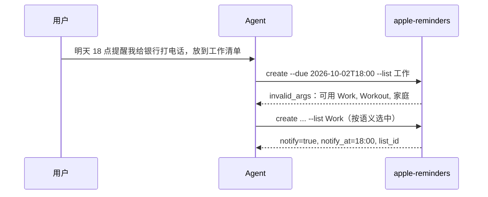

# 26-10-01 日历全天事件与提醒通知

状态：完成（2026-10-01，用户验收；分支 `feat/calendar-all-day`）　｜　验证：[verification.md](verification.md)
Spec：新增 [ios-calendar-all-day-and-reminders.md](../../../docs/specs/ios-calendar-all-day-and-reminders.md) 的 D1–D7、R1–R7、M1–M2；修改 [ios-calendar-recurrence.md](../../../docs/specs/ios-calendar-recurrence.md) 的 B4、B5（已生效）

## 目标

参考上游 OpenMinis 1.14（tag `1.14`），让日历工具支持全天事件，让提醒事项支持全天提醒和到点通知；写入目标的日历名、清单名改为精确匹配，并返回日历、清单的 ID 与来源。只涉及 iOS。

| 上游 1.14 改动 | 这次 | 解决的问题 |
| --- | --- | --- |
| 全天事件 | 做 | 事件只能按时刻创建，没法建整天的事件（假期、生日、出差） |
| ① 提醒到点通知（GH#251） | 做 | `--due …T18:00` 创建的提醒到点不弹通知 |
| ② 全天提醒（GH#286） | 做 | `--due 2026-02-25` 的提醒显示成“0:00 截止” |
| ③ 名称精确匹配（#282） | 做 | `--list Work` 可能写进 “Workout”；清单找不到时悄悄写进默认清单 |
| ④ 返回 ID 与来源 | 做 | 两个同名“工作”日历时分不清写进了哪个 |
| ⑤ 提醒 `--url` | 不做 | 系统提醒事项 App 不显示该字段 |
| ⑥ 同步提醒的隐藏开始时间 | 做 | 改截止后重复锚点停在旧日期 |

不做：⑤；整体升级到 1.14；Android。

## 方案

- 参考上游实现，按 MinisX 代码适配；辅助函数名与上游一致，方便以后整体升级。
- 事件 `create` 接入 MinisX 的严格参数解析、B4 校验与重复规则；`update` 先放下全天标志再写日期（全天状态下 EventKit 会丢弃日期写入），转全天前清除事件时区。
- 提醒：带时刻的截止 → 到点通知（`EKAlarm`，即提醒事项 App 自己的通知横幅，不是时钟闹钟）；纯日期 → 全天、无通知；`--notify on|off` 覆盖。只动时间通知，位置提醒保留。
- 名称找不到时报错并列出全部候选，由 LLM 按语义选中后重试。按事件 `id` 修改（如“10 号的婚礼改地点”）不经过名称匹配，不受影响。
- 与上游有意不同：全天事件结束日早于开始日、全天加 `--time-zone`，都返回 `invalid_args`（D3、D4）。

## 验收（有证据才打勾，注明证据位置）

- [x] 全天事件的创建与回读：满足 D1、D2、D7（`testAllDayCreateSingleAndMultiDay`；App 内实测，见 verification.md）
- [x] 全天事件的参数错误：满足 D3、D4（`testAllDayInvalidCombinationsDoNotSave`；App 内 `--time-zone` 被拒绝）
- [x] 全天重复事件：满足 D5（`testAllDayRecurringEvents`）
- [x] 事件在全天和定时之间切换：满足 D6（`testAllDayUpdateSwitching`、`testAllDayUpdateClearsEventTimeZone`；App 内复现并修复时区缺陷）
- [x] 全天提醒与到点通知：满足 R1、R2、R6、R7（`testReminderAllDayAndDefaultNotification`、`testReminderInvalidNotifyDoesNotSave`；App 内实测）。横幅弹出需真机确认
- [x] 提醒 update 的通知、位置提醒与开始时间：满足 R3、R4、R5（`testReminderUpdateMovesAndRemovesNotification`）
- [x] 名称精确匹配与归属字段：满足 M1、M2、B4、B5（`testExactCalendarAndListNameMatching`、`testUnknownCalendarDoesNotFallBack`、`testOwnershipFields`、`testInvalidDatesAndTimeZonesDoNotSave`；App 内实测）
- [x] 在 App 里实际执行命令：`--help`、创建、查询、删除全天事件和全天提醒（iPhone 18 Pro，`debug.shellExecute`；verification.md）
- [x] 已有测试无回退：45 项中只有 W1 那 4 项失败（iOS 27 `479131C9`；iOS 26.4 `A6D580D2` 另有 1 项 setUp 日历可见性偶发失败，单独重跑通过）

## 决定

- 只移植上游这几项，不整体升级到 1.14（用户，2026-10-01）
- 全天事件的 `--end` 包含结束日，与上游一致（用户，2026-10-01）
- 范围包括上游改动 ①②③④⑥，不做 ⑤ `--url`（用户，2026-10-01）
- 精确匹配时列出候选名称，由 LLM 按语义选择（用户，2026-10-01）
- 全天事件的结束日早于开始日、全天事件加 `--time-zone`：都返回 `invalid_args`，与上游不同（用户，2026-10-01）
- 单开分支 `feat/calendar-all-day`（用户，2026-10-01）
- 新规则单独成 Spec：原 Spec 加上后会超过 7,000 字符
- ✗ 继续用子串匹配：会把 “Work” 写进 “Workout”，等于由代码替 LLM 猜

## 实现计划

- [x] 实现（implementer）：辅助函数、事件 create/update、提醒全天与通知、精确匹配与归属字段、help 文本、系统提示
- [x] 测试：在 `CalendarRecurrenceTests.m` 补充用例；调整 `testUnknownCalendarDoesNotFallBack`
- [x] 两台模拟器各跑一轮 `MinisCalendarTests`
- [x] 在 App 里用 `debug.shellExecute` 实际执行
- [x] 独立审查（reviewer），处置审查意见（verification.md）
- [x] 用户验收后：去掉 `[拟议]`，提交

## 遗留事项

- ~~真机确认通知横幅~~：维护者 2026-10-01 在 Build 7 上实测全天日历与带时刻提醒，均成功。
- 已知限制，是否另开任务由用户决定（处置依据见 verification.md）：
  - ~~完全同名的日历或清单取第一个~~：已按 M4 修复，报歧义并支持 `--calendar-id` / `--list-id`（用户 2026-10-01 同意，未另建任务）；
  - ~~全天事件只传一端带时刻的日期~~：已按 D8 修复，只给开始时结束为当天 22:00（晚于 22:00 则 +1 小时），只给结束或混用纯日期时报错（用户 2026-10-01 决定）；
  - 其他客户端创建的 `relativeOffset` 型提醒通知不计入 `notify`，`--notify off` 也不删除（用户 2026-10-01：暂不使用其他客户端，不处理）；
  - ~~事件命令不拒绝 `--notify` 等提醒参数~~：已按 M3 修复（归档后的后续改动，用户 2026-10-01 同意，未另建任务）。
