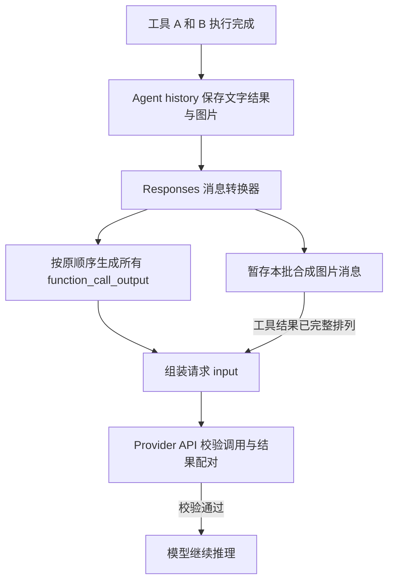
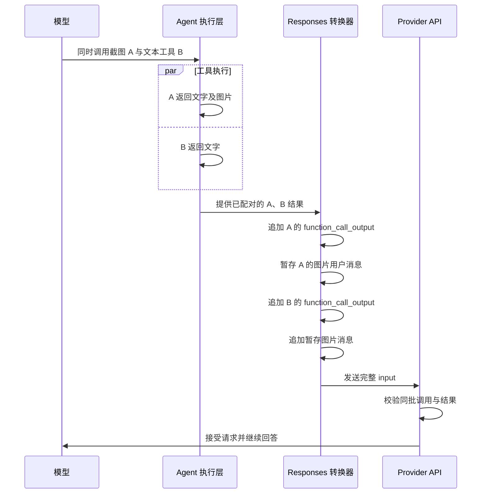

# 26-10-03 Responses 工具结果与图片消息顺序修复

状态：完成并经用户验收（2026-10-03；排序修复与新会话全文文档验证通过，维护者已分发 Build 10 至手机并反馈目前没有问题）｜Spec：`docs/specs/ios-agent-run-lifecycle.md`（新增 L8）｜验证：[verification.md](verification.md)

## 目标

应用在同批工具返回图片与文本时，先提交完整工具结果，再追加携带图片的用户消息。DeepSeek Responses API 能接受该请求，继续生成回答。

此次保留现有工具执行、图片能力判断和数据保存方式。任务不修改网页正文提取、搜索策略或 Provider 凭据。

## 方案

`function_call_output` 是发送给接口的工具结果。它通过 `call_id` 对应原工具调用。合成用户消息是应用为传递图片而生成的 `role: user` 消息。

1. Provider 转换器按原顺序生成同批全部工具结果。
2. 转换器暂存该批次产生的合成图片消息。
3. 转换器在完整工具结果之后追加这些图片消息。
4. 转换器在下一条正常消息之前结束该批次，保留聊天轮次边界。

相邻的工具结果消息可能来自历史重放。转换器需要在这些消息之间保持同批结果完整。图片能力判断、`call_id`、文字内容及图片顺序保持原有含义。

### 实现关系图

### 已验证典型场景图

原始失败请求的顺序、错误原文和证据位于 [evidence/before](evidence/before)。服务端内部校验过程是解释模型；实际证据包括完整 input、工具结果、400 和当前转换器源码。

## 验收

- [x] 满足 L8：单图与文本、多图、纯文本及不支持图片的模型通过真实转换器回归测试。证据：[8项测试](verification.md#定向构建与回归测试通过)。
- [x] 满足 L8、P4：相邻工具结果消息、多个批次和恢复历史重放保持配对及轮次边界。证据：[历史转换回归及验证边界](verification.md#定向构建与回归测试通过)、[独立审查](reviews/001%20工具结果与图片顺序/report.md)。
- [x] iPhone 18 Pro 上的定向测试和模拟器构建通过，应用安装启动成功。证据：[Build 10 与定向测试](verification.md#定向构建与回归测试通过)。
- [x] 真实应用请求证明同批结果位于合成图片消息之前，Provider 接受请求。证据：[实际 input 顺序及模型回答](verification.md#相同触发条件的真实-provider-请求通过)。
- [x] 原始 X 文章翻译指令不再因本次工具配对错误停止。原会话经追加继续指令完成最终译文和七张原图，用户已查看独立文档并确认没有问题。[原会话证据](verification.md#原始文章最终译文与原图通过)、[用户验收](verification.md#独立-markdown-文档与用户验收通过)。随后在新会话中，以原指令加独立 Markdown 要求的一条初始消息完成全文及七张本地原图，期间没有追加提示；七张图的位置和原生加载均验证通过。逐句学术译审未执行。[新会话验证](verification.md#新会话原始文章与独立-markdown-全流程通过)。
- [x] 独立审查检查正确性及资源开销，所有确定的问题已处理。没有确定缺陷或阻断疑点；资源结论限于静态审查。[审查摘要](reviews/001%20工具结果与图片顺序/report.md)。
- [x] 全局协作规则已要求详细错误流程图，最终报告说明应用组装、API 校验和模型推理的区别。证据：`/Users/huyuanzhao/.codex/AGENTS.md` 第20–24行及 [修复前后流程](verification.md#触发条件与失败流程)。

## 执行边界

- 仓库：`/Users/huyuanzhao/Coding/Projects/OpenMinis`。
- 基线：`optimize_web_search`，提交 `a0bda422075bafd2e9c9d09e237a96dc77e1fe9b`。
- 修复分支：`fix/responses-tool-result-image-order`。创建前工作区干净。
- 设备：iPhone 18 Pro，`479131C9-8187-44E7-8510-A499D7AC3034`，iOS 27.0。
- 验证通过应用本身调用 Provider。凭据不导出到独立 API 探针。
- 维护者已自行 Archive 并分发 Build 10 至手机，反馈目前没有问题。用户随后明确要求提交当前修复分支，本轮执行本地提交。

## 决定

- 使用先完整工具结果、后图片消息的方式。该方案保留当前 Responses 兼容路径。
- 不改为把图片直接嵌入工具输出；该方式虽有官方支持，但不是此次修复所需的协议变更。
- 不新增网络请求、重试或持续后台工作。暂存消息只存在于一次请求转换中。

## 实现计划

- [x] 从用户指定基线创建修复分支，并写入全局错误解释规则。
- [x] 先写入拟议 Spec，再修改转换器并增加回归测试；验证后 L8 已生效。
- [x] 完成独立审查、定向测试和相同故障触发条件的真实模拟器验证；原始文章最终译文及继续操作的边界单独记录。
- [x] 根据证据更新全部验收项和 L8 的状态；原始文章最终译文完成后，全部验收项均已按证据勾选。

## 遗留事项

本任务所要求的修复和最终译文查看已经完成。初始图片下载等待及后续自动滚动后 RPC 未响应的具体原因没有调查，相关实现没有修改；这些现象没有被当作本次 Provider 配对400的证据。用户新增要求的新会话“原始指令加独立 Markdown 文档”已完成一次性验证，期间没有追加提示。没有进行独立逐句译审或真实设备资源测量。用户已授权提交当前修复分支。Build 10 手机安装与使用反馈见 [验证记录](verification.md#build-10-手机分发反馈与提交授权) 和 [发布状态](../../../docs/minisx-release-status.md)。
