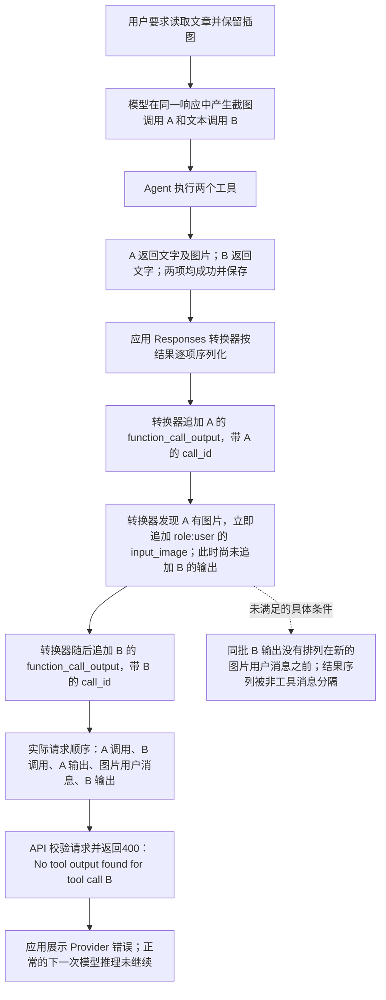
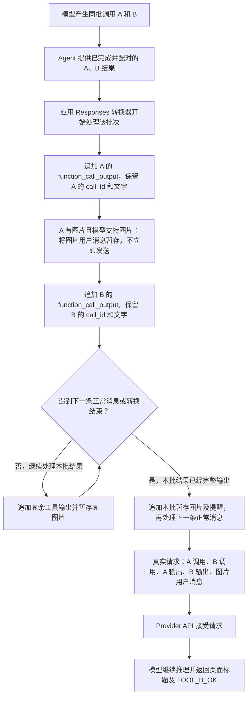

# 验证记录

## 修复前证据

原始指令在 iPhone 18 Pro、MinisX 1.13 (9)、`deepseek-flash` 上于2026-10-03 08:12复现，约36秒后停止。Provider API 返回400，错误为 `No tool output found for tool call call_01_i91utINgMXUUdbWBceIi1039`。

截图工具 A 和文本工具 B 均已执行成功。完整请求的最后五项为截图调用、文本调用、截图结果、合成图片用户消息、文本结果；B 的结果存在于请求及数据库中。问题位于应用转换器组装顺序，不能将 API 拒绝请求描述为模型推理后报错。

证据：[修复前请求](evidence/before/request-evidence.json)、[错误日志](evidence/before/runtime-error.log)。原始请求抓取上限截断了后面的工具定义，但完整 `input` 已恢复；脱敏证据没有 Provider 请求头和原始图片数据。

## 触发条件与失败流程

下面的请求顺序和400属于实测事实。“同批结果必须先完整出现”是结合错误、源码和修复后请求建立的解释；服务端内部校验算法没有被直接观察。

## 修复实现与流程

`OpenAIAgentProvider.convertMessagesResponsesAPI` 先输出同批全部 `function_call_output`，暂存该批次的图片及伴随提醒文字。在下一条正常聊天消息之前或转换结束时，追加暂存消息。相邻工具结果消息遵守同一规则，因此恢复后的历史也由同一转换器处理。

转换器保留工具的 `call_id`、输出文字和图片顺序。不支持图片的模型继续仅接收文字。方法由 `private` 调整为模块内可见，以便测试直接调用生产转换器，没有复制一套测试转换逻辑。

## 分支与规则

用户于2026-10-03授权创建修复分支并实施修复。主会话从干净的 `optimize_web_search`、提交 `a0bda422075bafd2e9c9d09e237a96dc77e1fe9b` 创建 `fix/responses-tool-result-image-order`。截至本记录，修改尚未提交、合并或推送。

主会话已在 `/Users/huyuanzhao/.codex/AGENTS.md` 的“错误排查与解释”中写入全局规则，要求详细流程图、具体失败条件，以及实测与解释模型的区分。

## 定向构建与回归测试：通过

2026-10-03 09:03，在 iPhone 18 Pro（`479131C9-8187-44E7-8510-A499D7AC3034`、iOS 27.0）上运行 `MinisTests/ResponsesToolResultImageOrderTests`，8项测试全部通过。Xcode 构建及测试返回0，日志记录 `TEST SUCCEEDED`，应用构建为 MinisX 1.13 (10)，随后已启动。

覆盖：单张图片位于首个或末个工具结果、多张图片、纯文本、不支持图片的模型、相邻历史结果消息、多个批次与下一轮消息边界、工具结果伴随提醒文字、正常用户图片、同模型 reasoning echo。历史场景是直接构造 `AgentMessage` 的转换器回归，不代表已另行完成应用重启后恢复会话的端到端测试。

证据：[测试摘要](evidence/after/xctest-summary.json)、[测试日志摘录](evidence/after/xctest-summary.log)。完整结果包位于 `build/provider-response-order-20261003.xcresult`。XcodeBuildMCP 受全局 Command Line Tools 选择影响，测试通过指定本次进程的 Xcode 开发目录执行；没有修改全局系统配置。

## 相同触发条件的真实 Provider 请求：通过

09:04，在修复后的 iPhone 18 Pro 应用内，通过 `DeepSeek-V4.1-Flash` 发出验证指令。模型在同一次响应中调用 `browser_use screenshot` 和 `shell_execute printf TOOL_B_OK`，两个结果均成功。

会话：`B29CC152-8594-444E-B3C1-ECD5DD7DEEAB`。最终主请求于 `2026-10-03T01:04:37.742Z` 发送至 `https://api.deepseek.com/v1/responses`，完整 input 中对应项目为：

| 索引 | 请求项目 | 配对标识 |
| --- | --- | --- |
| 5 | 截图调用 A | `call_00_jpaQGKANQh7CR7U7PUHq0458` |
| 6 | 文本调用 B | `call_01_nVPSToOVUBFptsIU9XzJ5151` |
| 7 | A 的 `function_call_output` | 与 A 相同 |
| 8 | B 的 `function_call_output` | 与 B 相同 |
| 9 | 含一张 `input_image` 的用户消息 | 不承担工具结果配对 |

图片消息之前已经存在 A、B 的结果。检查器在该位置记录的待返回调用集合为空；这是客户端根据请求序列计算的结果，并非服务端校验日志。Provider 返回有效响应，模型输出 `Example Domain` 和 `TOOL_B_OK`，会话正常结束、数据库无错误。此处以实际回答证明请求被接受，不虚构抓取中未提供的 HTTP 状态码。

证据：[请求顺序](evidence/after/runtime-mixed/requests.json)、[工具及回答](evidence/after/runtime-mixed/messages.json)、[结束状态](evidence/after/runtime-mixed/status.json)、[错误查询](evidence/after/runtime-mixed/message-errors.json)。验证经过应用自身的 Provider 路径，未将 Provider 凭据导出到独立探针。

## 原始 X 文章指令：部分验证，未完成全文流程

09:05:33 启动完全相同的原始指令，会话为 `0FCB780B-98D0-4430-A7E8-EDD9E6A34963`。应用已从页面取得文章段落并定位插图；09:06:14 开始执行多张图片的下载命令，之后长时间没有完成。09:11 检查显示下载目录 `total 0`，仍有 `curl` 进程；主会话随即停止这次复测，09:11:52 会话状态为未运行。

截至停止前未出现 Provider 400，但本次原始指令没有到达发送图片工具结果的步骤，也没有生成最终译文，因此不能据此宣称原始文章端到端验证通过。下载等待的具体原因尚未调查，本任务没有修改下载路径。独立的“截图＋文本”真实请求已经覆盖并通过本次故障的触发条件。

证据：[原始指令与设备](evidence/after/runtime-original/run.json)、[最后状态](evidence/after/runtime-original/status.json)、[已取得内容](evidence/after/runtime-original/messages.json)、[下载检查](evidence/after/runtime-original/download-state.json)、[停止记录](evidence/after/runtime-original/cancel.json)、[请求摘要](evidence/after/runtime-original/requests.json)。文章内容完整性、译文准确性及图片在译文中的最终位置均未验收。

## 独立审查与资源开销：静态审查通过

审查由全新上下文的 `gpt-6.1-sol / high` 子代理只读完成，审查范围包括转换器、回归测试、L8、历史构造及持久化路径。审查者未报告影响正确性或违背需求的确定缺陷，也未报告阻断疑点。主会话核对了实际差异及测试结果，无待处置审查意见。[审查摘要](reviews/001%20工具结果与图片顺序/report.md)。

转换增加一次局部内容扫描及当前连续结果批次的暂存数组，仍随消息及内容数量线性处理。图片仍各编码一次；没有新增网络请求、重试、持续缓存、后台任务或订阅。暂存数组在批次边界清空，整个调用返回后释放。该结论来自静态审查；未测量真实设备的峰值内存、CPU 或能耗。

## 文档与收尾检查

L8 的生产转换行为已由回归测试和真实请求验证，去除 `[拟议]` 标记。未修改 Spec 的 description 或一级标题，索引无需重新生成。最终执行 `git diff --check` 并核对修改范围。

首次结束时，原始文章完整复测的验收项仍未通过，任务因此保留在 active。用户随后要求查看最终译文；后续完成情况及验收边界见下文。运行证据目录按仓库现有规则被忽略，核心结论及请求序列写入本文，原始本地证据另行保留。

## 原始文章最终译文与原图：通过

用户于2026-10-03明确要求继续刚才的文章任务，必须能够查看最终译文。主会话继续使用 iPhone 18 Pro、MinisX 1.13 (10)、`DeepSeek-V4.1-Flash` 和原会话 `0FCB780B-98D0-4430-A7E8-EDD9E6A34963`，未新建应用会话或 Codex 对话。

主会话追加继续指令，要求直接将公开原图链接插入对应位置，避免继续等待此前的 shell 下载。应用于09:22返回12130字元的完整初稿。主会话随后要求调整为学术书面语，并核对原文中的 `X` 与 `Abhinandan` 示例，修正了将部分名称统一为 `X` 的偏移。

最终回答于 `2026-10-03T01:37:48.455Z`（本地09:37:48）生成，消息为 `3D4C56D9-DC88-43E0-878C-5D7A66DD9500`，共11938字元。会话正常结束，数据库没有 Provider 错误。该结果包含标题、正文、公式、例子和结尾，不是完成说明或内容摘要。

### 内容与图片核对

- 应用浏览器中的原文提取为391块、24365字元，标题为 `Prefill & Decode made Crystal Clear`。主会话核对了标题、`X ∈ ℝ^(S × D)`、主要技术段落、具体例子、文章结尾及七张图的上下文。
- 最后两处示例更正将 `X` 恢复为 `Abhinandan`。逐字符比较确认该版本只作三处相应字符串替换，其他正文与图片保持上一版学术化译文的内容。
- 七个图片引用的媒体标识及顺序与原文一致：封面、Tokenizer、Embedding、模型架构、Prefill、Decode、Compute-bound 与 Memory-bound。对应图分别出现在封面位置和相关段落之后。
- 应用日志记录七张图片加载成功，封面为1200×480，正文图为1200×900；应用重启后也再次确认七张图片均加载成功，没有加载失败。
- 主会话通过 `minis://sessions/0FCB780B-98D0-4430-A7E8-EDD9E6A34963` 打开原会话，模拟器显示最终回答及正文末尾。最终回答已原样导出为可查看的 Markdown 文件。

证据：[最终译文](evidence/after/translation/final-translation.md)、[验收摘要](evidence/after/translation/translation-acceptance.json)、[模拟器最终画面](evidence/after/translation/final-translation-screen.png)、[原文及图位置](evidence/after/translation/runtime-translation/article-source.json)、[最终会话状态](evidence/after/translation/runtime-translation-final-after-relaunch/status.json)、[最终回答与工具历史](evidence/after/translation/runtime-translation-final-after-relaunch/messages.json)、[最终请求摘要](evidence/after/translation/runtime-translation-final-after-relaunch/requests.json)、[重启后的图片加载](evidence/after/translation/runtime-translation-final-after-relaunch/post-relaunch-image-load-events.txt)。

### 观察边界与中间操作

本次在同一会话中追加了继续、语体调整和示例更正指令，最终完成了原文章任务；它不是重新从空白会话执行、没有干预的一次性成功证明。图片使用公开远程 URL，查看时需要网络。主会话完成了上述结构和例子的核对，没有进行独立的逐句学术译审。

先前 `chat.messages.list` 中的工具结果摘要在文章结尾处截断，不能据此认定模型没有取得原文结尾：该调试方法只返回结果的前2000个字符。此次直接核对应用最终 Provider 请求的工具输出，确认包含原文最后一句 `Hope you have read till last`，原文结尾已进入 Provider 输入。这里修正了此前对摘要截断范围的判断，没有修改网页提取实现。

自动滚动使用 `deltaY=8200` 后，应用内 RPC 未能及时返回，而 `/schema` 仍可响应。主会话先通过只读查询确认既有全文已持久化，再重启模拟器应用；调试接口恢复，历史会话重放后的 Provider 请求正常生成最终回答。未响应的具体原因没有定位，这不是此前工具结果配对400的证据，本任务没有修改滚动或渲染实现。

### 收尾

任务全部七项验收都有对应证据，L8 已生效，最终文档检查通过。任务按归档规则移至 `tasks/archive/26-10-03 Responses 工具结果与图片消息顺序修复/`。修复分支保持 `fix/responses-tool-result-image-order`，用户未要求提交、合并或推送，因此本次没有执行这些操作。

## 独立 Markdown 文档与用户验收：通过

用户要求在刚才的模拟器会话中，用独立 Markdown 文档显示整篇译文。主会话向原应用会话追加该要求，没有创建新的应用会话。

应用于2026-10-03 09:47创建 `/var/minis/workspace/prefill-decode-translation.md`，并通过 `minis-open` 打开应用内文档阅读预览。模拟器截图显示文件名、译文及原图，界面为独立文档预览。

文件为25809字节，包含七个图片引用。与之前最终译文比较，除末尾空白外完全一致。上述文件、验收摘要、会话结果和截图保存在 `/Users/huyuanzhao/.codex/.chatgpt-projects/g-p-6aa8f27e863c8191be6cf501db847b1a/outputs/provider-400-fix-20261003/runtime-markdown-document/`，文件包括 `prefill-decode-translation.md`、`acceptance.json`、`messages.json` 和 `document-preview.png`。

用户随后明确反馈：“我看了一下，目前没问题。”该反馈作为独立译文文档的用户验收通过记录。结合既有8项回归测试、相同触发条件的真实 Provider 请求及独立审查，本次工具结果与图片消息排序导致的 Provider 400 可以认定已解决。

此次只补充验收状态，没有再次运行模拟器或测试，没有修改生产代码。原指令经过继续、语体调整和示例更正的验证边界保持不变。修复仍保留在 `fix/responses-tool-result-image-order` 的未提交修改中，没有提交、合并、推送或发布。

## 新会话原始文章与独立 Markdown 全流程：通过

用户随后要求创建新的模拟器应用会话，以相同文章指令生成独立 Markdown 文档，并核对全部原图的位置。主会话于2026-10-03 09:57:44，在相同 iPhone 18 Pro、MinisX 1.13 (10)、DeepSeek-V4.1-Flash 上创建会话 `B3BA7CAF-DCF8-4AB8-BC0E-F3985FEAB142`。初始消息保留原始文章阅读、学术化翻译和插图要求，并追加独立文档保存及预览要求。

### 本次验收

- [x] 新会话：`run.json` 记录 `isNewSession=true`，模型仍为 `DeepSeek-V4.1-Flash`。会话历史仅有一条非工具结果的用户初始消息，没有追加提示，也没有向该会话提供之前的译文或图片列表。
- [x] 完整流程：会话于10:04:02正常结束，约6分18秒，数据库错误记录为空，没有 Provider 400。模型在短链网络命令等待后自行继续，通过浏览器分段读取全文，并取得七张原图。
- [x] 文档与正文：应用实际生成 `/var/minis/workspace/prefill-decode-translation.md`，为29379字节、13976字符。主会话核对了正文顺序、公式、具体示例、技术段落和结语；字符数包括译者说明、图注及术语表，不单独用来证明全文完整。
- [x] 原图内容与顺序：独立读取的原文有七张图片。文档七个相对路径引用的排列顺序一致；与应用从对应媒体地址取得的文件逐字节比较，七份文件均完全一致。所有图片保存在该会话工作区的 `prefill-decode/images/`。
- [x] 图片位置与预览：逐图比较原文和译文中的前后段落，全部对应。应用自行调用 `minis-open` 打开原生文档阅读预览；主会话查看真实截图，确认文档标题、封面与译文显示正常。原生日志记录七张图均加载成功。

| 图片 | 原文及译文的对应插入位置 |
| --- | --- |
| 封面 | 正文和引言之前 |
| Tokenizer | 分词及 token ID 介绍之后 |
| Embedding | token ID 映射为嵌入向量的说明之后 |
| 模型架构 | 输入矩阵开始经过 transformer 层的说明之后 |
| Prefill | 首次前向传播处理完整提示词的说明之后 |
| Decode | 逐 token 生成持续至回应结束的说明之后 |
| Compute-bound vs Memory-bound | 两阶段计算与内存带宽瓶颈的对比之后 |

### 证据与边界

本次证据位于 `/Users/huyuanzhao/.codex/.chatgpt-projects/g-p-6aa8f27e863c8191be6cf501db847b1a/outputs/provider-400-fix-20261003/fresh-session-markdown/`，包括 `prompt.txt`、`run.json`、`messages.json`、`status.json`、`message-errors.json`、`fresh-article-source.json`、`source-image-contexts.json`、`acceptance.json`、`native-image-load-events.txt`、`initial-document-preview.png` 和详细 `verification.md`。最终 Markdown、图片目录和 `translation-with-images.zip` 为应用生成文件的原样副本。

七张 `image_read` 后的连续有效模型回答及会话正常结束证明 Provider 接受了实际请求。后期请求含多张图片 base64，超过调试抓取长度，不能从此次 `requests.json` 声称取得了后期请求完整 input 排列；完整排序证据仍见之前的“截图＋文本”受控真实请求。

此前记录的“没有无干预一次完成的证据”是当时原会话的观察边界。本次补充了用户指定的新会话“原始指令加文档保存要求”一次性完成证据。尚未进行独立逐句学术译审。新文档由主会话完成技术核对，用户尚未反馈对此新会话文档的查看结果。

此次没有修改生产代码，没有再次构建或运行单元测试，没有提交、合并或推送。模拟器保持在新会话生成的独立文档阅读预览。

## Build 10 手机分发反馈与提交授权

维护者于2026-10-03确认：“我已经用 build10 archive 并分发推送到手机上了，目前没问题。”该反馈记录为 Build 10 已安装到手机且当前使用正常，不代替特定故障复现或资源指标的专项真机测试。

本地归档为 `/Users/huyuanzhao/Library/Developer/Xcode/Archives/2026-10-03/Minis 10-3-26, 10.14 AM.xcarchive`。主会话只读核对了归档及四个产品的 `Info.plist`：均为1.13（10），最低iOS版本均为26.0。归档创建时间为10:14:50，上传事件为10:16:50，状态为成功；分发记录ID为 `2bb317c8-83c1-47f8-819e-d03811331d64`。全部时间使用 Asia/Taipei。

归档时分支 HEAD 为 `a0bda42`，排序修复仍处于未提交状态。没有读取归档时完整源码快照或 App Store Connect 后台处理状态；发布事实与观察边界同步记录于 `docs/minisx-release-status.md`。

用户明确要求先提交当前分支。主会话已核对完整待提交范围，修复源码、8项回归测试、L8、任务及审查记录属于同一修复主题；发布状态采用单独的记录提交。本轮只更新事实记录并提交既有修复，没有再次构建、启动应用或调用模型测试。
