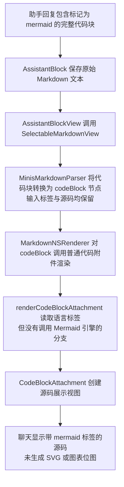
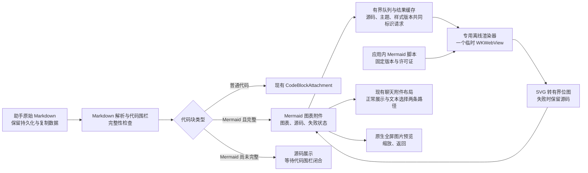
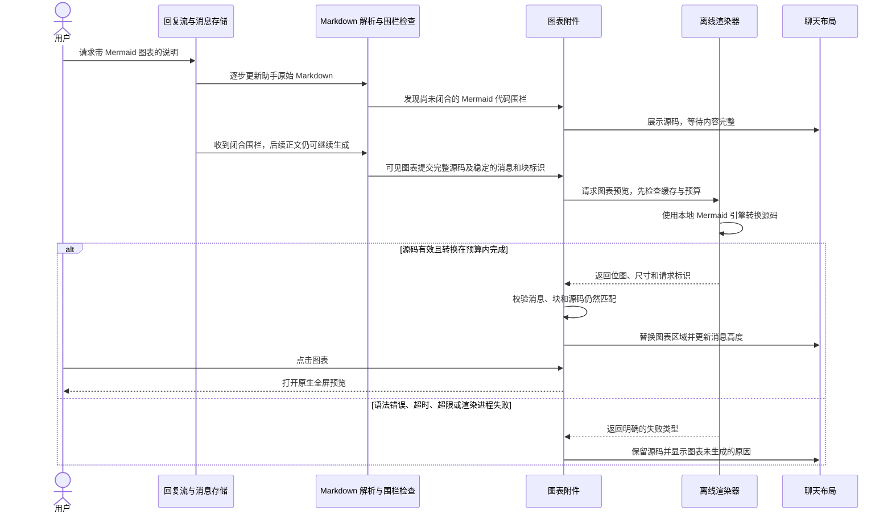

# 26-10-03 聊天内 Mermaid 图表渲染

状态：取消（2026-10-03）　｜　Spec：未建立，原拟议 M1–M23 已撤回　｜　验证：[verification.md](verification.md)

用户因更紧迫的任务取消本次工作。以下方案保留为历史参考；产品实现尚未开始。

## 目标

助手回复包含 Mermaid 代码块时，MinisX 在该代码块的位置显示图表。用户可以放大图表、查看源码和复制源码。历史回复重新打开后仍能显示图表。

首版范围是助手回复中的 Mermaid 代码块。用户消息目前采用文本气泡，首版保留该展示方式。首版不包含图表编辑器、额外插件、外部图表服务或要求模型自动修复源码的行为。文件预览使用同一 Markdown 渲染组件时，需要验证其兼容性，不把独立的文件预览改造列为本任务目标。

## 现状依据

- `AssistantBlockView.textBlockView` 把助手文本交给 `SelectableMarkdownView`。
- `MinisMarkdownParser` 已经保留代码块的语言标签和源码。
- `MarkdownNSRenderer.renderBlock` 把所有代码块交给普通代码附件，没有 Mermaid 分支。
- `MarkdownRenderView` 与文本选择视图分别管理附件。新增图表需要覆盖正常展示、文本选择和高度测量。
- `KaTeXRenderer` 已采用本地网页生成位图的技术路径。Mermaid 使用独立组件，生命周期与网络限制另行实现。

以下流程是源码核查得到的现有路径，未运行模拟器复现。

缺少的是应用内图表转换和展示步骤。该路径没有 Mermaid API 调用，因此不存在图表 API 校验失败。模型是否返回正确语法，需要在实现后作为单独场景验证。

## 方案

采用随应用打包的 Mermaid 引擎和原生图表附件。应用使用一个专用的本地网页渲染器，将 Mermaid 源码转换为 SVG（矢量图），再生成聊天使用的位图预览。图表附件沿用现有消息布局机制，放大查看优先复用现有原生图片预览。

| 路线 | 用户效果 | 代价与判断 |
| --- | --- | --- |
| 本地引擎生成图片预览，原生组件展示 | 图表直接出现在回复中；已有消息离线可用；可以放大和复制源码 | 增加应用包体；位图放大有清晰度上限。推荐采用，实施时测量中文与宽图的可读性。 |
| 每张图表长期保留一个网页组件 | 可以保持矢量缩放和网页交互 | 多图长对话会增加网页组件、内存和手势协调成本。首版不采用。 |
| 使用外部图表渲染服务 | 本地接入步骤较少 | 图表文本需要联网传输，离线不可用。首版不采用。 |

### 关系图（拟议）

### 典型场景图（拟议）

### 展示与状态

| 条件 | 应用行为 |
| --- | --- |
| Mermaid 代码围栏尚未闭合 | 展示已收到的源码；不逐 token 执行图表转换，也不把未完成语法显示为失败。 |
| 代码围栏已经闭合 | 图表可见时独立转换；回复的其余文字继续正常生成。 |
| 图表已经生成 | 默认展示图表；提供查看源码和复制源码操作；点击图表进入全屏预览。 |
| 用户查看源码 | 展示原始图表文本；切换返回图表时优先使用已有结果。 |
| 语法错误或无法识别的图表类型 | 保留源码，说明未生成图表；不覆盖相邻文字与其他图表。 |
| 输入超限或单次渲染超时 | 停止该次转换，显示原因和源码；不无限重试。 |
| 用户停止回复，末尾围栏仍未闭合 | 保留源码，不把截断文本作为完整图表提交。 |
| 消息重试、截断、删除或切换会话 | 清理失效请求；忽略已过时的回调，不把旧图表显示到新的内容上。 |

### 样式确认稿（待确认）

建议采用学术灰度样式，重点是可读的文字、结构和关系。普通流程节点使用统一的灰阶填充。需要区分类别时，使用少量灰阶、形状、线型和文字标签。

| 元素 | 浅色模式 | 深色模式 |
| --- | --- | --- |
| 图表背景 | 白色 `#FFFFFF` | 深灰 `#1E1E20` |
| 普通节点填充 | 极浅灰 `#FAFAFA` | 灰色 `#29292C` |
| 文字 | 深灰 `#242424` | 浅灰 `#E8E8E8` |
| 边框与箭头 | 中灰 `#606060` | 灰色 `#B4B4B4` |

- 文字使用清晰的常规字体，中文和英文保持一致的阅读层级。
- 边框和箭头采用细线，节点使用矩形与极小圆角；判断节点保留菱形。
- 图表保持静态，不使用渐变、阴影、发光、纹理或持续动画。
- 应用统一控制调色板；源码中的颜色设置不能使最终图表偏离已确认样式。图表的形状、连接与文字语义保留。
- 浅色和深色的视觉样例仅用于确认外观。正式 Mermaid 的布局、iOS 可读性和操作效果仍需要实施后验证。

这组颜色是推荐稿，尚未获得用户确认。用户确认样式和资源策略后，才能开始产品实现。

### 本地引擎与资源边界

实施时锁定经过 iOS 26 验证的官方 Mermaid 版本，并随应用打包全部所需脚本和许可证。图表类型以该版本内置能力为准。首轮测试至少覆盖流程图、时序图、状态图、类图、实体关系图和思维导图；未测试的类型不宣称已验收。

渲染器使用临时网站数据存储，只读取自己的资源目录。应用固定 Mermaid 的安全配置，并阻止外部网络请求、外部图片加载和图表脚本回调。图表源码通过结构化参数传递，不能直接拼接成可执行脚本。

按每个对话只有少量图表的使用场景，优先减少启动、重复转换和长期驻留。渲染必然产生短暂的计算与显示图片所需内存；本任务不承诺完全零开销，也不把预算上限当作常态占用。

已经生成的预览可通过少量可清理文件缓存复用。普通滚动、源码切换和宽度变化不重新执行 Mermaid。源码、主题或已确认样式改变后，才生成新版本。文件缓存淘汰后，需要显示的图表可以重新转换。

以下预算从原方案的 24 MiB／16 项缓存、30 秒空闲驻留收紧而来，均为待确认值。实施验证若需要提高预算，先向用户说明原因并取得确认。

| 项目 | 首轮预算与清理条件 |
| --- | --- |
| 网页渲染器 | 同时最多一个；应用启动与普通聊天不创建、不预热；首次有可见完整图表需要转换时创建；当前可见批次完成后立即释放；进入后台时取消并释放。 |
| 渲染工作 | 同时最多一个；等待队列最多 4 项；相同请求合并；离开可见区域后取消无人等待的工作。 |
| 单次转换 | 从提交 JavaScript 到生成预览最多 5 秒；超时销毁失效网页实例，旧回调不进入下一次请求。 |
| 源码长度 | 最多 50,000 个 UTF-16 单元；超限保留原文并说明原因；原始消息不截断。 |
| 预览位图 | 每张最多 2,000,000 像素；普通屏幕宽度变化只缩放已有图片；测量中文及极宽、极高图表的清晰度；无法提供可读结果时保留源码并说明限制。 |
| 结果缓存 | 优先使用可清理文件缓存，合计最多 8 MiB、最多 4 项；显示时才解码；离屏附件释放自身位图引用；内存警告清除可重建的图片引用。 |
| 失败与日志 | 相同源码、主题和尺寸的失败不自动反复重试；日志只记录类型、尺寸、耗时和请求标识，不记录完整回复。 |

以上是本任务的拟议工程边界，不是 Mermaid 官方对 iOS 性能的保证。源码检查、模拟器运行与真机资源表现分别记录。

## 原拟议规则（未写入 Spec，随任务取消撤回）

- **M1** 助手回复中的围栏代码块，语言标签首个词不区分大小写等于 `mermaid` 时，应用将其识别为 Mermaid 图表。
- **M2** 应用在 Mermaid 围栏闭合后才提交图表转换；未闭合时展示源码，并允许相邻正文继续生成。
- **M3** 完整且有效的 Mermaid 代码块在原位置显示图表，前后 Markdown 和多图顺序保持一致。
- **M4** 图表成功后提供全屏放大、查看源码和复制源码操作，源码切换不修改持久化消息。
- **M5** 复制 Mermaid 源码得到代码围栏内原始文本；复制整条 Markdown 消息保留原始 Mermaid 围栏和正文。
- **M6** 无效语法、未知类型、超时和预算超限分别显示可理解的原因，并保留可复制的源码。
- **M7** 单张图表失败只影响该图表，普通代码块与相邻内容继续正常显示。
- **M8** 重新加载历史消息时，应用使用持久化源码重建图表，不依赖之前的内存缓存或重新请求模型。
- **M9** 深浅色改变后，应用使用对应主题的结果；普通显示宽度变化只缩放已有图片，中文标签与箭头保持可辨认。
- **M10** 渲染器只使用应用内资源和临时网站数据存储，拒绝图表引发的外部资源请求与脚本交互。
- **M11** 应用使用结构化参数传递源码，并固定图表安全配置，源码不能改变应用设定的安全边界。
- **M12** 单实例、队列、转换时限、源码长度、位图和缓存按本任务预算执行；批次完成、离屏、后台与内存警告触发对应清理。
- **M13** 异步结果同时匹配消息、块、源码、主题和样式版本后才更新图表，过时结果被丢弃。
- **M14** 图表尺寸变化同步更新正常展示与文本选择视图的布局，保持相邻文字和聊天滚动位置可用。
- **M15** VoiceOver 能识别图表类型及可用操作，用户可以进入源码视图读取或复制文本。
- **M16** 图表展示只派生于原始 Markdown，不将图片替换进 Provider history、消息持久化文本或后续模型请求。

- **M17** 图表使用已确认的学术灰度调色板，类别通过灰阶、形状、线型和文字区分，源码不能引入鲜艳配色。
- **M18** 图表使用清晰常规字体和细线边框，保持静态，不增加装饰性的阴影、渐变或持续动画。
- **M19** 没有可见且完整的 Mermaid 图表时，应用不创建或预热渲染器，也不为该功能启动轮询与后台工作。
- **M20** 相同源码、主题和样式版本命中缓存时，滚动、重新查看、源码切换和普通宽度变化不再次执行 Mermaid 转换。
- **M21** 当前可见批次转换结束后，应用立即释放网页渲染器，仅保留预算内的可重建预览。
- **M22** 图表只在显示时解码预览图片，离屏后释放图片引用，文件缓存按大小和数量双重限制淘汰。
- **M23** 资源验收分别核查普通聊天的新增工作和首次图表转换的瞬时开销，实测 CPU、内存与交互后才报告相应结论。

## 验收（任务取消，以下产品项均未实施）

用户在确认和实施之前取消任务。以下验收项保持未勾选，原因均为未进入产品实施阶段。

- [ ] 满足 M1–M3、M7：六种代表图表及大小写标签在助手回复中正确显示；未标注 Mermaid 的代码块仍显示源码。验证：相关测试和模拟器截图。
- [ ] 满足 M2：逐段输入、围栏闭合和 Stop 三个场景符合状态表。验证：定向测试和模拟器连续交互记录。
- [ ] 满足 M4–M5：点击图表可以放大并返回，源码切换和两种复制操作保留相应原文。验证：模拟器交互和剪贴板内容对照。
- [ ] 满足 M6–M7：错误语法、未知类型、超长输入和超时分别保留源码；相邻内容与下一张有效图表继续工作。验证：失败注入测试和模拟器记录。
- [ ] 满足 M8、M13、M16：退出会话、重启应用、重试和截断后，图表归属正确；持久化与 Provider history 保留原始 Markdown。验证：历史加载测试和模拟器重启记录。
- [ ] 满足 M9、M14、M17–M18：中文、深浅色、多图长回复和宽图在旋转与文本选择后无重叠或遮挡。验证：模拟器截图与连续交互；图表可读性由维护者确认。
- [ ] 满足 M10–M11：离线渲染成功；外部图片、链接回调和配置覆盖输入无法突破限制。验证：网络阻断测试与隔离配置核查。
- [ ] 满足 M12、M19–M23：普通聊天不启动渲染器；重复查看不重复转换；批次完成、离屏、后台、超时和内存警告清理正确。验证：定向测试、模拟器资源记录与代表性真机对照；尚未测量的指标保持未验证。
- [ ] 满足 M15：VoiceOver 可以访问源码与图表操作。验证：辅助功能核查和实际交互。
- [ ] 相关 iOS 测试和模拟器构建通过；独立只读审查的问题已逐条处理。证据记录在 verification.md。
- [ ] 真机查看多图长回复、放大操作和反复切换会话，维护者确认可读性与交互；资源测量未完成时保留未验证状态。

## 执行边界

- 原工作分支为 `feat/chat-mermaid-rendering`，从 `optimize_web_search` 建立；取消后恢复网页搜索分支，并删除没有新增提交的本地 Mermaid 分支。
- 首版只修改 iOS 图表渲染和对应的 Harness 文档；最低系统版本保持 iOS 26.0。
- 任务已取消，停止需求推进和实施。未来恢复时，由用户重新确认范围、样式与资源策略。
- 多文件实施按照仓库分工交给 `gpt-6-luna / xhigh` 子代理；独立审查使用 `gpt-6.1-sol / high` 新上下文。
- 提交、推送、合并和 TestFlight 发布分别依照用户后续指令执行。

## 决定

- 2026-10-03：用户因更紧迫的任务取消 Mermaid 分支与本次开发任务。

- 2026-10-03：按用户的新分支请求，从当前网页搜索分支建立 Mermaid 工作分支。
- 2026-10-03：用户要求学术、专业和克制的图表样式；具体灰度方案尚待确认。
- 2026-10-03：用户说明每个对话的图表数量较少，并要求在此前提下尽可能节约资源。
- 2026-10-03：用户要求在双方确认后才开始实施；当前状态继续保持待确认。
- 展示方式、具体调色板、首版范围与收紧后的资源预算均为待确认方案。

## 原实现计划（取消后不再执行）

- [ ] 用户确认目标、范围和验收后，新增 `ios-chat-mermaid.md`，生成 Spec 索引并把规则引用移入任务状态行。
- [ ] 锁定引擎版本，验证本地脚本完整加载和离线转换，再接入有界的独立渲染器。
- [ ] 接入代码围栏完整性识别、图表附件、正常展示及文本选择布局、全屏预览和源码操作。
- [ ] 完成定向测试、模拟器构建、代表场景验证和独立审查，逐条更新验收状态。
- [ ] 由维护者完成真机体验确认；按已有证据处理拟议规则与任务归档。

## 遗留事项

- Mermaid 产品功能、相关测试、应用构建与设备验收均未开展，原因是用户取消任务。
- 当前没有需要回滚的产品代码或拟议 Spec。
- 计划与样式示意保留为参考；未来重新开展时，先重新确认目标与执行范围。

## 官方参考

- [Mermaid 接口与运行环境](https://mermaid.js.org/config/usage.html)：`mermaid.render` 将图表字符串转换为 SVG，实施时核对选定版本与 Safari 兼容性。
- [Mermaid securityLevel](https://mermaid.js.org/config/schema-docs/config-properties-securitylevel.html)：`strict` 的标签与点击限制；该配置不能替代应用的网络阻断与数据隔离。
- [Mermaid maxTextSize](https://mermaid.js.org/config/schema-docs/config-properties-maxtextsize.html)：官方配置提供源码长度上限，应用仍需在提交前执行自己的预算检查。
