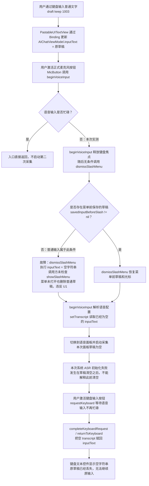
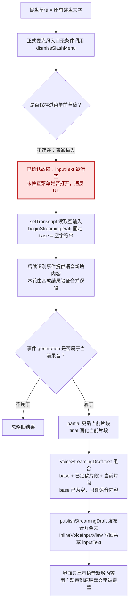
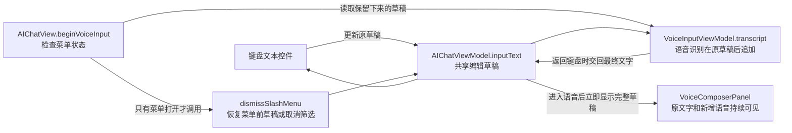
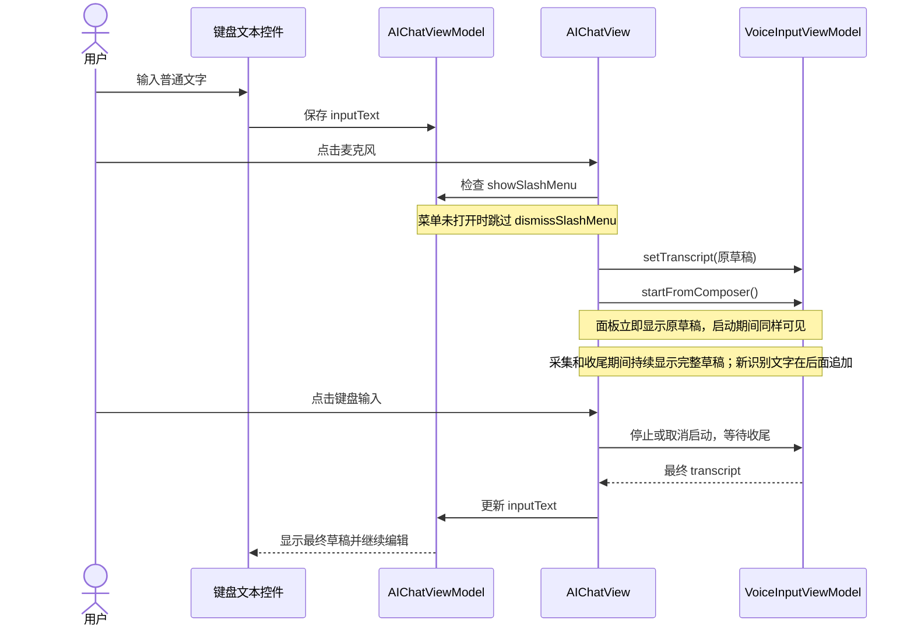

# 26-10-03 语音与键盘切换保留输入草稿

状态：完成（2026-10-04）　｜　Spec：`docs/specs/ios-voice-input-lifecycle.md`（U1、P4、S5、K3、K5；新增 U4、K7–K8）　｜　验证：[verification.md](verification.md)

## 目标

- 用户已经通过键盘输入普通文字时，点击麦克风后，原草稿立即显示在语音面板中。
- 语音启动、采集和收尾期间，面板持续显示完整草稿。新识别内容在原文字后面显示。
- 用户随后通过语音输入新内容时，新内容追加在原键盘文字后面。识别修订只更新当前语音片段，原键盘文字完整保留。
- 用户进入语音后全程不说话，立即返回键盘，输入框仍显示原草稿，用户可以接着输入。
- 用户没有说话、取消启动或遇到识别失败时，输入方式切换仍保留原草稿。
- 按用户已确认的预览参数调整共享语音面板：额外行间距 4 pt、标题行与正文区域间距 -7.5 pt、正文使用完整可用宽度自然换行。基准字号保持 17 pt，正文最大基准高度保持 160 pt，并保留 Dynamic Type。默认 iPhone 18 Pro 上约容纳每行 20 个中文字符；不插入强制换行或横向平移。
- 本任务不调整语音 Provider、波形或识别协议。

## 已确认的问题

当前分支是 `fix/voice-keyboard-draft`。
用户要求从 `optimize_web_search` 创建本分支，基点是 `b51aa64c8427e2d79e2c6d641d85b8ee114bba52`。
以下故障描述保留修复前的调查事实；修复后的结果见验收清单。

在 iPhone 18 Pro / iOS 27.0 上，正式麦克风入口会在进入语音面板前清空普通草稿。
返回键盘只把已经为空的语音草稿交回输入框。

实际调用栈已经确认：
`MicButton` 调用 `beginVoiceInput()`，后者调用 `dismissSlashMenu()`。
`dismissSlashMenu()` 在 `savedInputBeforeSlash == nil` 时执行 `inputText = ""`。
普通输入没有打开过 `/` 菜单，也没有保存菜单前草稿，因此进入这条清空分支。

- 入口：`src/ios/Views/Chat/AIChatView.swift:3368`。
- 清空：`src/ios/Agent/Chat/AIChatViewModel+SlashCommands.swift:87`。
- 语音草稿交接：`AIChatView.swift:3372`。
- 返回键盘交接：`InlineVoiceInputView.swift:114`、`AIChatView.swift:3378`。

用户补充的精确场景也已复现：输入文字后进入语音模式，全程不说话，立即返回键盘。
本次两次正式按钮动作合计 237 毫秒，返回后的真实文本控件为空。
证据见 `evidence/09-immediate-reproduction.json`。

### 实际故障流程

下图描述实测状态和源码执行顺序；清空调用由调试器调用栈确认。

### 语音追加后只剩新文字的形成路径

用户补充：已有键盘文字后输入语音，最终只保留语音内容。
已确认的入口清空缺陷足以产生这个结果。
下图前半段由模拟器与调用栈确认，后半段来自源码和合并测试。
基线调查阶段未完成成功录音识别的完整复现。

实际合并类型的检查结果如下：

| 传入的原草稿 | 传入的语音结果 | 合并结果 |
| --- | --- | --- |
| 空字符串 | 语音新增内容 | 语音新增内容 |
| 原有键盘文字 | 语音新增内容 | 原有键盘文字 语音新增内容 |

现有三项追加、修订和旧回调测试已在指定模拟器通过。
这些测试不经过正式麦克风入口，不能替代完整录音验证。

## 方案

采用入口条件修复，只在 `vm.showSlashMenu == true` 时调用 `vm.dismissSlashMenu()`。
普通草稿不经过菜单取消逻辑，随后按现有顺序交给语音输入。
修复后的语音合并必须保留原草稿，并在后面追加新片段。
当前合并源码和三项测试支持这一行为，暂不扩大为合并逻辑重构。

这与当前点击菜单外部、再次点击 `/` 按钮时的调用条件一致。
已有菜单确实打开时，保留恢复菜单前草稿或取消命令筛选文字的现有行为。

不采用全局修改 `dismissSlashMenu()` 清空规则的方案。
其他调用方通过该函数取消命令输入，全局改动会扩大行为范围。

语音面板已有 `transcript: inputText` 展示入口。
本项需求先通过保留共享草稿实现，验证时必须检查进入语音后的即时显示和录音期间的完整显示。

### 修复关系图

### 修复典型场景

## Spec 变更

用户已经确认实施。语音生命周期 Spec 新增 U4、K7、K8；源码、生命周期测试与本地正式界面验证已经完成，规则生效。用户于2026-10-04确认最后两项真机验收均通过，全部12项验收已完成。真机结论来自用户确认，详见 verification.md 的“2026-10-04 真机验收确认”。

## 验收

- [x] 调查与准备：从 `optimize_web_search` 创建当前修复分支，正式入口复现普通草稿丢失和不说话立即返回丢失，调用栈确认清空节点；基线三项追加测试通过。证据见 `evidence/05-real-entry-draft.json`、`09-immediate-reproduction.json`、`10-append-tests-summary.json` 与 `clear-call-stack.json`，详见 verification.md 的基线调查。
- [x] 首要验收，U1、K7：进入语音后不说话，随后直接通过正式键盘按钮返回，原文字完整保留；继续键盘输入仍保留原稿。正式 AX 动作、真实控件回读和标准触摸测试通过（`evidence/fixed/11-lldb-formal-immediate.json`、`11-ax-continued-inspect.json`、`16-ui-accepted-cases.json`）。
- [x] U1、K7：多行草稿通过正式麦克风与键盘按钮重复切换两次，文字和换行保持完整。标准触摸测试通过（`testMultilineDraftSurvivesTwoVoiceRoundTrips`，`evidence/fixed/16-ui-accepted-cases.json`）。
- [x] U1、K8、S6：进入语音时原草稿立即显示，系统识别初始化失败后仍完整显示，返回键盘仍保留。正式入口截图和控件回读通过（`evidence/fixed/13-formal-voice-after-failure.png`、`13-failure-return-inspect.json`）。
- [x] K5、K7、S2、S3：经生产入口准备方法建立语音基础草稿后，合成 partial/final 追加、较短修订、空修订和空识别结果均保留原文字；追加后包含原稿和新内容。真实 ViewModel 生命周期测试通过（`evidence/fixed/15-lifecycle-summary.json`，新增生产准备路径测试与既有修订测试）。本项没有使用成功真实 ASR。
- [x] 菜单兼容：活动 `/` 菜单恢复原稿，隐藏菜单的旧快照不覆盖当前稿，其他菜单取消入口保持既有函数。生产准备测试与正式触摸菜单测试通过（`testVoicePreparationRestoresDraftOnlyForVisibleSlashMenu`、`testVoicePanelShowsWholeDraftAndMicCancelsOpenSlashMenu`）。
- [x] P4、S5、K3、K6：取消尚未执行的启动、停止后保留、编辑或重新录音后旧回调失效、发送后旧结果不回填，相关生命周期测试通过（`evidence/fixed/15-lifecycle-summary.json`）。正式启动状态的独立运行观察见末项边界。
- [x] U4：基准字号17pt、额外行距4pt、标题行与正文区域间距-7.5pt、最大正文基准高度160pt；完整宽度自然换行，默认 iPhone 18 Pro 连续中文每行20字。默认与应用字号上限 `xxxLarge` 的原生截图已检查；长稿滚动后键盘按钮可用，大字号下按钮底部94%位置真实触摸通过，底部提示稳定后完整显示（`evidence/fixed/14-native-full-preview.png`、`16-native-long-default.png`、`17-native-long-largefont.png`、`17-ui-largefont-summary.json`）。
- [x] 工程验证：修复版模拟器构建成功；全部14项 `VoiceComposerLifecycleTests` 通过，0失败、0跳过；四项界面场景分别通过，并补充放大字号检查（`evidence/fixed/15-build-summary.txt`、`15-lifecycle-summary.json`、`16-ui-accepted-cases.json`）。
- [x] 独立审查：未发现已确认缺陷；正式入口与大字号触摸疑点已经补充运行证据。静态资源检查确认没有新增采集、定时器、网络、I/O或持续任务；没有进行真机性能测量（`reviews/01 草稿与间距独立审查/report.md`、verification.md）。
- [x] 并列核心验收，U1、K5、K7、K8：成功真实 ASR 识别新内容后，原文字与语音新增内容同时持续可见，返回键盘后仍完整。用户于2026-10-04确认此项在自己的真机上测试通过。证据见 verification.md 的“2026-10-04 真机验收确认”；此前模拟器初始化失败与合成事件证据仍单独保留。
- [x] 完整阶段真机验收：真实录音启动中返回、采集和收尾期间，完整草稿持续可见，返回后没有重新开麦。用户于2026-10-04确认此项在自己的真机上测试通过。证据见 verification.md 的“2026-10-04 真机验收确认”；该确认不是 Agent 独立采集的逐阶段日志。

## 决定

- 用户 / 2026-10-03：从当前 Optimize Web Search 分支创建新的修复分支。
- 用户 / 2026-10-03：先在 iPhone 18 Pro 模拟器复现，先说明故障流程，再提出修复计划。本轮不修改实现。
- 调查 / 2026-10-03：普通模式切换调试入口可以保留草稿；该入口绕过 `beginVoiceInput()`，因此不能作为正式麦克风路径通过的证据。
- 调查 / 2026-10-03：正式入口两次清空草稿，调试器确认同一调用链。
- 用户补充 / 2026-10-03：本任务的首要场景是进入语音后全程不说话，立即返回键盘；原键盘草稿必须保留。该场景已在同一原始构建中再次复现。

- 用户补充 / 2026-10-03：已有键盘文字后，语音新增内容必须追加，不能删除原文字。该场景与“不说话立即返回”并列为核心验收。
- 调查 / 2026-10-03：实际合并类型保留非空 base；三项现有生命周期测试通过。成功录音识别的完整路径仍未验证。

- 用户补充 / 2026-10-03：原键盘文字必须出现在语音输入界面，进入后立即显示，后续语音内容与原文字共同显示。新增拟议规则 K8，并增加独立显示验收。

- 用户 / 2026-10-03：已完成交互预览调节，要求在当前分支直接实施，并修复草稿清空和语音覆盖问题；采用额外行间距 4 pt、标题间距 -7.5 pt，以及完整可用宽度自然换行。

- 用户验收 / 2026-10-04：用户在自己的真机上完成最后两项测试，并确认两项均通过。记录据此关闭真实语音追加和完整录音阶段的验收项。

## 实现计划

- [x] 将已确认的 U4、K7–K8 写入语音生命周期 Spec，并在本地验证后生效。
- [x] 修复正式语音入口的菜单条件判断，并增加覆盖生产准备路径的草稿保留与追加回归测试。
- [x] 在共享语音面板应用已确认间距，保留自然换行、滚动和 Dynamic Type。
- [x] 构建修复分支，运行全部相关生命周期测试，完成已具备条件的正式入口模拟器验证与独立审查。
- [x] 按实际证据更新 Spec、验收清单和验证记录，区分合成识别事件与真实 ASR 结果。

## 执行边界

- 工作目录：`/Users/huyuanzhao/Coding/Projects/OpenMinis`。
- 设备：`iPhone 18 Pro`，标识 `479131C9-8187-44E7-8510-A499D7AC3034`，iOS 27.0。
- 用户已授权在当前分支实现草稿修复和确认的间距，并于2026-10-04要求归档后提交、推送相关改动。
- 原有未提交的 Mermaid 任务档案保留。
- 当前任务记录和证据用于实现与验收。

## 遗留事项

无已确认的待修复问题。全部12项验收已通过，最后两项依据2026-10-04用户真机确认完成。
真机CPU、GPU、内存和能耗没有专项测量；已安装构建号与上传后台没有独立核对。这些证据边界继续保留在 verification.md 和发布状态文档中。
