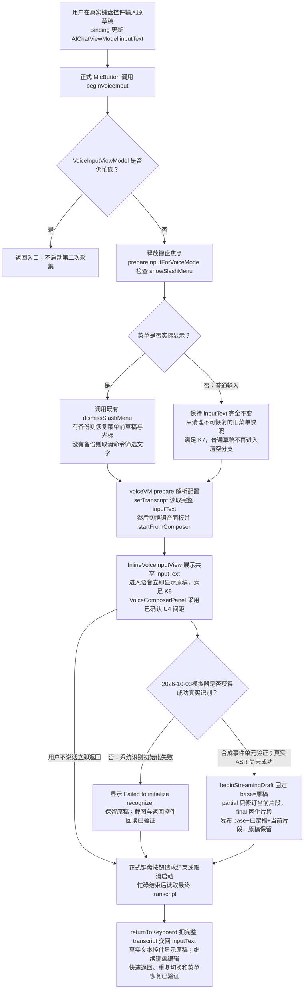

# 调查与修复验证记录

调查与本地验证日期：2026-10-03；真机验收确认日期：2026-10-04（Asia/Taipei）。

## 当前结论

已在当前修复分支实施入口条件修复和用户确认的间距。
修复构建成功，14项生命周期测试通过；正式入口的无语音返回、继续编辑、多行两次切换、菜单恢复、长文滚动与大字号按钮操作均有运行证据。
用户于2026-10-04确认成功真实语音追加和完整录音阶段两项真机验收均通过。全部12项验收已经完成，任务已于2026-10-04按用户指令归档，状态为“完成”。真机证据来自用户确认，见文末。

以下基线调查部分保留修复前证据，其中“基线调查阶段”不描述当前修复状态。最新修复与验收见文末。

## 分支与设备

| 项目 | 实测值 |
| --- | --- |
| 原分支 | optimize_web_search |
| 修复分支 | fix/voice-keyboard-draft |
| 基点 | b51aa64c8427e2d79e2c6d641d85b8ee114bba52 |
| 设备 | iPhone 18 Pro |
| 标识 | 479131C9-8187-44E7-8510-A499D7AC3034 |
| 系统 | iOS 27.0 |
| 应用 | com.yyzzzor.minisx / 1.13 (10) / Debug |
| 构建 | 原始代码 BUILD SUCCEEDED |

分支创建前只有未跟踪的 `tasks/archive/26-10-03 聊天内 Mermaid 图表渲染/`。
该目录没有修改、移走或提交。

## 实测步骤和证据

1. 将当前原始代码构建、安装并启动到指定模拟器。
2. 使用 `debug.inputText` 向真实键盘文本控件输入 `draft keep 1003`。
3. 回读控件，确认文字非空且控件已获得焦点（`01-keyboard-before-inspect.json`）。
4. 首先使用调试模式入口打开语音面板，再启动采集。草稿保留。
5. 激活正式键盘输入按钮，原草稿保留（`04-return-draft.json`、`04-return.png`）。
6. 激活正式“开始语音输入”按钮。语音面板草稿立即为空（`05-real-entry-tap.json`、`05-real-entry-draft.json`、`05-real-entry.png`）。
7. 激活正式“键盘输入”按钮。返回的键盘控件不再包含原文字（`06-real-return-input.json`、`06-real-return.png`）。
8. 再次输入 `draft trace 1003`，确认真实控件包含该文字（`07-trace-before.json`）。
9. 在 `inputText` 非空变为空的位置设置断点，激活正式麦克风按钮。调试器捕获清空栈与 oldValue。
10. 移除断点、继续应用并断开调试器。返回键盘后，控件文字是空字符串，且仍可编辑（`08-trace-return-inspect.json`）。

正式按钮通过应用的可访问性动作激活。
调试器栈确认该动作进入 `MicButton`、`beginVoiceInput()`，并非替代业务逻辑的模式调试入口。

初期 AXe 触摸和键盘 HID 操作未产生所需业务状态变化，不能作为复现证据。
本记录采用随后成功的应用内文本输入和正式按钮可访问性操作。

## 补充复现：全程不说话，立即返回

用户 / 2026-10-03 补充：输入文字后进入语音模式，不说话，直接返回键盘。

1. 确认真实键盘控件为空且已经获得焦点。
2. 输入“原有键盘草稿 1003”，回读确认文字已经进入真实控件。
3. 激活正式“开始语音输入”按钮。
4. 该动作返回后立即激活正式“键盘输入”按钮，中间没有等待、截图或其他操作。
5. 回读返回后的真实键盘控件，其文字为空字符串。

两次按钮动作合计 237 毫秒；语音入口动作耗时 154 毫秒，返回动作耗时 84 毫秒。
分项与总时长由分别四舍五入得到，因此可能有 1 毫秒差异。
全程没有说话、播放音频或注入音频，也没有发送消息。

运行日志记录原草稿先被清空，随后才解析和预热语音识别配置。
本次立即返回的证据不依赖等待识别器失败。

- 时序与动作结果：`evidence/09-immediate-reproduction.json`。
- 原草稿回读：`evidence/09-immediate-before-inspect.json`。
- 返回后空字符串回读：`evidence/09-immediate-after-inspect.json`。
- 本次日志：`evidence/09-immediate-runtime.log`。
- 返回后截图：`evidence/09-immediate-return.png`。

修复计划的首要验收已更新为用户补充的精确场景。
基线调查阶段没有修改源码或 Spec，也没有实施修复。

## 故障定位

调试器捕获的前六层栈见 `evidence/clear-call-stack.json`。
关键业务调用顺序如下：

1. `MicButton` 的按钮动作调用 `AIChatView.beginVoiceInput()`。
2. `beginVoiceInput()` 在第 3368 行无条件调用 `vm.dismissSlashMenu()`。
3. `dismissSlashMenu()` 在第 87 行执行 `inputText = ""`。
4. `inputText.didSet` 命中断点，oldValue 为 `draft trace 1003`。

源码解释：普通草稿没有菜单前备份，`savedInputBeforeSlash` 为 nil。
关闭菜单函数因此进入清空分支，调用方没有检查菜单是否打开。
这违反语音输入应继续同一份草稿的 U1。

清空后，`beginVoiceInput()` 才把空字符串交给 `VoiceInputViewModel`。
返回键盘读取的是已经为空的语音草稿。
因此，返回动作显示了此前的丢失结果。

## 语音识别边界

本次系统识别出现 `Failed to initialize recognizer`。
运行日志先记录输入框清空，之后才记录识别器启动和失败。
识别失败不能解释更早发生的清空。
调试模式入口启动同一系统识别并失败时，原草稿仍保留。

基线调查阶段没有验证成功识别的新文字追加、真实语音准确率或真机体验。
修复后的成功识别场景仍保留在待验收项中。

## 补充调查：已有键盘文字后追加语音

用户 / 2026-10-03 报告：语音新增内容会覆盖已有键盘文字。

已确认的入口清空缺陷足以解释该表现。
本节的合并结论由实际源码和合成识别事件测试支持。
基线调查阶段尚未在成功的真实 ASR 上完整复现这一追加场景。

### 源码事实

1. `beginVoiceInput()` 清空普通草稿后，才调用 `setTranscript(vm.inputText)`。
2. `beginStreamingDraft()` 使用当时的 `transcript` 创建 `VoiceStreamingDraft(base: transcript)`。
3. `VoiceStreamingDraft.text` 按顺序组合原草稿、已定稿片段和当前片段。
4. `publishStreamingDraft()` 将合并全文交回共享输入草稿。
5. 因为 base 已经为空，后续全文只有语音内容，原键盘文字无法出现在结果中。

代码位置：`VoiceInputPanel.swift:161-183`、`:647-681`；`InlineVoiceInputView.swift:69-73`。
非流式分段路径在 `VoiceInputPanel.swift:1401` 也会在空草稿时直接使用新片段。

### 实际合并类型检查

从当前源码原样提取 `VoiceStreamingDraft`，使用合成识别文字验证：

- base 为空时，加入“语音新增内容”，结果只有“语音新增内容”。
- base 为“原有键盘文字”时，结果为“原有键盘文字 语音新增内容”。
- 当前语音片段从较长修订稿变成较短修订稿时，原有键盘文字继续保留。

源码摘要与边界见 `evidence/10-append-source-check.json`。
检查结果见 `evidence/10-append-draft-results.txt`。
该检查使用真实合并类型，但没有使用麦克风或真实 Provider。

### 现有生命周期测试

在已指定的 iPhone 18 Pro / iOS 27.0 上，关闭并行克隆并运行三项现有测试：

- `testRealtimeRevisionsReplaceWholeCurrentPhrase`：中间稿修订不删除原草稿。
- `testRealtimeTailFinalAndLateCallbacksAfterFinish`：最终语音追加在原草稿后面，旧回调失效。
- `testKeyboardEditsAndNewRecordingRejectOldGeneration`：编辑后的文字成为新录音基础，旧录音结果被忽略。

结果：3 项通过，0 项失败。
证据见 `evidence/10-append-tests-summary.txt` 和 `evidence/10-append-tests-summary.json`。
完整结果包位于 `/private/tmp/minisx-voice-append-20261003.xcresult`。

这些测试直接驱动语音 ViewModel，没有经过正式麦克风入口。
测试通过不能证明入口正确，也不能证明真实识别已通过。
因此，修复后的真实追加场景继续保留为未验收。

### 计划更新

“不说话立即返回”和“已有键盘文字后追加语音”是两个并列核心验收。
当前计划仍先修复入口清空，再验证两条完整路径。
基线调查阶段没有修改源码、测试源码或 Spec，也没有实施修复。

## 补充需求：语音面板显示原键盘草稿

用户 / 2026-10-03 要求：使用语音输入时，原先输入的文本应出现在语音输入界面。

本次将该要求明确为：

1. 进入语音模式后，原草稿立即显示在面板中。
2. 正在启动麦克风时，原草稿同样可见。
3. 采集和收尾期间，面板持续显示完整草稿，新语音文字追加在原文字后面。

静态事实：`InlineVoiceInputView.swift:46` 将共享 `inputText` 传给 `VoiceComposerPanel` 显示。
现有展示入口支持显示完整草稿；实际效果仍需在入口修复后验收。
任务新增拟议规则 K8，并增加即时显示和持续显示验收。
本次只更新需求记录，没有修改源码或 Spec，也没有新增运行验证。

## 静态与测试边界

- 原始代码的模拟器构建成功；摘要见 `evidence/baseline-build-summary.txt`。
- 首轮定位未运行单元测试；本次补充调查运行与追加相关的三项现有测试，全部通过。
- 基线调查阶段没有修复后的构建或回归结果。
- 现有 `VoiceComposerLifecycleTests` 直接设置语音草稿，并不调用 `beginVoiceInput()`。
- 因此，现有生命周期测试不能发现本次入口无条件清空；后续必须验证正式按钮路径。

## 资源影响

基线调查阶段只有调试和文档，没有修改产品运行行为。
拟议修复只新增菜单状态条件判断，不新增音频采集、异步任务、定时器或网络请求。
真机 CPU、内存与能耗未测量，不能从基线调查阶段模拟器证据推断。

## 收尾

断点已移除，调试器已断开。追加测试结束后，指定模拟器已重新启动正常应用。
基线调查阶段没有发送聊天消息，没有运行斜杠命令，没有创建提交或推送。

## 修复实现与本轮验收

### 实现事实

1. `AIChatView.beginVoiceInput()` 改为调用生产准备方法 `prepareInputForVoiceMode()`。
2. 菜单可见时，准备方法调用既有 `dismissSlashMenu()`；菜单隐藏时，不修改 `inputText`，只丢弃无效的旧菜单草稿和光标快照。其他取消调用方没有修改。
3. 入口随后以完整原稿调用 `setTranscript`。现有流式合并仍按 base、已定稿片段、当前片段组成全文；本轮没有重构识别协议或合并规则。
4. 共享 `VoiceComposerPanel` 使用4pt基准额外行距、固定-7.5pt标题行间距；正文行距继续随 Dynamic Type 缩放。内层标题/正文布局确实缩短间距，标题层级保护键盘按钮的重叠触摸区域。正文宽度、17pt基准字号和160pt最大基准高度保持。
5. 测试源码增加四项生产准备路径回归；全部14项生命周期测试已经执行。没有修改 Android、最低 iOS 版本、Provider 设置或付费调用路径。

### 修复后的执行流程与证据边界

以下流程图保留2026-10-03本地验证的证据范围；后续真机结果见文末。
下图的正式入口、显示和返回已由模拟器按钮与控件回读支持；识别事件合并分支来自实际 ViewModel 的合成事件测试，不能代表真实 ASR 成功。

### 构建与测试

- 修复模拟器构建：`BUILD SUCCEEDED`。原始日志位于 `/private/tmp/minisx-voice-draft-fixed-build.log`；摘要见 `evidence/fixed/15-build-summary.txt`。
- 生命周期：14通过、0失败、0跳过，指定 iPhone 18 Pro / iOS27.0，关闭并行克隆。结果包 `/private/tmp/minisx-voice-draft-fixed-20261003.xcresult`，摘要 `evidence/fixed/15-lifecycle-summary.json`。
- 四项独立界面场景均已通过，使用已安装应用与 `XCUIElement.tap()`。单行继续输入、多行两次切换、活动菜单恢复在 `/private/tmp/minisx-voice-ui-checks-default-r2.xcresult` 通过；长文滚动在 `/private/tmp/minisx-voice-ui-checks-long-r3.xcresult` 通过。逐项来源见 `evidence/fixed/16-ui-accepted-cases.json`。
- 临时界面测试首次使用了错误的位置假设：软件键盘出现后，输入框会移到屏幕中线上方；该条件导致验证工具失败。另一次长文准备在已有相同文本时重复粘贴，失败发生在进入语音之前。两项测试工具问题均已修正，只重新执行未通过场景；没有因此修改产品源码。
- 大字号长文：使用仅本次启动生效的 `fontSettings.appBaseScale=3` 参数，对应应用可选字号上限 `xxxLarge`。等待底部状态完整位于屏幕内，滚动后点击键盘按钮高度94%处并回读全文，测试通过。结果包 `/private/tmp/minisx-voice-ui-checks-largefont-settled.xcresult`，摘要 `evidence/fixed/17-ui-largefont-summary.json`。
- 当前测试工具源文件、工程与产品测试源码校验值分别保存在 `evidence/fixed/16-ui-test-source.swift`、`16-ui-test-project.pbxproj`、`15-tested-source-sha256.json`。

### 正式入口的快速返回和失败恢复

当前模拟器的 AXe 触摸调用虽然返回成功，但没有改变产品状态；应用内通用查找也未定位到目标按钮。上述工具返回不作为通过证据。

根会话直接定位聊天 HostingView 的正式可访问性按钮，激活真实 MicButton 动作，并安排正式键盘按钮紧接着激活。调试脚本的0.2秒是排程参数，调试器暂停会影响墙钟时序，本轮没有用它测量实际响应耗时。该方式没有调用模式调试入口或修改业务草稿。
返回后的真实文本控件仍为“原有键盘文字 draft 1003”；继续输入后为“原有键盘文字 draft 1003，继续键盘输入”。证据见 `11-lldb-formal-immediate.json`、`11-ax-immediate-return-inspect.json`、`11-ax-continued-inspect.json`。
随后独立 XCUITest 用标准系统触摸补充了相同草稿保留与继续输入场景。

进入正式语音后，原稿在面板中显示。系统初始化失败后，原稿仍显示，并在返回键盘时完整保留。截图 `13-formal-voice-after-failure.png` 与回读 `13-failure-return-inspect.json` 支持这一结论。
该系统失败也发生在基线中，不是本轮新增的识别错误。

### 已确认间距的原生核对

- 默认字体：连续112个中文字符，没有手工换行；原生默认首行容纳20字，其余各行自然换行。截图 `14-native-full-preview.png`。
- 正文额外行距4pt，标题行与正文布局间距-7.5pt，字号17pt和最大正文基准高度160pt均由共享参数控制。没有添加字数硬限制、横向平移或缩小字号。
- 长稿：336个连续中文字符超出正文上限，滚动后返回键盘仍完整。默认截图 `16-native-long-default.png`。
- 放大字号：标题、正文、底部控制和提示在布局稳定后完整显示；键盘按钮下缘的重叠区域仍可真实触摸。截图 `17-native-long-largefont.png`。
- 初次大字号附件捕获了布局变化中的截帧，因此额外等待底部状态进入屏幕后重新核对；最终稳定布局通过，没有据此增加产品改动。

### 独立审查与处置

审查原文见 `reviews/01 草稿与间距独立审查/report.md`。

| 审查项 | 处置与证据 |
| --- | --- |
| 正式入口整条路径不能只依赖手工连接的单元测试 | 已补充正式 AX 动作与标准 XCUITest；无语音返回、继续编辑、多行与菜单场景通过。成功真实 ASR 后续由用户于2026-10-04在真机确认通过，见文末。 |
| 负间距、大字号、正文滚动后可能影响键盘触摸 | 已补充默认长文滚动与应用字号上限的原生验证；键盘按钮下缘94%位置触摸、底部状态完整显示和回读全文通过。 |
| 资源开销 | 静态检查没有新增采集器、持续任务、定时器、网络或I/O；测量与全文排版沿用现有机制。可视区域上限不是总排版成本上限，未进行真机性能测量。 |

### 2026-10-03 本地验证的真实识别边界

当时指定模拟器报告 `Failed to initialize recognizer`，没有获得成功真实 ASR 的新文字。实际 ViewModel 的合成 partial/final 测试只证明事件合并，不能表述为模拟器成功录音识别。
当时也没有捕获真实启动、采集和收尾的全部阶段；取消启动与旧回调有单元证据，快速正式返回有运行证据。
两项当时保留为待真机验收，现已依据2026-10-04用户确认完成；原本的模拟器证据边界保持不变。

### 收尾状态

独立测试只安装自身测试 runner，没有重新安装、清除或卸载产品数据；临时字号启动参数已经移除，模拟器恢复正常启动。调试器已经断开，没有遗留断点或暂停进程。
没有发送聊天消息、执行斜杠命令、创建提交、推送或发布；原有 Mermaid 任务档案没有修改。

## 2026-10-04 真机验收确认

用户在此前明确安排将最后两项放到真机验证，并准备发布 Build 11。
2026-10-04，用户在当前对话确认：“我已经在我自己的机器上测试了，最后两项都通过了”。

| 验收项 | 结果与证据来源 |
| --- | --- |
| 已有键盘文字后成功识别新增语音，原稿与新增内容持续可见，返回键盘后仍完整（U1、K5、K7、K8） | 用户真机测试通过；证据为上述对话确认。 |
| 真实录音启动中返回、采集和收尾阶段保持完整草稿，返回后不重新开麦（P4、K3、K8） | 用户真机测试通过；证据为上述对话确认。 |

这份确认补足本任务最后两项验收，全部12项已通过。
本对话前述发布安排为 Build 11；用户本条反馈没有另行说明设备型号、系统版本或已安装版本号，本轮没有读取这些信息。
本轮没有重新运行构建、测试、模拟器或真机，也没有采集识别日志。用户确认不等于 Agent 独立取证或真机资源测量。
真机确认的状态更新阶段仅修改任务、验证记录和发布状态，没有修改产品源码、创建提交、推送或移动任务目录。后续归档见下节。

## 2026-10-04 归档与提交范围

用户确认最后两项真机验收通过后，要求先归档任务，再提交并推送相关代码。
全部12项验收均有各自证据；新增Spec规则U4、K7、K8已经生效。
任务目录整体移至 `tasks/archive/26-10-03 语音与键盘切换保留输入草稿/`，审查报告与64份证据保留。
证据和审查附件与移动前的SHA256逐项一致，发布状态中的任务链接已更新。

提交范围包含草稿入口修复、确认的语音布局、四项新增生命周期测试，以及相应Spec、任务和发布记录。
主应用、ShareExtension、FileProvider、AgentWidget的Debug与Release配置共有八项构建号调整，均为10到11，随本任务提交。
四份实际测试过的源码文件与本地验证时保存的SHA256一致，本轮没有重复运行产品构建、模拟器或真机测试。
本轮静态收尾核对包括验收清单、Spec生效状态、索引、文档链接和提交范围。
原始 `evidence/baseline-build-summary.txt` 含一个末尾空行，默认暂存格式检查只报告该项。为保持原始证据字节不变，保留该空行；其余暂存文件的默认格式检查通过。
原有Mermaid任务档案不属于本次提交。
