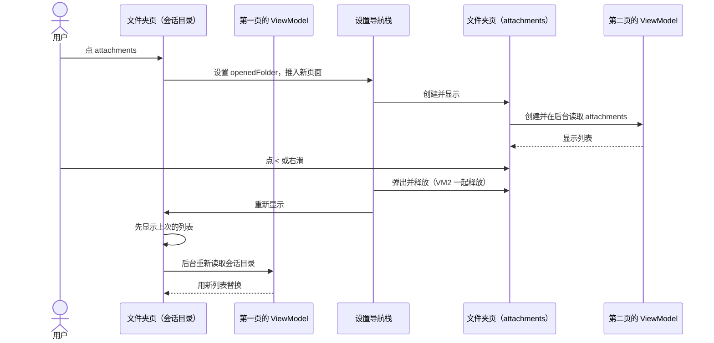

# 26-10-07 文件浏览器逐层推入导航

状态：完成（2026-10-07；Build 13 已在手机上使用，用户反馈 Close 动画流畅）　｜　Spec：[文件浏览器](../../../docs/specs/ios-file-browser.md)（新建，本任务新增 F1–F10；2026-10-07 修改 F6、F7）　｜　关联：[资源规范](../../../docs/specs/resource-efficiency.md)

## 问题

在"设置 → 存储 → 某个会话 → Browse Files"里，用户点进 `attachments` 后点左上角 `<`，整个 Files 页被关掉，回到显示 "Browse Files" 的会话存储页。用户期望 `<` 回到 Files 的上一层。

原因（2026-10-07 在 iPhone 18 Pro 模拟器复现）：

1. `FileBrowserView` 只有一个页面。点文件夹时，`FileBrowserViewModel.navigateTo(_:)` 只改当前路径并重新读取目录，导航栈里没有新页面。
2. "存储"入口用 `NavigationLink` 把 Files 页推入"设置"导航栈，系统 `<` 弹出的是整个 Files 页。
3. `FileBrowserView` 自带的左上角 Close 调用 `dismiss()`，在推入场景下和 `<` 效果重复。

## 目标

- 用户点文件夹时，App 推入一个新页面显示该文件夹。
- 用户点 `<` 或从屏幕左边缘右滑，App 回到上一层文件夹。
- 每个页面的标题显示当前文件夹名。
- 路径栏只显示位置，不能点击。

不做：

- 不改"浏览对话文件"的根目录（`/`）和初始目录（`/var/minis`）。
- 不改"移动到… / 复制到…"使用的 `DirectoryPickerView`。
- 不改各入口的呈现方式（sheet 或推入）。

## 方案

### 文件浏览器的入口

| 入口 | 呈现方式 | 根目录 | 第一页 |
| --- | --- | --- | --- |
| 设置 → 存储 → 会话 → Browse Files（`StorageManagementView.swift:205`） | 推入"设置"导航栈 | 会话目录 `Library/MinisChat/minis/<会话ID>` | 根目录 |
| 对话 `⋯` → 浏览对话文件；空对话的浏览按钮（`AIChatView.swift:988`） | sheet | `/` | `/var/minis` |
| 下载面板 → 在文件中显示（`AIChatView.swift:774`） | sheet | `/var/minis/workspace` | 根目录，并高亮下载的文件 |
| 终端（`ISHTerminalView.swift:150`） | sheet | rootfs 根目录 | 根目录 |
| Rootfs 管理（`RootfsManagementView.swift:186`） | sheet | `/` | 根目录 |
| 挂载详情（`MountDetailView.swift:144`） | sheet | 挂载的外部文件夹 | 根目录 |

本文中"文件夹页"指显示一个目录内容的页面；"第一页"指入口打开时显示的文件夹页。

### 路线

每个文件夹页有自己的 `FileBrowserViewModel`，只负责一个目录。

1. 用户点文件夹行时，当前文件夹页把该文件夹写入自己的 `@State` 变量。
2. 文件夹页用 `.navigationDestination(item:)` 观察这个变量，变量非空时推入新的文件夹页。
3. 新文件夹页创建自己的 `FileBrowserViewModel`，在后台读取目录。
4. 用户点 `<` 或右滑时，系统弹出当前文件夹页，变量回到 `nil`。

选择 `.navigationDestination(item:)` 的理由：

- 它只在用户点击后才创建目标页面，列表里几百个文件夹行不会预先创建页面对象。
- 它不依赖外层导航栈的路径类型。"设置"导航栈混有按值推入和按视图推入的页面（例如会话存储页是按视图推入的），按值推入文件夹会打乱已推入的页面。

`FileBrowserView` 的初始化参数保持不变，另加一个参数，用来告诉文件夹页是否显示 Close。"存储"入口传入"不显示"，其他入口使用默认值"显示"。

未采用的方案：

- ✗ 把"存储"入口改成 sheet：只能去掉误导人的 `<`，进入子文件夹后仍不能用 `<` 或右滑返回。
- ✗ 隐藏系统 `<`，换成自定义返回按钮：会失去边缘右滑返回，返回时也没有系统动画。
- ✗ "浏览对话文件"打开时把 `/`、`/var` 预先压入导航栈：要混用两种导航机制，需要先做原型；用户选择了更简单的菜单就地切换（见"决定"）。

### 关系图（拟议）

```mermaid
flowchart TD
    Entry["入口<br/>StorageManagementView / AIChatView / 终端 / Rootfs 管理 / 挂载详情"]
    FBV["FileBrowserView<br/>第一页：Close、路径栏、⋯ 菜单"]
    Page["文件夹页<br/>每页一个目录"]
    VM["FileBrowserViewModel<br/>读取目录、排序、文件操作"]
    Nav["导航栈<br/>设置栈或 sheet 自带的 NavigationStack"]
    FS["FileManager<br/>后台读取目录"]

    Entry -->|推入或 sheet 呈现| FBV
    FBV -->|第一页就是一个文件夹页| Page
    Page -->|持有| VM
    VM -->|后台读取| FS
    Page -->|navigationDestination(item:)<br/>点击文件夹时推入| Nav
    Nav -->|显示新的| Page
```

### 典型场景图（拟议）：从"存储"进入 attachments 再返回



## 验收（有证据才打勾，注明证据位置）

设备：iPhone 18 Pro 模拟器（iOS 27），DEBUG 构建。截图存到 `evidence/`。

- [x] 满足 F1、F2：在"存储 → Translate Prefill-Decode… → Browse Files"中点 `attachments` → 推入标题为 "attachments" 的新页面 → 截图（evidence/01-storage-files-root.png、02-storage-attachments-pushed.png；`<` 的标签为 "Files"）
- [x] 满足 F1：在 `attachments` 页点 `<` → 回到标题为 "Files" 的会话目录页；再点 `<` → 回到会话存储页 → 截图（evidence/04-back-to-files-root.png、05-back-to-session-storage.png）
- [x] 满足 F1：在 `attachments` 页从左边缘右滑 → 回到会话目录页 → 截图（evidence/06-edge-swipe-back.png）
- [x] 满足 F3：点路径栏里的任一段 → 页面不变 → 点击前后截图（点击前 evidence/02-storage-attachments-pushed.png，点击会话 ID 段后 03-breadcrumb-tap-no-effect.png）
- [x] 满足 F7：在"存储"入口的任一文件夹页，左上角只有 `<`，没有 Close → 截图（evidence/01-storage-files-root.png、02-storage-attachments-pushed.png）
- [x] 满足 F4、F6：sheet 入口进入第 2 层 → 左上角只有 `<`，没有 Close；`⋯` 菜单里没有 Go to Parent Folder → 截图（Rootfs 管理第 2 层 evidence/13-rootfs-level2-bin.png；菜单在同为 sheet 的终端入口第 2 层检查：09-terminal-sheet-level2.png、10-level2-menu-no-parent.png）
- [x] 满足 F6：在 sheet 入口第 2 层下滑 sheet → sheet 关闭 → 截图（在终端入口第 2 层执行，回到终端：evidence/11-swipe-down-dismiss-from-level2.png。第一次手势起点在 sheet 边缘未触发，第二次从导航栏下滑成功）
- [x] 满足 F6：在 Rootfs 管理入口第一页点 Close → sheet 关闭 → 截图（evidence/12-rootfs-first-page.png、14-rootfs-close-dismissed.png）
- [x] 满足 F5：打开"浏览对话文件" → 第一页是 `/var/minis`，标题为 "minis"，左上角只有 Close；点 `⋯` → Go to Parent Folder → 第一页就地切换到 `/var`；点 `minis` → 推入新页面；点 `<` → 回到 `/var` → 截图（evidence/15–19）
- [x] 满足 F10：停留在子文件夹页时上一级目录出现新文件，再点 `<` → 上一级页面列表出现新文件，最终状态没有加载指示器 → 截图（evidence/07-return-refreshed-list.png）。为不改动会话真实文件，改为从 Mac 端在会话目录放临时文件 `zz-f10-probe.txt`，测完已删除。截图在转场结束后采集，不能证明转场过程中没有闪现加载指示器；该点由代码 `hasLoaded` 判定和审查确认
- [x] 下载面板"在文件中显示"仍能高亮下载的文件。没有下载记录时，用代码审查确认高亮逻辑未变，并在此注明 → 截图或审查记录（模拟器无下载记录，debug-server 也没有生成下载记录的方法，未做设备验证。审查确认：高亮只传给第一页；目录读取改在 `onAppear` 后，List 出现时调用 `locateHighlightTarget`，`items` 变化时也会调用，仍能定位并高亮；`didLocateHighlight` 保证只跳一次。见下文"审查"）
- [x] 终端、挂载详情两个入口能打开文件浏览器，并能进入子文件夹和返回 → 截图（终端 evidence/08、09；挂载 20–22。挂载目录为空，临时在源目录建 `zz-fb-test/note.md`，测完已删除）
- [x] 满足 F8、F9 与资源规范 V2：独立审查确认没有预先创建页面、首次显示只读取一次目录、弹出的页面释放 ViewModel。真机性能未测量，记为未验证 → 审查报告（见下文"审查"）
一键关闭（2026-10-07 追加）：

- [x] 满足 F6：sheet 入口第 2 层左上角显示 `<` 和 Close → 截图（"浏览对话文件"的 `attachments` 页：evidence/35-sheet-level2-back-and-close.png）
- [x] 满足 F6：sheet 入口第 3 层点 Close → sheet 关闭 → 截图（`uploads` 页 evidence/36-sheet-level3-uploads.png，关闭后回到聊天页 37-sheet-level3-close-dismissed.png）
- [x] 满足 F6："存储"入口第 3 层点 Close → 一次回到会话存储页 → 截图（evidence/31-storage-level3-back-and-close.png、32-storage-close-to-session-page.png）。第一版实现在深层页面调用第一页的 `dismiss`，结果关闭了整个"设置"界面；改为由 `SessionStorageDetailView` 用 `navigationDestination(isPresented:)` 控制推入后通过。关闭后再次打开、推入、`<` 返回均正常
- [x] 满足 F7：sheet 入口第一页左上角只有 Close；"存储"入口第一页左上角只有 `<` → 截图（evidence/34-sheet-first-page-close-only.png、30-storage-first-page-back-only.png）。Browse Files 行由 `NavigationLink` 改为 `Button`，外观与改动前一致（33-session-page-browse-row.png）
- [x] 模拟器构建成功 → 命令输出（`bash scripts/build_ios_simulator.sh --skip-deps` 输出 `** BUILD SUCCEEDED **`，已安装到 iPhone 18 Pro 模拟器完成上述操作）

- [x] 模拟器构建成功：`bash scripts/build_ios_simulator.sh --skip-deps` → 命令输出（implementer 运行，输出 `** BUILD SUCCEEDED **`；该构建已安装到 iPhone 18 Pro 模拟器并完成上述操作）

## 审查

2026-10-07 由 reviewer 子代理只读审查，没有阻断级或重要级缺陷，F1–F10 从代码上看都满足。

| 编号 | 发现 | 处理 |
| --- | --- | --- |
| D1（次要，已确认） | Go to Parent Folder 就地切换目录后，新目录读完前列表仍显示旧目录的条目；此时点文件夹会拼出错误路径，删除会作用到错误的文件 | 已修复：`FileBrowserViewModel.goBack()` 在读取前重置 `hasLoaded`，读取期间显示加载指示器。重新构建后在模拟器上从 `/var/minis` 连续上移到 `/`，标题和列表正确（evidence/23） |
| 疑点 1 | `FileItem.id` 每次读取都是新的 UUID，返回时整表替换，长列表可能闪烁或丢失滚动位置 | 实测：在 `/usr/lib/python3.12`（199 项）滚到 18% 处，推入 `xml` 再返回，可见行和位置都与推入前相同（evidence/24、25）。转场中是否闪烁无法用截图确认，记为未验证 |
| 疑点 2 | 栈中被遮住的页面也可能响应排序与"显示隐藏文件"的变化而重读 | 只记录：次数以栈深为上限；按资源规范 R4，不为未确认的理论收益增加复杂度 |
| 疑点 3 | 边缘右滑中途取消时，`onAppear` 可能多触发一次读取 | 只记录：结果由 `loadToken` 保证正确，多余读取有界 |
| 疑点 4 | 3 层以上嵌套推入没有验证 | 实测：sheet 内推到第 6 页（`/usr/lib/python3.12/xml/dom`）后逐层返回到第一页（evidence/26、27）；"设置"栈内推到 `workspace/prefill-decode/images` 后逐层返回到会话存储页（evidence/28、29） |

资源结论（资源规范 V3）：

- 资源影响小。读目录的次数与旧版基本持平：推入时读一次，返回时读一次。
- 每个文件夹页持有一个 ViewModel，内存以导航栈深度为上限，页面弹出后释放。
- 没有新增持续任务、定时器、订阅或无界结构。
- 未验证：真机 CPU、内存、流畅度；慢速 FileProvider 挂载上反复推入返回时的线程占用。

范围外的现有问题，只记录，不在本任务修改：

- `moveItem` 和 `copyItem` 成功后函数内已读一次目录，完成回调又读一次。
- `childURL` 使用不带 `isDirectory` 的 `appendingPathComponent`，可能在主线程多查一次文件系统。

## 决定

- 采用逐层推入，不采用把"存储"入口改为 sheet（用户，2026-10-07）。
- 路径栏只显示位置，不可点击；理由是手机上路径栏太小，不便点击（用户，2026-10-07）。
- "浏览对话文件"的根目录和初始目录不变（用户，2026-10-07）。
- 从 `/var/minis` 往上走，用 `⋯` 菜单就地切换第一页（用户，2026-10-07）。
- ~~sheet 入口只在第一页显示 Close（用户，2026-10-07）~~：用户真机试用 Build 12 后改为下一条。
- 第 2 层及以后的文件夹页在 `<` 右侧显示 Close，一次退出文件浏览器；6 个入口都适用，"存储"入口点 Close 回到会话存储页（用户，2026-10-07）。
- 在 `feat/file-browser-push-nav` 分支上实现，基于 `fix/voice-keyboard-draft`（用户，2026-10-07）。
- ✗ "浏览对话文件"改为以当前对话目录为根：用户不需要。

## 实现计划

- [x] 按 update-spec 新建 `docs/specs/ios-file-browser.md`，写入 F1–F10，标 `[拟议]`
- [x] implementer 子代理修改 `src/ios/Views/Rootfs/FileBrowserView.swift` 和 `src/ios/Views/Settings/StorageManagementView.swift`
- [x] 模拟器构建，按验收逐条操作并截图
- [x] reviewer 子代理独立审查，包含资源规范 V2 的五个问题
- [x] 更新验收清单，Spec 规则从 `[拟议]` 改为生效

## 遗留事项

- 真机上的流畅度与内存未做专项测量。慢速 FileProvider 挂载文件夹上反复推入、返回的表现也未验证。
- 下载面板"在文件中显示"的高亮只经过代码审查，未在设备上验证。原因：模拟器上没有下载记录。
- 审查疑点 2、3 只记录未改：被遮住的页面可能响应设置变化而重读目录；右滑返回中途取消时可能多读一次目录。两者次数都以导航栈深度为上限。
- 范围外的现有问题：`moveItem` 和 `copyItem` 成功后会读两次目录；`childURL` 可能在主线程多查一次文件系统。
- 路径栏不可点击，但文字仍是蓝色。是否改为次要灰色（`FileBrowserView.swift` 中路径栏的 `.foregroundColor(.blue)`）由用户决定。
- Build 13 上传时 MinisFileProvider 的构建号为 12；归档时已在 `project.pbxproj` 中统一为 13。
